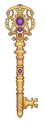

  

    

  

  

    

      <VuetifyButton id="btn1" class="hc-btn" color="primary" label="Do science" href="/do-science/" block />
    

    

      <VuetifyButton id="btn2" class="hc-btn" color="primary" label="Administer science" href="/coordination/" block />
    

    

      <VuetifyButton id="btn3" class="hc-btn" color="primary" label="Govern science" href="/governance/" block />
    

  

<h1>Welcome to the HUNT Cloud documentation</h1>

<b>
These pages contains official user documentation for HUNT Cloud.  See <a href="https://www.ntnu.edu/mh/huntcloud">About HUNT Cloud</a> for introductory information on our scientific services.
</b>

**HUNT Cloud is a scientific computing environment located at [NTNU](https://www.ntnu.edu/) in Norway.**

## [Do science](/do-science)

Practical matters such as how to get started, how to use the HUNT Workbench and similar.

## [Administer science](/administer-science)

How to oranize your scientific group in HUNT Cloud, including compliance, training, data handling, financal aspects and similar.

## [Govern science](/govern-science)

The content focuses on scientific and trust governance in HUNT Cloud, including privacy and security.

## [About HUNT Cloud](/about)

Read about the team, the technologies and the thinking behind HUNT Cloud.

