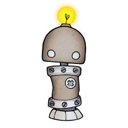

# About HUNT Cloud

**HUNT Cloud is shaped by a small team of scientific instrument makers.**

This is a pilot page that where we will add information about the thinking and team behind HUNT Cloud.

::: tip Next Tingweek (Ting 9)

- **Labting**: Tuesday 30 May 2023 - 2 to 4 p.m. CET
- **Data space ting**: Wednesday 31 May 2023 - 9 to 11 a.m. CET
- **Data controller ting**: Wednesday 31 May 2023 - 1 to 3 p.m. CET
- **Lagtun**: Thursday 1 June 2023 - 9 to 11 a.m. CET

[Read more about HUNT Cloud Tingweeks](/govern-science/tingweek/)

:::

