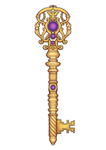
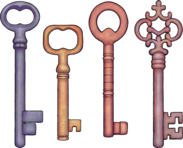
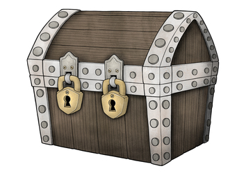
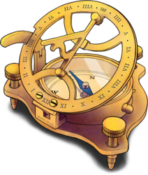
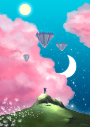
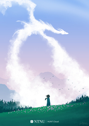
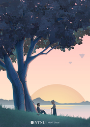
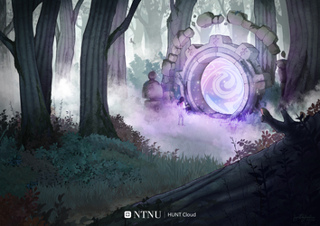

<!-- NOTE: This page is autogenerated.  -->
<!--       All manual edits will be removed.  -->

# Artworks

**Our magical world of data science is filled with abstract ideas. This page present artworks where we imagine such ideas in practical forms. Our main purpose is to ease dialogues and strengthen cooperation.**
 
::: tip
We are publishing these artworks under a `CC BY­-NC-­ND 4.0` license. This means that you are free to use, share, copy and redistribute the works under just a few simple terms ([license](/visence/#license)).
:::

[[toc]]

## Introduction

*«There are no rules of architecture for a castle in the cloud.»*

It's hard to imagine that Gilbert Chesterton aimed at digital clouds when he constructed his famous paradox more than a century ago. Regardless, the quote inspired us to explore an area where truly only your dreams and imaginations defines the boundaries - art.

The field of data science is filled with abstract ideas that are hard to grasp and harder to discuss, such as data value, data space, clouds and ethical dimensions.

Our aim is to visualize ideas and concepts into practical forms that make the abstract world of data science more understandable. And maybe contributing a tiny bit of soul and identity to the field on the way.

We are truly appreciative that digital artist Ingunn B. Ferstad entered the fascinating field of data sciences, and on her way established and evolved the exciting world that ends up in these artworks.

## Individual artworks

::: tip About the creator
These artworks are created by HUNT Cloud imagineer  [Ingunn B. Ferstad](https://www.ingunn.design/) in collaboration with the HUNT Cloud team.
:::

<!-- The artworks are inserted here: -->

### Bottle of knowledge

Knowledge is the currency in science. This is what we seek with our explorations. It's derived from data. It's not oil nor gold, although it resembles some of the same characteristics. It's essential to keep it flowing as knowledge empowers both your personal career and our joint journey towards a better world. 

::: details Download

* [Full](https://assets.hdc.ntnu.no/assets/artworks/hunt-cloud_bottle-of-knowledge_full.png) - 1499 x 3252 pixels - 4,7M
* [Medium](https://assets.hdc.ntnu.no/assets/artworks/hunt-cloud_bottle-of-knowledge_medium.png) - 885 x 1920 pixels - 1,8M
* [Small](https://assets.hdc.ntnu.no/assets/artworks/hunt-cloud_bottle-of-knowledge_small.png) - 498 x 1080 pixels - 627K
* [Extra small](https://assets.hdc.ntnu.no/assets/artworks/hunt-cloud_bottle-of-knowledge_xsmall.png) - 115 x 250 pixels - 46K

**Title:** Bottle of knowledge  
**Version:** 1.0  
**Creator:** Ingunn B. Ferstad, HUNT Cloud / NTNU.  
**License:** CC BY­-NC-­ND 4.0
:::

::: details Reflections

.

:::

::: details Use

We use this image to illustrate, 

* that new **knowledge is the goal** of data explorations and what our scientists tireless seeks.
* that **flow** is essential in knowledge generation (we are using liquid metaphors). 
* that **data is the raw material** that goes into the production of knowledge.
* that **data differ qualitatively from oil and gold**, for example in duration and monitization, although some are partly similar (needs refinements, end products holds high value).

:::

### The keymakers

High impact science is about exploring the unknown. You will meet previously unopened doors on these journeys. Unpicking the most difficult locks requires custom keys. These are often carefully crafted, blending wisdom from humanities, social sciences, technologies and administration. Helpers from these fields are your keymakers. 

::: details Download

* [Full](https://assets.hdc.ntnu.no/assets/artworks/hunt-cloud_the-keymakers_full.jpg) - 2480 x 3508 pixels - 1,6M
* [Medium](https://assets.hdc.ntnu.no/assets/artworks/hunt-cloud_the-keymakers_medium.jpg) - 1357 x 1920 pixels - 649K
* [Small](https://assets.hdc.ntnu.no/assets/artworks/hunt-cloud_the-keymakers_small.jpg) - 764 x 1080 pixels - 248K
* [Extra small](https://assets.hdc.ntnu.no/assets/artworks/hunt-cloud_the-keymakers_xsmall.jpg) - 177 x 250 pixels - 28K

**Title:** The keymakers  
**Version:** 1.0  
**Creator:** Ingunn B. Ferstad, HUNT Cloud / NTNU.  
**License:** CC BY­-NC-­ND 4.0
:::

::: details Reflections

.

.

:::

::: details Use

We use this image to illustrate that, 

* high-impact science on sensitive data do often **explore data and methods in new ways** not previously done.
* such innovative activities often will meet **new challenges in legal, ethical and/or technological areas** that have not been previously solved.
* **flow in such projects is often dependant on new or customized solutions** in legal, ethical or technological areas.
* that **other areas of humanities** and social sciences such as language (e.g. choice of words) and writing (understandable across domains), art, history and cultural context (anthropology) and similar areas often are key to communicate new ideas in trustworthy ways to interested parties.
* **identifying and recruiting your team of helpers** (keymakers) is essensial to keep complex projects moving.
* we see **scientific coordinators** as the driving force and orchestrators of the custom keymaking process.

:::

### Keys in stock

Luckily, many keys are already available in stock and ready to be picked up in HUNT Cloud. Collectively crafted for known doors. Caringly handed over so you can instantly advance your activities. 

::: details Download

* [Full](https://assets.hdc.ntnu.no/assets/artworks/hunt-cloud_keys-in-stock_full.png) - 2837 x 2299 pixels - 4,5M
* [Medium](https://assets.hdc.ntnu.no/assets/artworks/hunt-cloud_keys-in-stock_medium.png) - 2369 x 1920 pixels - 3,0M
* [Small](https://assets.hdc.ntnu.no/assets/artworks/hunt-cloud_keys-in-stock_small.png) - 1333 x 1080 pixels - 979K
* [Extra small](https://assets.hdc.ntnu.no/assets/artworks/hunt-cloud_keys-in-stock_xsmall.png) - 309 x 250 pixels - 73K

**Title:** Keys in stock  
**Version:** 1.0  
**Creator:** Ingunn B. Ferstad, HUNT Cloud / NTNU.  
**License:** CC BY­-NC-­ND 4.0
:::

::: details Reflections

.

:::

::: details Use

We use this image to illustrate that,

* **solutions to common problems may already be available**, for example agreed security measures for specific data providers, predefined agreement setups, machine learning equipment, software solutions and so forth;
* we work hard to continously **develop and evolve stock solutions** together with our cloud community;
* our goal is to **make all stock solutions available to all users as soon as possible** to elevate activities for as many of you as possible.

:::

### Chest

. 

::: details Download

* [Full](https://assets.hdc.ntnu.no/assets/artworks/hunt-cloud_chest_full.jpg) - 3508 x 2480 pixels - 4,0M
* [Medium](https://assets.hdc.ntnu.no/assets/artworks/hunt-cloud_chest_medium.jpg) - 2716 x 1920 pixels - 2,7M
* [Small](https://assets.hdc.ntnu.no/assets/artworks/hunt-cloud_chest_small.jpg) - 1528 x 1080 pixels - 954K
* [Extra small](https://assets.hdc.ntnu.no/assets/artworks/hunt-cloud_chest_xsmall.jpg) - 354 x 250 pixels - 70K

**Title:** Chest  
**Version:** 1.1  
**Creator:** Ingunn B. Ferstad, HUNT Cloud / NTNU.  
**License:** CC BY­-NC-­ND 4.0
:::

::: details Reflections

.

:::

::: details Use

.

:::

### Strategic compass

Trust enables science. Explorations in unknown terrain, often at a competitive pace, place great demands on trustworthy navigation. Ground your course over a solid moral and value-based compass, buckle up, and enjoy the ride! 

::: details Download

* [Full](https://assets.hdc.ntnu.no/assets/artworks/hunt-cloud_strategic-compass_full.png) - 1901 x 2245 pixels - 4,9M
* [Medium](https://assets.hdc.ntnu.no/assets/artworks/hunt-cloud_strategic-compass_medium.png) - 1626 x 1920 pixels - 3,4M
* [Small](https://assets.hdc.ntnu.no/assets/artworks/hunt-cloud_strategic-compass_small.png) - 915 x 1080 pixels - 1,2M
* [Extra small](https://assets.hdc.ntnu.no/assets/artworks/hunt-cloud_strategic-compass_xsmall.png) - 212 x 250 pixels - 87K

**Title:** Strategic compass  
**Version:** 1.0  
**Creator:** Ingunn B. Ferstad, HUNT Cloud / NTNU.  
**License:** CC BY­-NC-­ND 4.0
:::

::: details Reflections

.

:::

::: details Use

We use this image to illustrate that, 

. 

:::

### Pink clouds

Imagine a new world. Kind of familiar, kind of different. Where digital laboratories are built on floating islands. Where you are the explorer, and the sky holds no limit. Welcome to HUNT Cloud. 

::: details Download

* [Full](https://assets.hdc.ntnu.no/assets/artworks/hunt-cloud_pink-clouds_full.jpg) - 3508 x 4961 pixels - 7,4M
* [Medium](https://assets.hdc.ntnu.no/assets/artworks/hunt-cloud_pink-clouds_medium.jpg) - 1358 x 1920 pixels - 1,3M
* [Small](https://assets.hdc.ntnu.no/assets/artworks/hunt-cloud_pink-clouds_small.jpg) - 764 x 1080 pixels - 454K
* [Extra small](https://assets.hdc.ntnu.no/assets/artworks/hunt-cloud_pink-clouds_xsmall.jpg) - 177 x 250 pixels - 52K

**Title:** Pink clouds  
**Version:** 1.1  
**Creator:** Ingunn B. Ferstad, HUNT Cloud / NTNU.  
**License:** CC BY­-NC-­ND 4.0
:::

::: details Reflections

.

:::

::: details Use

We use this image to illustrate that, 

* we see our scientists as **explorers**;
* their **new world** looks kind of familiar (grass, trees, clouds) and kind of different (floating islands, pink clouds, day/night sky at the same time). Both scientists, scientific coordinators and scientific leaders should expect to spend some time to know their new world well;
* we see **data spaces as floating islands** up in the skys, and that getting a new data space is for us a bit like **getting your own island**. This is the place where your establish and organize your labs and scientific activities;
* we see **labs as buildings on the floating islands**. You can have have one to many such buildings (labs) on your data space;
* **ideas** travel between labs and data spaces with a little help scientific coordinators and our cloud community (illustrated with flower seeds in the lower left corner).

:::

### Here be dragons

Text

::: details Download

* [Full](https://assets.hdc.ntnu.no/assets/artworks/hunt-cloud_here-are-dragons_full.jpg) - 3508 x 4961 pixels - 4,1M
* [Medium](https://assets.hdc.ntnu.no/assets/artworks/hunt-cloud_here-are-dragons_medium.jpg) - 1358 x 1920 pixels - 1,1M
* [Small](https://assets.hdc.ntnu.no/assets/artworks/hunt-cloud_here-are-dragons_small.jpg) - 764 x 1080 pixels - 395K
* [Extra small](https://assets.hdc.ntnu.no/assets/artworks/hunt-cloud_here-are-dragons_xsmall.jpg) - 177 x 250 pixels - 41K

**Title:** Here be dragons  
**Version:** 1.1  
**Creator:** Ingunn B. Ferstad, HUNT Cloud / NTNU.  
**License:** CC BY­-NC-­ND 4.0
:::

::: details Reflections

.

:::

::: details Use

.

:::

### Tree of knowledge

Text

::: details Download

* [Full](https://assets.hdc.ntnu.no/assets/artworks/hunt-cloud_tree-of-knowledge_full.jpg) - 3508 x 4961 pixels - 4,2M
* [Medium](https://assets.hdc.ntnu.no/assets/artworks/hunt-cloud_tree-of-knowledge_medium.jpg) - 1358 x 1920 pixels - 1,2M
* [Small](https://assets.hdc.ntnu.no/assets/artworks/hunt-cloud_tree-of-knowledge_small.jpg) - 764 x 1080 pixels - 511K
* [Extra small](https://assets.hdc.ntnu.no/assets/artworks/hunt-cloud_tree-of-knowledge_xsmall.jpg) - 177 x 250 pixels - 55K

**Title:** Tree of knowledge  
**Version:** 1.1  
**Creator:** Ingunn B. Ferstad, HUNT Cloud / NTNU.  
**License:** CC BY­-NC-­ND 4.0
:::

::: details Reflections

.

:::

::: details Use

.

:::

### Portal

. 

::: details Download

* [Full](https://assets.hdc.ntnu.no/assets/artworks/hunt-cloud_portal_full.jpg) - 4961 x 3508 pixels - 4,7M
* [Medium](https://assets.hdc.ntnu.no/assets/artworks/hunt-cloud_portal_medium.jpg) - 2715 x 1920 pixels - 3,2M
* [Small](https://assets.hdc.ntnu.no/assets/artworks/hunt-cloud_portal_small.jpg) - 1527 x 1080 pixels - 1,3M
* [Extra small](https://assets.hdc.ntnu.no/assets/artworks/hunt-cloud_portal_xsmall.jpg) - 354 x 250 pixels - 97K

**Title:** Portal  
**Version:** 1.0  
**Creator:** Ingunn B. Ferstad, HUNT Cloud / NTNU.  
**License:** CC BY­-NC-­ND 4.0
:::

::: details Reflections

.

:::

::: details Use

.

:::

## License

We have made these artworks available under the [CC BY­-NC-­ND 4.0](https://creativecommons.org/licenses/by-nc-nd/4.0/) license from Creative Commons. This means that you are free to share, copy and reuse the artworks in any medium or format as long as you follow a few simple terms:

(1) Give appropriate credit to the creator.  
(2) Do not use the artwork for commercial purposes.  
(3) Do not distribute modified versions of the artwork.

