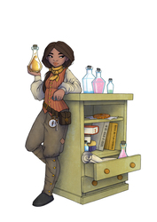

<!-- NOTE: This page is autogenerated.  -->
<!--       All manual edits will be removed.  -->

# Illustrations

**Our magical world of data science is filled with abstract ideas. Here, we aim to present illustrations where we imagine such ideas in practical forms to ease dialogues and strengthen cooperation.**
 
[[toc]]

::: tip
We are publishing these illustrations under a `CC BY­-NC-­ND 4.0` license. This means that you are free to use, share, copy and redistribute the works under just a few simple terms ([license](/about/illustrations/#license)).
:::

## Categories

### Scenery

[Click here for scenery illustrations >>](/about/illustrations/scenery.md)

### Objects

[Click here for objects illustrations >>](/about/illustrations/objects.md)

### Characters

[Click here for characters illustrations >>](/about/illustrations/characters.md)

## About

### About the aim

*«There are no rules of architecture for a castle in the cloud.»*

It's hard to imagine that Gilbert Chesterton aimed at digital clouds when he constructed his famous paradox more than a century ago. Regardless, the quote inspired us to explore an area where truly only your dreams and imaginations defines the boundaries - art.

The field of data science is filled with abstract ideas that are hard to grasp and harder to discuss, such as data value, data space, clouds and ethical dimensions.

Our aim is to visualize ideas and concepts into practical forms that make the abstract world of data science more understandable. And maybe contributing a tiny bit of soul and identity to the field on the way.

### About the creator

These illustrations are created by Ingunn B Ferstad in collaboration with the HUNT Cloud team.

We are truly appreciative that Ingunn entered the fascinating field of data sciences, and on her way established and evolved the exciting world that ends up in these illustrations. 

## License

The illustrations under this section are made available under the [CC BY­-NC-­ND 4.0](https://creativecommons.org/licenses/by-nc-nd/4.0/) license from Creative Commons. This means that you are free to share, copy and reuse the artworks in any medium or format as long as you follow a three simple terms:

(1) Give appropriate credit to the creator.  
(2) Do not use the artwork for commercial purposes.  
(3) Do not distribute modified versions of the artwork.

