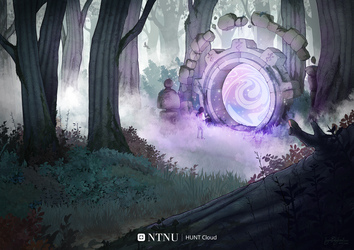
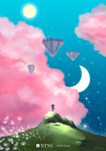
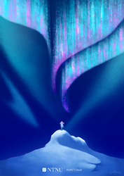
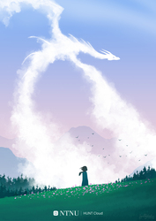
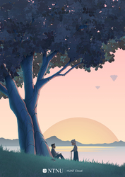

<!-- NOTE: This page is autogenerated.  -->
<!--       All manual edits will be removed.  -->

# Illustrations - Scenery

**Ingress.**
 
[[toc]]

::: tip
We are publishing these illustrations under a `CC BY­-NC-­ND 4.0` license. This means that you are free to use, share, copy and redistribute the works under just a few simple terms ([license](/about/illustrations/#license)).
:::

## The portal

. 

::: details Download

* [Full](https://assets.hdc.ntnu.no/assets/artworks/hunt-cloud_the-portal_full.jpg) - 4961 x 3508 pixels - 4,7M
* [Medium](https://assets.hdc.ntnu.no/assets/artworks/hunt-cloud_the-portal_medium.jpg) - 2715 x 1920 pixels - 3,2M
* [Small](https://assets.hdc.ntnu.no/assets/artworks/hunt-cloud_the-portal_small.jpg) - 1527 x 1080 pixels - 1,3M
* [Extra small](https://assets.hdc.ntnu.no/assets/artworks/hunt-cloud_the-portal_xsmall.jpg) - 354 x 250 pixels - 98K

**Title:** The portal  
**Creator:** Ingunn B. Ferstad, HUNT Cloud / NTNU.  
**License:** CC BY­-NC-­ND 4.0  
**Year:** 2023  
**Version:** 1.0  
**ArtworkID:** hcc-artwork6 
:::

::: details Reflections

.

:::

::: details Use

.

:::

## Explore the new world

Imagine a new world. Kind of familiar, kind of different. Where digital laboratories are built on floating islands. Where you are the explorer, and the sky holds no limit. Welcome to HUNT Cloud. 

::: details Download

* [Full](https://assets.hdc.ntnu.no/assets/artworks/hunt-cloud_explore-the-new-world_full.jpg) - 3508 x 4961 pixels - 6,5M
* [Medium](https://assets.hdc.ntnu.no/assets/artworks/hunt-cloud_explore-the-new-world_medium.jpg) - 1358 x 1920 pixels - 1,3M
* [Small](https://assets.hdc.ntnu.no/assets/artworks/hunt-cloud_explore-the-new-world_small.jpg) - 764 x 1080 pixels - 466K
* [Extra small](https://assets.hdc.ntnu.no/assets/artworks/hunt-cloud_explore-the-new-world_xsmall.jpg) - 177 x 250 pixels - 53K

**Title:** Explore the new world  
**Creator:** Ingunn B. Ferstad, HUNT Cloud / NTNU.  
**License:** CC BY­-NC-­ND 4.0  
**Year:** 2022  
**Version:** 1.1  
**ArtworkID:** hcc-artwork2 
:::

::: details Reflections

.

:::

::: details Use

We use this image to illustrate that, 

* we see our scientists as **explorers**;
* their **new world** looks kind of familiar (grass, trees, clouds) and kind of different (floating islands, pink clouds, day/night sky at the same time). Both scientists, scientific coordinators and scientific leaders should expect to spend some time to know their new world well;
* we see **data spaces as floating islands** up in the skys, and that getting a new data space is for us a bit like **getting your own island**. This is the place where your establish and organize your labs and scientific activities;
* we see **labs as buildings on the floating islands**. You can have have one to many such buildings (labs) on your data space;
* **ideas** travel between labs and data spaces with a little help scientific coordinators and our cloud community (illustrated with flower seeds in the lower left corner).

:::

## Explore the unknown

. 

::: details Download

* [Full](https://assets.hdc.ntnu.no/assets/artworks/hunt-cloud_explore-the-unknown_full.jpg) - 3508 x 4961 pixels - 9,3M
* [Medium](https://assets.hdc.ntnu.no/assets/artworks/hunt-cloud_explore-the-unknown_medium.jpg) - 1358 x 1920 pixels - 2,0M
* [Small](https://assets.hdc.ntnu.no/assets/artworks/hunt-cloud_explore-the-unknown_small.jpg) - 764 x 1080 pixels - 668K
* [Extra small](https://assets.hdc.ntnu.no/assets/artworks/hunt-cloud_explore-the-unknown_xsmall.jpg) - 177 x 250 pixels - 50K

**Title:** Explore the unknown  
**Creator:** Ingunn B. Ferstad, HUNT Cloud / NTNU.  
**License:** CC BY­-NC-­ND 4.0  
**Year:** 2023  
**Version:** 1.0  
**ArtworkID:** hcc-artwork3 
:::

::: details Reflections

.

:::

::: details Use

.

:::

## Here be dragons

. 

::: details Download

* [Full](https://assets.hdc.ntnu.no/assets/artworks/hunt-cloud_here-be-dragons_full.jpg) - 3508 x 4961 pixels - 4,1M
* [Medium](https://assets.hdc.ntnu.no/assets/artworks/hunt-cloud_here-be-dragons_medium.jpg) - 1358 x 1920 pixels - 1,1M
* [Small](https://assets.hdc.ntnu.no/assets/artworks/hunt-cloud_here-be-dragons_small.jpg) - 764 x 1080 pixels - 395K
* [Extra small](https://assets.hdc.ntnu.no/assets/artworks/hunt-cloud_here-be-dragons_xsmall.jpg) - 177 x 250 pixels - 41K

**Title:** Here be dragons  
**Creator:** Ingunn B. Ferstad, HUNT Cloud / NTNU.  
**License:** CC BY­-NC-­ND 4.0  
**Year:** 2023  
**Version:** 1.1  
**ArtworkID:** hcc-artwork4 
:::

::: details Reflections

.

:::

::: details Use

.

:::

## Tree of knowledge

. 

::: details Download

* [Full](https://assets.hdc.ntnu.no/assets/artworks/hunt-cloud_tree-of-knowledge_full.jpg) - 3508 x 4961 pixels - 4,2M
* [Medium](https://assets.hdc.ntnu.no/assets/artworks/hunt-cloud_tree-of-knowledge_medium.jpg) - 1358 x 1920 pixels - 1,2M
* [Small](https://assets.hdc.ntnu.no/assets/artworks/hunt-cloud_tree-of-knowledge_small.jpg) - 764 x 1080 pixels - 511K
* [Extra small](https://assets.hdc.ntnu.no/assets/artworks/hunt-cloud_tree-of-knowledge_xsmall.jpg) - 177 x 250 pixels - 55K

**Title:** Tree of knowledge  
**Creator:** Ingunn B. Ferstad, HUNT Cloud / NTNU.  
**License:** CC BY­-NC-­ND 4.0  
**Year:** 2023  
**Version:** 1.1  
**ArtworkID:** hcc-artwork5 
:::

::: details Reflections

.

:::

::: details Use

.

:::

