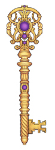

# Administer science in HUNT Cloud

**Welcome to our documentation for individuals that administer science in HUNT Cloud.**

This section is aimed at lab leaders, lab coordinators, data space leaders and data space administrators that administer science in HUNT Cloud. 

You will find practical information on lab and data space administration. See our [main documentation](/) page for other sections.

::: tip Next Ting

Lab Ting 8 is held Tuesday 14 February 2023 - 2 to 4 p.m. CET. All Lab leaders and Lab coordinators are invited.

Data space Ting 8 is held Wednesday 15 February 2023 - 9 to 11 a.m. CET. All Data space leaders and Data space administrators are invited.

[Read more >>](/administer-science/community/ting)

:::

