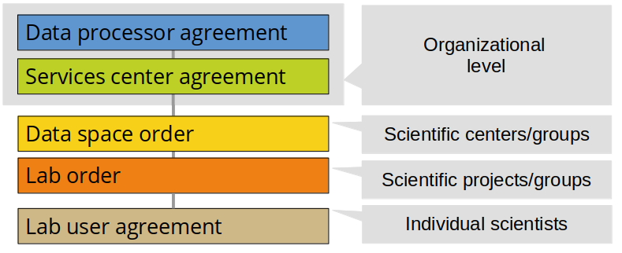

# Administrative agreements

**We believe a solid framework of documented responsibilities is a key success factor to enable your scientists with the freedom to explore. This page holds an overview of the administrative agreements in HUNT Cloud.**

As a coordinator you will balance a backstage agreement framework that is somewhat complex. Bear with us, once up and running it will provide you with significant powers.

[[toc]]

## Overview

Our activities are organized in five agreement layers:

::: tip Get going

The Data processor agreement and Service center agreement is part of our [Organizational access](/govern-science/organizational-access/) procedure, while the Data space order and Lab order is part of our [Scientific access](/administer-science/scientific-access/) procedures The Lab user agreement is part of our [user management](/administer-science/service-desk/lab-orders#add-a-new-lab-user) procedures.

:::

## Data processor agreement

The **Data controller** is your organizational unit that control your data ownership and data protection inside our services, in short the data processing. The *Data processor agreement* control these activities and is therefore placed on top of our agreement hierarchy. All other arrangements between us are incorporated into this agreement as amendments.

## Service center agreement

The **Services center** is your organizational unit that control the cloud services that you consume. The *Services agreement* details our services specifications and conditions for resource consumption, cost and billing. One or many services centers can be attached to a data processor agreement.

## Data space order

The **Data space** is your research unit that manages scientific activities across one to many labs. The *Data space order* specify cross-lab coordinators and the subscription level that defines services availability. One or many data spaces can be attached to one services center.

## Lab order

The **Lab** is your digital laboratory where your get access to cloud resources for storage, computation and transport of data. The *Lab order* specify a lab leader and lab coordinator that can allocate resources and authorize users inside their lab. One or many labs can be attached to one data space.

## Lab user agreement

The **Lab user** is a scientist that can access data and cloud services in one lab. The *Lab user agreement* specify the acceptable use policy for our services. One or many lab users can be attached to one lab. One lab user can be attached to more than one lab, each such authorization requires a unique lab user agreement.

