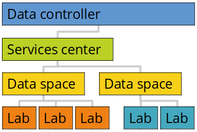

# Administrative agreements

**We believe a solid framework of documented responsibilities is a key success factor to enable your scientists with the freedom to explore. This page holds an overview of the administrative agreements in HUNT Cloud.** 

As a coordinator you will balance a backstage agreement framework that is somewhat complex. Bear with us, once up and running it will provide you with significant powers.

::: tip Get going
Head over to our [get going](/administer-science/get-going) page for a step-wise guide on how to start your agreement quest, and the [FAQ](/administer-science/agreements/faq/) section for frequently asked agreement questions.
:::

[[toc]]

## Overview

Our activities are organized in the following agreement hierarchy: 

1. The **Data controller** is your organizational unit that control your data ownership and data protection inside our services, in short the data processing. The *Data processor agreement* control these activities and is therefore placed on top of our agreement hierarchy. All other arrangements between us are incorporated into this agreement as amendments.
2. The **Services center** is your organizational unit that control the cloud services that you consume. The *Services agreement* details our services specifications and conditions for resource consumption, cost and billing. One or many services centers can be attached to a data processor agreement. 
3. The **Data space** is your research unit that manages scientific activities across one to many labs. The *Data space order* specify cross-lab coordinators and the subscription level that defines services availability. One or many data spaces can be attached to one services center.
4. The **Lab** is your digital laboratory where your get access to cloud resources for storage, computation and transport of data. The *Lab order* specify a lab leader and lab coordinator that can allocate resources and authorize users inside their lab. One or many labs can be attached to one data space.
5. The **Lab user** is a scientist that can access data and cloud services in one lab. The *Lab user agreement* specify the acceptable use policy for our services. One or many lab users can be attached to one lab. One lab user can be attached to more than one lab, each such authorization requires a unique lab user agreement.

We will need all agreement levels in place before to activate your new lab environment. 

We know, this is lots of papers. On the bright side, although complex at the first glance, the prepared structure provides a solid framework for flexibility. 

And keep in mind, the more layers already in place, the simpler it is to get compliant labs up and running. 

## Data processor agreement

The data processor agreement is on top of our agreement hierarchy because it regulates one of the most important asset in digital science: your trustworthiness towards your research participants (data protection and data privacy).

The remaining agreements on this page are therefore formally incorporated into the data processor agreement as attachments. 

### About

In short, the data processor agreement defines that your organization owns the data that you upload and generate in HUNT Cloud. And it specifies privacy and security controls that are to be in place to protect your data. 

The data processor agreement allows your research to be compliant with the Data Protection Directive from EU (GDPR) and relevant Norwegian laws and regulations, including partly compliance with the Norwegian «*Norm for informasjonssikkerhet*».

### Signatories

The data processor agreement is formally agreed between your host organization that control your data (data controller), and our host institution that process the data on your behalf (data processor). 

Your signatory will be the individual that is authorize to control your data on behalf of your organization. This may range from top management via head of departments to individuals in various organizational units.

::: tip

For NTNU, we recommend Head of Departments as signatories on our internal data processor agreements (see 'enighetsavtale' below).

:::

Our signatory will be the Head of Department at our department, the [Department of Public Health and Nursing](https://www.ntnu.no/ism/ledelse) at the Faculty of Medicine and Health Sciences, NTNU. 

### Getting started

We need to ensure that we have an active data processor agreement with your host organization or department (for NTNU) before we can process your data space and lab orders. Head over to the [get going](/administer-science/get-going/data-processor) section for a step-by-step guide on how to start.

### Required information

[HUNT Cloud Data Processor Agreement Form](https://assets.hdc.ntnu.no/assets/agreements/hunt-cloud-processor-form.txt)(txt)

We use information from the text file above to render the final data processor agreement. Please download the form, update the information and send us the text file for agreement rendering in the data processor section of our [service desk](/service-desk/data-controller-orders/#new-data-processor-agreement). Click the "Clarification of the form fields" below for more information on each field.

::: details Clarification of the form fields

The following form fields are including in the "HUNT Cloud Data Processor Agreement Form" version 3.7.

**Data controller**

- *controller.name:* This is the name of your organizational unit that will sign the agreement. For NTNU controllers, this is the name of your department.
- *controller.affiliation:* Include additional organizational affiliations if relevant. For NTNU controllers, this is the name of your faculty.
- *controller.institution:* This is your main institutional name. For NTNU controllers, this is NTNU. 
- *controller.enterprise.no:* This is your enterprise number. For NTNU controllers, leave blank. 
- *controller.part.of.ntnu:* State "yes" if you are part of NTNU and "no" if you are not. NTNU agreements differ slightly in their wording and holds a different dispute resolution clause.

**Signatory official** 

This is the name of the individual that are authorized to sign the data processor agreement on behalf of the institution. For NTNU, this is the head of your department.

**Administrative contact person**

This is the name of the individual that will coordinate administrative aspects of the data processor agreement. The individual will act as the deputy contact for other contacts if needed.

**Scientific contact person** 

This is the name of the individual that will coordinate scientific aspects between the data controller, services centers, data space leaders and HUNT Cloud. This include services developments, knowledge transfers between data spaces, reporting etc. For NTNU, this is typically a research adviser at the department.

**Data protection officer**

This is the name of the individual that will coordinate privacy aspects of the data processor agreement. There is an expectation of direct communication in the case of suspected or confirmed data breach. For NTNU, leave this field blank as we will include the Data Protection Officer at NTNU.

**Information security officer**

This is the name of the individual that will coordinate information security aspects of the data processor agreement. There is an expectation of direct communication for evaluation of major system changes and audit results. For NTNU, leave this blank as we will include the Security Officer at NTNU.

**Security incident response**

This is the emergency response contact during suspected or confirmed data loss or data breach. Emergency numbers are expected to respond around the clock. For NTNU, leave this field blank as we will include NTNU's Security Operations Center (SOC).

**Agreement type**

This section defines the overall agreement type (data processor or data subprocessor agreement). See FAQ section below whether HUNT Cloud will be your "data processor" or your "data subprocessor". Specify "Databehandler" for data processor, and "Underdatabehandler" for data subprocessor. 

**Organization type**

This section defines the dispute clause. Specify "Public" if your organization is organized under a Norwegian Ministry, such as an University, Health trust, Municipality etc. Specify "Private" for other options. Public organizations will use the Ministry of Education and Research (KD) for resolutions, while disputes with private organizations will be resolved in court. 

**Purpose of processing**

This information is aimed at the overall processing purpose of the information under your data spaces and labs. This is addition to the information on the processing in individual labs that are collected in our lab orders.

- *purpose.pro:* This defines the overall purpose of the planned data processing, such as research, health services, innovation etc. For NTNU, state "Research" for normal cases.
- *purpose.cat:* This defines the broad categories of data subjects of the processing. This may for example be research participants, patients etc. NTNU controllers, "Research participants" is the most common category.
- *purpose.con:* This specify the content of personal data included in the processing. Se example in Norwegian below: 

*Kategorier av personopplysning vil kunne omfatte helseopplysninger, genetiske opplysninger og biometriske opplysninger jf. Personvernforordningen artikkel 9 (1) som selvrapporterte helseopplysninger, undersøkelsesdata, bildedata og uttrekk fra journalopplysninger.*

**Administrative fields**

-  *Agreement date:* Leave this field blank. This is the approximate start date of the agreement. We use this to track re-negotiations every two years. For the record, the agreement starts formally when it is signed by both parties.
- *Agreement tag:* Leave this field blank. This is our internal tag (identifier) for your organization.

**Send us the text file for activation**

When you have added the information to the text file, forward the text file to us on in the data controller section of our [service desk](/service-desk/data-controller-orders/#new-data-processor-agreement).

:::

### Agreements within NTNU

Data processor agreements are agreed between enterprises. This means that we cannot sign data processor agreements between NTNU departments. 

To allow for documented security measures, we have therefore developed a Memorandum of understanding (MoU) for internal data processing that we call "enighetsavtale". We sign these at the Department level. 

The document clarifies the same rights and protections as our regular processor agreement with one exception: Disputes will be resolved with binding effect by NTNU's management with our Rector as the last instance.

### Data subprocessor agreement

Sometimes you may be processing data on behalf of others. This is the case when the processing purpose if defined by another organization than your host organization (contract research). 

To illustrate, this may be the case if you provide analytical expertise to a project that is controlled/managed by another organization, and you want to transfer their data to your lab to take advantage of your established tools and resources.

In such circumstances your data provider may be the "data controller" and you may be the "data processor". If so, HUNT Cloud may be the "data subprocessor" (data underbehandler). We have dedicated agreement templates for such setups that gets defined under "Agreement type" in the agreement form fields (see required information above). 

[Contact us](/contact) if you wonder which of the two agreement types that fits your processing needs.

### Custom processing templates

Your host organization may prefer to use their own data processing agreement template. This is fine with us as long as the template is compliant with requirements set forth in GDPR, other relevant laws, ISO 27001 and 27701, and that we are able to comply with your organization's security requirements. 

Note that such templates will need involvement from legal teams from both sides. [Contact us](/contact) for time estimates of such arrangements.

## Services agreement

The services agreement regulates how cloud resources are controlled and billed across data spaces and labs. 

The aim of this agreement is to establish a unified way to control services and resources, and to simplify the establishments of data spaces and labs attached to the this agreement.

### About

The services agreement regulates conditions related to the use of our cloud services. This includes specifications of the services, support responsiveness and service levels. The agreement do also specify cost, metering and billing.The following attachments are included to the agreement: 

- services specifications
- service levels
- price list
- list of attached data spaces and labs
- data space order template
- lab order template
- user agreement template
- contact list

### Signatories

The services agreement is signed by the services center leader, your data controller and us. The signatory level depends on your organization. Services agreement may be signed on the same level as data processor agreements, data spaces or somewhere in between.

::: tip NTNU

For NTNU, services agreements are signed at the Department level with Deputy Head of Department for Research as Center leader.

:::

### Getting started

We need to ensure that we have an active service center agreement to attach your data space and lab orders.

We already have many such agreements in place for speedy processing. If you know your organization holds an active service center agreement with us, let's jump to the [data space order](agreements/overview/#data-space-order).

[Contact us](/contact) if you don't know if your organization or research center holds an active services agreement, or to get started on a new agreement. For new agreements it will bootstrap the process if your help us with the required information below.

### Required information 

[HUNT Cloud Services Agreement Form](https://assets.hdc.ntnu.no/assets/agreements/hunt-cloud-services-agreement-form.txt)(txt)

Please download the form, update the information and send us the text file for agreement rendering in the data processor section of our [service desk](/service-desk/data-controller-orders/#add-a-service-center). Click the "Clarification of the form fields" below for more information on each field.

::: details Clarification of the form fields

The following form fields are including in the "HUNT Cloud Services Agreement Form" version 1.3.

**Services center short name**

This is the short name or abbreviation for your services center. We use this name in day to day communication. Leave blank if you prefer us to compose a tag from your center name.

**Services center organization**

This is the full name of your organizational unit that will establish the services center. The services center will be in control of all attached data spaces and labs.

**Data processor name**

This is the name of the organization that holds the data processor agreement (or "enighetsavtale" within NTNU) with HUNT Cloud for which your services center will be attached. [Contact us](/contact) if you are uncertain if your host organization holds such an agreement or under which agreement your data space should be attached.

**Services center leader**

This individual is authorized by the data controller to lead the services center. The role include a responsibility to authorize new data spaces under the services center, and the overarching responsibility to ensure that data spaces pay for the resources they consume.

**Administrative coordinator**

This is the name of the individual that will coordinate administrative aspects of the services center agreement, such as updates to this agreeement. The individual will act as the deputy contact for other contacts if needed, including the ability to authorize new data spaces under the services center. 

**Lagtun invitation**

This is the name of the individual that will receive invitation to Lagtun during the HUNT Cloud Tingweeks.  [Lagtun](/tingweek/lagtun) is the Ting that appoints time to govern the scientific development of HUNT Cloud.

**Signatory official**

This individual is legally entitled to accept the financial side of the Cloud Service Orders on behalf of the Client institution.

**Send us the text file for activation**

When you have added the information to the text file, forward the text file to us on in the data controller section of our [service desk](/service-desk/data-controller-orders/#add-a-service-center).

:::

## Data space order

The intention of the data space is to simplify management of several labs under one scientific center or research group. The structure allow for roles, controls and reporting to be unified across a lab portfolio.

### About

The agreement specifies a data space that is attached to a services center. The data space list roles and define access to cloud resources that is unified across all labs that are attached to the data space. The aim is to simplify responsibilities, communication and reporting across many labs.

The data space order is co-signed by the services center leader and the data space leader.

### Invoice profile

Each data space needs to specify at least one invoice porfile where services gets billed. Depending on your data space subscription, you can establish several profiles (BLUE subscription layer). [Click here](/administer-science/agreements/downloads/#data-space-order) to download the form. 

### Getting started

We need to ensure that we have an active services center agreement with your host organization or department (for NTNU) before we can process your data space order.

When the services agreement are in place, it's quite simple to order a data space: (1) Download the [data space order](/administer-science/agreements/downloads/#data-space-order) and the [invoice profile](/administer-science/agreements/downloads/#invoice-profile), (2) fill in the fields (descriptions on the download page), (3) and send the order and invoice profile to us via the service center section in our [service desk](/service-desk/service-center-orders/#new-data-space).

## Lab order

The lab order is used to establish a digital laboratory where you can store and analyze data.

### About

The lab order specifies the name of the lab, under which data space the lab is attached, names and contact information for the lab leader and the lab coordinator. 

The lab coordinator is authorized by the lab leader to approve certain tasks, such as allocate or upgrade resources and order internal kistas. 

The agreement do includes GDPR related fields such as purpose of the processing in your lab. We use this information to provide an overview to data spaces and data controllers for processes under their control.

The lab order agreement is signed by the data space leader and the lab leader (third-party verification).

### Getting started

We need to ensure that we have an active data space order with your research group or research center before we can process your lab order.

When the data space order are in place, it's quite simple to order a lab: (1) Download the [lab order](/administer-science/agreements/downloads/#lab-order), (2) fill in the fields (descriptions on the download page), (3) and send us the lab order in the data space section of our [service desk](/service-desk/data-space-orders/#new-lab). 

[Contact us](/contact) for a chat before you start the process so we can learn about your science and together discuss how to best onboard your scientists and adjust and tune your storage and compute resources to best make your science fly.

## User agreement

The user agreement authorizes access for individual researchers to one specified lab. 

### About 

The agreement clarify the acceptable use policy for HUNT Cloud and responsibilities associated with lab access. The agreement is signed by the lab leader and the lab user (third-party verification). 

### Getting started

When you have ordered a lab, it's quite simple to add users: (1) Download the [user agreement](/administer-science/agreements/downloads/#data-space-order), (2) fill in the fields (descriptions on the download page), (3) and send the agreements to us via the lab section in our [service desk](/administer-science/service-desk/lab-orders/#add-a-new-lab-user) for user activations. 

