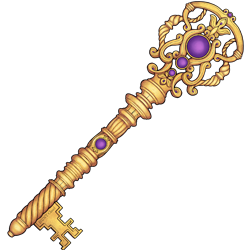

# Administer science in HUNT Cloud

**Welcome to our documentation for individuals that administer science in HUNT Cloud.**

This section is aimed at those that administer science in HUNT Cloud. See our [main documentation](/) page for other sections.

See our [scientific access](/administer-science/scientific-access/) section for guidance on how new scientific centers and research groups can enable HUNT Cloud resources for their scientists.

<NavitationCards :buttons="$frontmatter.buttons" />

