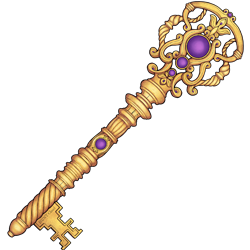

  

    <h1>Administer science in HUNT Cloud</h1>
    
Welcome to our documentation for individuals that administer science in HUNT Cloud.

  

  

      
    

  

      
This section is aimed at those that administer science in HUNT Cloud. See our <a href="/">main documentation page</a> for other sections.

    

  <NavigationCards :buttons="$frontmatter.buttons" />

