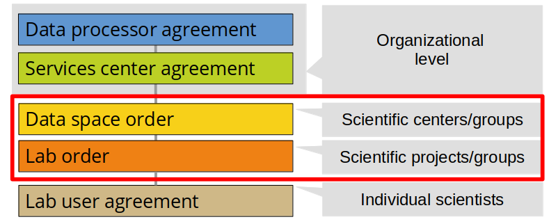

# Scientific access

**This page provides a guide for scientific centers and groups that wants to enable HUNT Cloud resources for their data scientists.**

::: tip Cut to the chase

[Click here](#order-scientific-access) to jump directly to the service orders that needs to be in place before you can onboard your scientists to HUNT Cloud.

:::

[[toc]]

## Background

We have five agreement layers in HUNT Cloud (illustration below). This guide covers Data space orders and Lab orders that needs to be in place before you can onboarding your scientists and data explorers.

::: warning Organizational access dependency

Both your Data space order and Lab orders are attached to your organizations Service center agreement. Your organization do need to activate [organizational access](/govern-science/organizational-access) to HUNT Cloud before you can start your scientific onboarding. [Contact us](/contact) if you are unsure of your current organizational agreement status or need guidance on how to start your organizational onboarding. 

:::

## Service orders

Data space orders and Lab orders are formally attached to your organizations Service center agreement as Service orders. These orders defines the type of services you request and those at your side that are responsible for services.

### Data space order

**A Data spaces in HUNT Cloud is the administrative unit that coordinate scientific activities across one or many labs. The aim is to simplify your management.** 

Your Data space is the management account where your labs and their attached services are managed, controlled and billed. A Data space subscription is therefore required before individual labs and services can be ordered.

Your Data space do also identify your management team that we interact with to ensure smooth activities across your labs, and your Data space subscription level defines the service level that is available to the labs under your control. 

::: details Data space order resources

* [HUNT Cloud Services specification](/administer-science/services/specifications/) specifies the Data spaces services details. 
* [HUNT Cloud Price list](/administer-science/prices/pricelist/) specifies the Data space subscription cost. 
* [HUNT Cloud Data space order](/administer-science/agreements/downloads/#data-space-order)
* [HUNT Cloud Invoice rofile](/administer-science/agreements/downloads/#invoice-profile
:::

### Lab order

**A lab in HUNT Cloud is a digital environment (laboratory) where your scientists access their scientific tools and resources for storage, computation and transport. You may attach one to many labs under your Data space**

By default, a lab consist of a security framework that we control, and a home machine where your scientists can store data and run analysis. 

Your lab leader or lab coordinator choose the initial size of the home machine and the initial storage your want to start with. From there they can adjust the machine size, add additional machines, and expand the storage resources throughout the project period. 

::: details Lab order resources

* [HUNT Cloud Services Specification](/administer-science/services/specifications/) specifies the Lab services and individual resource services details. 
* [HUNT Cloud Price calculator](/administer-science/prices/calculator/) exemplifies the Lab subscription cost and the cost for individual services. 
* [HUNT Cloud Price list](/administer-science/prices/pricelist/) specifies individual prices for the Lab subscription and individual services. 
* [HUNT Cloud Machine types](/administer-science/services/machine-types/) lists available machine types that can be deployed either as home machines or additional machines to the lab. 
* [HUNT Cloud Lab order](/administer-science/agreements/downloads/#lab-order)
:::

## Decision support

**Time to grab fresh coffee!**

There are a number of small decisions to be made in your first order. We recommend that you set aside 30 minutes to fill out the three PDF forms within the HUNT Cloud Scientific Access Bundle in the PDF link supported by the decision support below: 

1. Data space order
2. Invoice profile
3. Lab order

::: details Data space order decision support

**Service center** 

*Find your Service center name*

[Contact us](/contact) for a quick clarification if you are unsure of your Service center name. For NTNU, your service center name is the acronym of your Department, such as `ntnu-ism`, `ntnu-idi` etc.

*Identify your Service center leader*

[Contact us](/contact) for a quick clarification if you are unsure of your Service center leader. For NTNU, your service center leader is the Deputy head of Research (Nestleder forskning) of your Department.

**Data space name**

We recommend that you invest some time to identify a short and powerful name for your data space. Name recognition may help strengthen your scientific brand when you communicate with colleagues, collaborators and other interested parties. 

*Data space short name*

We will use your Data space short name in communication with your team and when we communicate with your department and faculty. Abbreviation of centers, groups and labs are often used. 

*Data space full name*

This is the official name that we will use in reports, invoices and similar.

**Data space leader**

This is the individual that is authorized to make decisions for all labs in the Data space and pay fees for the accrued costs under the Data space. Scientific center leaders and/or principal investigator do often hold this role.

**Administrator roles**

You have the option to list specific individuals as our point-of-contact for dialogues on agreements, data, technologies, training of new users and financial aspects. Leave this field BLANK if you would like the Data space leader to hold this role.
 
For larger center and groups, we see these roles as senior positions that administer and ensures a common practice for e.g. your data handling across your many labs and collaborations. [Click here](/administer-science/roles/) to read more about the different roles.

**Subscription level**

*Subscription level*

Your Data space subscription level decide the degrees of freedom for your scientists. Our [services overview](/administer-science/services/overview/#data-space) provides a summary of different features, the [services specifications](/administer-science/services/specifications/) holds the detailed description, and the [price list](/administer-science/prices/pricelist/) specify the yearly cost.

We recommend that you start with the free-of-charge WHITE subscription level if you are unsure of which level you should choose as you may easily upgrade this later. [Contact us](/contact) if you need guidance in your selection process.

*Subscription length*

You may choose 1 or 3 year subscription length. The cost of your subscription will be metered in full on your first invoice.

**Signatures**

You need to get a signature from the Service center leader, typically by saving the PDF and forwarding it on email -after- you have completed the remaining pages, and then you need to get the signature of the Data space leader.

**Great work! Now let's jump to the Invoice profile form.**
:::

::: details Invoice profile decision support

The Invoice profile specify where accrued costs for you Data space and attached labs should be invoiced. You need at least one Invoice profile to get going.

**Data space**

Repeat the Data space short name and the Data space leader that you just stated above.

**Invoice unit**

Leave this blank as DATA SPACE is the default. You may register additional invoice profiles later if you want to separate lab costs in individual bills.

**Invoice contact**

This individual is our point of contact for practical aspects related to the billing, typical a financial officer at your department.

**Invoice address (outside NTNU)**

For organizations outside NTNU, specify the address where invoices are to be sent.

**Account information (inside NTNU)**

Specify "K.STED" and "PROJECT NUMBER" for your data space. These fields are mandatory for NTNU.

**Billing information (outside NTNU)**

* PEPPOL BIS: This is the international identification number for your organization. [Click this link](https://directory.peppol.eu/public/locale-en_US/menuitem-search) to search for your id (opens a new window).
* REFERENCE NUMBER: This is your order number with HUNT Cloud that ensures that the invoice is reaching you inside your organization. The format varies between organizations.

**Pilot period**

Leave this blank. 

**Free quota**

Leave this blank. 

**Advance payment**

You may make an advance payment to your invoice profile. The payment is applied to the accrued costs. If the payment is larger than the amount currently owed, it will reduce the next automatic charge. For clarification, a positive account balance due to advance payments will not be refunded at the end of services.

* AMOUNT: This is the optional amount in NOK that will be payed at the initiation of the invoice profile.

**Spending limit**

You may add a monetary spending limit to your account.

* LIMIT: If applicable, specify a maximum spending limit in NOK that can be consumed over the spending period (see below).
* TYPE: For the soft and hard limit type, notifications will be sent to the Invoice Contact and Data Space Leader at consumption of approximately 50%, 90% and 100%. For the hard limit type, services will be temporarily deactivated if consumption exceeds the limit.
* PERIOD: This is the period in days for which the limit is applied. The default is per ninety days.

**Signatures**

Invoice profiles are signed by Account signatory. This is the individual that is authorized to operate the account information specified in the invoice profile on behalf of their organization, typically the Data space leader. 

Co-signature from HUNT Cloud is required to effectuate i Pilot period and/or Free quota.

**Great work! Now let's jump to the Lab order.**

:::

::: details Lab order decision support

**Data space**

Repeat the Data space short name and the Data space leader that you just stated above.

**Lab name**

Invest some time to identify a cool, catchy or powerful name for your lab. This may help you strengthening your scientific brand. This will be visible for all your scientific collaborators. We use the name when we communicate with your lab colleagues. 

- *Short name*. This is the short name or abbreviation for your lab, similar to the Data space short name. We will use this name in day to day communication.
- *Full name*. This is the full name of your new lab. 

**Lab leader ad lab coordinator**

You need to identify one lab leader and one lab coordinator that will manage day-to-day activities in your lab, including adding new lab users and adjusting lab resources. 

The lab leader and lab coordinator are our point of contact in the lab for dialogue and help, as well as the point of contact for your Data space administrator team.

The Data space leader may also be listed as a Lab leader. It is common to list a senior scientist that manages the day-to-day analytical activities in one of these roles.

**Lawful processing**

We use the Lab order to document activities in the lab on behalf of your host organization. 

- *Ethical approval*. If applicable, specify one to many ethical approvals that governs your processing. 
- *Privacy justification*. If applicable, specify the legal ground for the processing under GDPR, such as Article 6 or 9. 
- *Purpose of the processing*. If applicable, specify the purpose of the processing such as research, health service, innovation etc 
- *Categories of data subjects*. If applicable, specify the broad categories of data subjects such as research participants, patients etc. 
- *Personal data content*. If applicable, specify the personal data content included in the processing such as "self reported health information, genomics information, medical images, information from medical records" etc.

**Signatures**

You need to get a signature from your Lab leader, typically by saving the PDF and forwarding it on email, and then add the signature of the Data space leader before you submit the final agreement to HUNT Cloud on [email](contact) for Lab activation.

:::

[Contact us](/contact) if you think we can provide additional guidance. We are more than happy to help!

## Order scientific access

::: tip First time access:

[HUNT Cloud Scientific Access Bundle](https://assets.hdc.ntnu.no/assets/agreements/hunt-cloud-scientific-access-bundle.pdf) (PDF)

**Steps:**

1. Click on the PDF-link above. This file contains a (i) Data space order, an (ii) invoice profile, and a (iii) Lab order. You need all three to get going.
2. Fill out the needed information and save the PDF on your local computer.
3. Send us the saved PDF as an [email](/contact) attachment to get going. Expect an email confirmation for the received order. 

**Allow for a few days in processing time from your order is sent until you can order onboard of your first lab user.**
:::

## FAQ

See our [Scientific access FAQ](/administer-science/scientific-access/faq/) for frequently asked questions about scientific access to HUNT Cloud.

