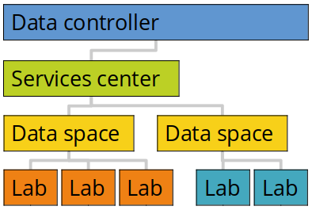
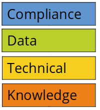
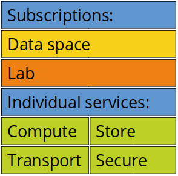
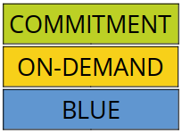

# Services model

**The new services model in HUNT Cloud was introduced 1st July, 2021. The aim has been to simplify your path to complex cloud powers. The result is a new way to manage digital laboratories.**

::: tip Summary

* The service model introduces a new way to control and manage labs via "Services centers" and "Data spaces". This setup also includes a new way to price services in labs.
 
:::

[[toc]]

## About

Scientists deserve elegant and predictable services on their quest to change the world for the better! And they deserve solutions that bring people together for fun and significant collaborations.

As our cloud community has been rapidly growing in both size and complexity, we saw a possibility to rethink our services model to keep up with the much appreciated growth. Here we humbly present the results.

We have put a lot of thinking into these changes with a clear intention to simplify access to great scientific services. We are thankful for all the in-depth discussions and feedback from the community on the way.

The result is an upgraded services model that includes a new way to organize and manage digital laboratories (data spaces), a way to separate organizational aspects from scientific activities (services centers), and a new way to price scientific cloud services that we hope will give you both flexible access to resources and services that is sustainable over time. 

### New management model

We are introducing two new management units: Services centers and Data spaces. The intention of the new organization is to: (1) simplify onboarding of new labs, (2) simplify management of many labs under one research group, and (3) separate contractual services aspects from scientific activities. 
 

**Services center** is a new cloud unit intended for the department level that regulates how cloud resources are controlled, priced and billed across data spaces and labs. This is controlled in a new [services agreement](/administer-science/agreements/overview/#services-agreement) that includes the services specification and price list. Services centers are attached to data controllers.

**Data space** is a new cloud unit that is intended for the research center and research group level to simplify management of one to many labs, including cross-lab coordination, reporting and billing. Data spaces are now attached to a services center via a simple [data space order](/administer-science/agreements/downloads/#data-space-order).

**Lab** is still the same place where you can explore and discover together with your team: you collaborate, store and analyze your data inside a digital laboratory. No changes, except that the registration of new labs are simplified into a quick to complete [lab order](/administer-science/agreements/downloads/#lab-order).

To summarize, the separation of scientific aspects (data spaces and labs) from contractual complexity (data controller and services centers) allow for a simplified and quick way to boot up your data space and add new labs into your portfolio. The practical aspect is that we will need new agreements with all labs, and new agreements with data spaces and services centers. 

### New coordinator roles

One intention with data spaces is to simplify coordination and knowledge transfers between labs under the same research group or center. Based on discussions from our last two coordinator tings we are now introducing [cross-lab coordinators](/administer-science/roles) for the following areas: 

* The **compliance coordinator** is our point of contact for issues related to agreements and compliance evaluations such as DPIA and ethical approvals inside the data space. The compliance coordinator can place lab orders and acts as deputy for other contacts when needed, including for the data space leader.

* The **data coordinator** is the new point of contact for issues related to data inside the data space, including transfers, archiving, backups and similar for labs under the data space.

* The **technical coordinator** is the new point of contact for issues related to technical aspects for cloud services and analytical tools, including configurations, adjustments and maintenance for labs under the data space.

* The **knowledge coordinator** is the new point of contact for knowledge transfers between lab users across labs under the data space, including know-hows related to user onboardings, common tasks, practical analytical setups, documentation etc.

A second goal of this setup is to enhance exchanges of scientific coordination expertise between data spaces within similar roles. We are already looking forward to [Tingweek #4](/tingweek/) in October!

### New services model

We are introducing new [services specifications](/administer-science/services/specifications/) with the intention to increase the predictability and to tune expectations of available services. The document is attached to the services agreement and includes the following service categories:

The services specifications include three new [data space subscription levels](/administer-science/services/overview/#data-space) named by colors. These differ in their individual service availability, resource prioritization, costs for individual resources etc. In short, 

* The **WHITE** data space subscription is intended to help small research groups into scientific cloud computing.

* The **ORANGE** data space subscription is intended to help medium sized research groups and small centers manage their portfolio of labs and benefit from volume discounts of storage.

* The **BLUE** data space subscription is intended to help large research groups and centers benefit from unified portfolio management, volume discounts on storage, cost-effective access to community resources (BLUE machines) and participation in our continuous development.

### New price model

Our purpose is to elevate data for a better world. To do so, we have chosen to spend our time helping scientists with digital tools on their quest. Money is a means towards this goal, not an end. We are part of a public university that runs these services with zero profit. 

In that context, we have been thinking hard about how to best establish a model that takes into account the diverse needs of our community members. 

Our solution is a model that tries to balance the need for financial financial predictability with scientific flexibility with three different prices: commitment prices, on-demand prices and BLUE prices. 

* **COMMITMENT** prices allow you to prepaid for services for one or three years. The intention is to allow for stability and predictable prices on services that you rely on.

* **ON-DEMAND** prices allow you to allocate resources that you pay for on a "per day" basis. The intention is to allow for flexibility in accordance with shifting needs in your research project.

* **BLUE** prices are reduced prices available on the BLUE data space subscription level. The intention is to allow for utilization of "common pool resources" and allow for low-cost flexibility.

For storage, we have a **VOLUME DISCOUNT** that is automatically calculated from all allocated terabytes across all labs attached to one data space. The intention is to encourage large data collections in your lab portfolio.

Details on how costs are measured (metered), adjusted and billed are included under each service chapter in our [services specifications](/administer-science/services/specifications). 

::: tip PRICE LIST

Details on the cost for individual services are included in our price list.

[Click here to see the price list](/administer-science/prices/pricelist)

:::

Three notes on the transition to new price model: 

* Services and resources that are allocated to established labs per 1 July 2021 will be given a pilot period until 1 January 2021 before the new prices will be metered and billed (see timeline below).

* New services or adjustments made after 1 October 2021 will be metered and billed in accordance with the new model. 

* Prepayments made between 1 January 2020 and 1 July 2021 will be forwarded as Free Quota for the remaining of their project period.

We expect prices and services specifications to be adjusted three times per year based on discussions in our [Tingweeks](/tingweek/).

### Continuous development

For the record, making a new model for how to organize digital laboratories and digital science is hard. We have given this our best shot in a direction that we think will elevate the scientific significance of our community. However, this is by no means perfect. 

The current model must be seen as work in progress under our continuous development principle. We have already allocated time in our next [Tingweek](/tingweek/) so we together can think up how to further improve the model and advance our common quest to elevate data for a better world! 

## Timeline

The new services model was announced 1 July 2021 and introduction to new users from 1 October 2021. Existing users converted at 1 January 2022.

## Contact us

Well aware of [Tesler's law](https://en.wikipedia.org/wiki/Law_of_conservation_of_complexity) we know that this may feel complex. [Contact us](/contact) for questions and discussions related to the new services model so we can guide you on your journey of exploring data for a better world.

