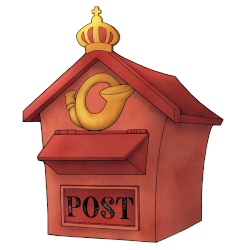

# Contact us

### General requests

Click the blue button to contact us for information, dialogues on how your science may prosper from our services, how to establish your first lab, how we protect your data etc. - or just to share the joy and excitement of data-driven science!

<GRButton form="general_contact_request" />

### Service desk for active users

::: tip Faster response

To speed up your answers and deliveries, check if your order is predefined in our service desks for [do science](/do-science/service-desk), [administer science](/administer-science/service-desk) and [govern science](/govern-science/service-desk).

:::

### Cloud community for active users

Come join us at our community cafe ([hunt-cloud.slack.com](https://hunt-cloud.slack.com)) to chat with lab users from other labs and us at HUNT Cloud. [Click here](/do-science/community/) to learn more.

### EMERGENCIES

Report ongoing data breach or data loss to [soc@ntnu.no](mailto:soc@ntnu.no) and phone [906 64 350](https://innsida.ntnu.no/wiki/-/wiki/English/NTNU+SOC+-+Digital+security).

### Threats and vulnerabilities

Report potential threats, vulnerabilities and adverse events by clicking the blue "Contact HUNT Cloud" button above.
