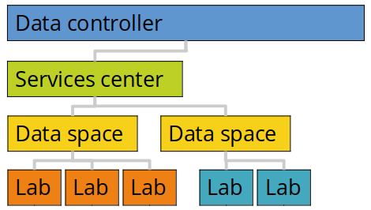

# New services model

**We are introducing our new services model from 1 July 2021. This will introduce several changes for lab leaders and lab coordinators.**

::: tip Summary

* The service model introduces a new way to control and manage labs via "Services centers" and "Data spaces". This setup do also include a new way to price services in labs.  

* Our intention is to simplify access to labs and data spaces as soon as a service center is established, and to ensure predictable prices that allow for both access to reliable resources and sustainable services.  
 
* We will kindly ask all labs to sign a new set of agreements as soon as possible, and to help us organize your activities into data spaces and services center. This needs to be completed before January 2022.  

* New labs will be required to use the new agreements from July 2021. Existing labs needs to upgrade from October to adjust resources, and all labs needs to upgrade before January 2022 to continue their services.  

[Click here](/services/new-services-model/#getting-started) to get started with the upgrades.

:::

[[toc]]

## About

Scientists deserve elegant and predictable services to elevate their quest towards data for a better world! And they deserve solutions that brings people together for friendly and fruitful collaborations.

As our cloud community has been rapidly growing in both size and complexity, we saw a possibility to rethink our services model to keep up with the much appreciated growth. We are humble to now present our results.

We have put a lot of thinking and our best efforts into these changes with a clear intention to simplify access to great scientific services. 

The result is a new way to organize and manage digital laboratories (data spaces), a split of financial aspects from scientific activities (services centers), and a new price list that aims to mirror the need for flexibility in rapidly changing collaborations and scientific environments. 

### New organization 

We have introduced two new management units: 

- **data spaces**
- **services centers** 

**Data space** is a new unit where you attached and manage one to many labs for simplified cross-lab scientific coordination, reporting and resource management. The intention is to simplify and unify management of lab portfolios. For example, this allows you to attach new labs to your data space via simple [lab orders](/agreements/downloads/#lab-order).

**Services center** is a new unit that regulate how cloud resources are controlled, priced and billed across attached data spaces and attached labs. These centers signs the [services agreement](/agreements/overview/#services-agreement). Data spaces are attached to a services center via simple data space orders.
 

To illustrate, if a department is registered as a services center, research centers and research groups may deploy their own data spaces via a simple [data space orders](/agreements/downloads/#data-space-order), and their scientists may deploy their own labs via a simple [lab orders](/agreements/downloads/#lab-order). 

### New subscriptions 

We 

**WHITE**

**ORANGE**

**BLUE**

### New pricing 

Flexibility, long-term, on-demand. Pay per day. 

## Getting started

### Upgrade agreements

::: tip Checklist for a successful upgrade

* A data processor agreement or "enighetsavtaler" is in place between my department / host institution and HUNT Cloud.
* The new services agreement is in place between my department / host institution and HUNT Cloud.
* The new data space order is signed for my research groups or research center. 
* The new lab order is signed by my lab leader that includes the purpose of my processing.

:::

[Click here](agreements/overview/) to read more about our new agreement structure. [Contact us](/contact) us to get going with the new services agreement and to check status on the data processor agreement for your host institution.

### Estimate cost

We know the new price list and the various options can difficult to get around. To get going you may want to read our [services specification](/services/specifications) before you head to the [price list](/prices/pricelist). 

We have included a few [price examples](/prices/examples/) for common uses cases and a [frequently asked questions](/prices/faq) to guide you on your way. 

For existing labs, [contact us](/contact) for specific cost estimates for your environment. And for new labs, [contact us](/contact) us for assistance on price estimates for your projects. 

### More information 

[Contact us](/contact) if you are wondering how to approach the new services and price models and/or if you need more information.

::: warning Important dates 

* New labs will be required to follow the new model from 1 July 2021.
* Existing labs will need to upgrade from 1 October 2021 to upgrade or change resources or services.
* Existing labs will be required to upgrade by 1 January 2022 to continue their services.
* All labs are encouraged to upgrade to the new services model as soon as possible. [Contact us](/contact) to start the process.

:::

Well aware of the law of conservation of complexity ([Tesler's law](https://en.wikipedia.org/wiki/Law_of_conservation_of_complexity)), there is an inherent amount of complexity with scientific cloud services for sensitive data that we cannot remove or hide. 

## Detailed list of changes

The following changes was introduced 1 July 2021:

### Lab agreement update

We have updated the lab agreement (now named [lab order](/agreements/downloads/#lab-order)) do include information on "lawful processing" (ethical approvals, privacy justification etc). We do this to help your host with lists of their processing in our services. All labs will need to upgrade to the new version.

**Practical aspects:** All new will be required to use the new lab order from 1 July 2021. Existing labs needs to sign the new lab order from 1 October 2021 to upgrade or change resources, or at the latest by 1 January 2022 to continue their services.

**Dependencies:** New lab orders are dependent on a signed services agreement and an active data space. [Contact us](/contact) to start this process.

### Data space as a new unit

Data space is now introduced as a new subscription service. We do this to ease the management of one to many labs. The data space subscription defines service availability for labs. Activation of a data space will require an active services agreement (see below) and a new [data space order](/agreements/downloads/#data-space-order). 

**Practical aspects:** All new labs needs to be attached to a data space from 1 July 2021. Existing labs needs to be attached to a data space from 1 October 2021 to upgrade or change resources, or at the latest by 1 January 2022 to continue their services. 

**Dependencies:** New data spaces are dependent on a signed services agreements. [Contact us](/contact) to start this process.

### Services center as a new unit

[Services centers](/agreements/overview/#services-agreements) is now introduced as the new agreement unit that control services specifications and prices. We do this to separate financial aspects of the cloud services (services centers) from the scientific management (data spaces). Services centers are defined in our new services agreement where services specifications and prices are incorporated as appendixes.

**Practical aspects:** All new labs and data spaces needs to be attached to a services center from 1 July 2021. Existing labs and data spaces needs to be attached to a data space from 1 October 2021 to upgrade or change services and resources, or at the latest by 1 January 2022 to continue their services. 

**Dependencies:** New services agreements are dependent on a signed data processor agreement (or enighetsavtale for NTNU departments). [Contact us](/contact) to start this process.

### Services specifications update

We have updated the [services specifications](/services/specifications) with information on meter, cost, and billing of our services. The updates will be effective from 1 July 2021. The document is attached to the services agreement. 

### New price list

We are announcing the new [price list](prices/price-list) 1 July 2021. We do this to increase the sustainability and predictability of our services. [Click here](/prices/introduction) for and introduction to the price model.

The price list will be effective from 1 October 2021. Costs are metered and billed in accordance with our services specifications. The document is attached to the services agreement.

**Practical aspects:** Allocated lab resources per 1 July 2021 will be metered and billed from 1 January 2021, and new resources deployed after 1 July 2021 will be metered and billed from 1 October 2021.

**Dependencies:** The new price list is dependent on signed services agreement, data space orders and lab orders. [Contact us](/contact) to start this process.

### Billing account as a new form

We have introduced a new form with billing account information ([billing account form](/agreements/downloads/#billing-account-form)). The form is attached to a data space and may, depending on the data space subscription level, define the entire data space or individual labs as billing points.

**Practical aspects:** All new data spaces needs to register an billing account from 1 July 2021. Existing labs and data spaces needs to register an account from 1 October 2021 to upgrade or change services and resources, or at the latest by 1 January 2022 to continue their services. 

**Dependencies:** Registration of a billing account is dependent of an active data space.

### Expected adjustment

We expect to adjust the services model based on input from the [next ting week](/tingweek/#dates) (Ting week #4).

