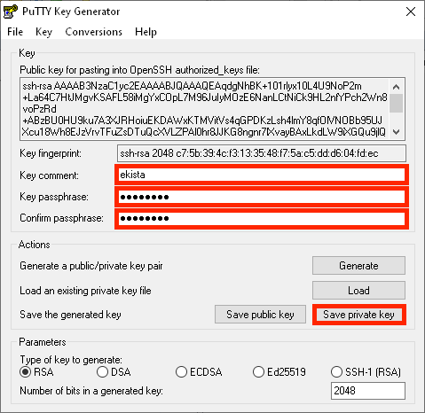

# External kista

**External kistas support labs with a simple and secure way to transfer data from an external user located outside HUNT Cloud and into a lab in HUNT Cloud.**

[[toc]]

::: tip Note
This page describes the practical aspects of external kista transfers. Head over to our [external kista FAQ](/faq/external-transfer/#external-kista) for more information on the service itself.
:::

## For external users

This section aims to give a technical description on how external users outside HUNT Cloud can connect and transfer data to our hosted SFTP service called external kista. 

In short, external kistas are short-lived and hardened [SFTP](https://en.wikipedia.org/wiki/SSH_File_Transfer_Protocol) servers dedicated to transferring data. Please [contact us](/contact) if you require more information or run into trouble.

::: warning Technical requirements

As an external user outside HUNT Cloud, you will need to meet the following technical requirements to transfer data to/from a external kista.

- [Network connection to HUNT Cloud](#network-connection-to-hunt-cloud)
- [SSH key pair](#ssh-key-pair)
- [SFTP client](#sftp-client)

All major operating systems such as Windows, MacOS and Linux are supported.

:::


### Network connection to HUNT Cloud

Your host organization might need to open it's network firewall in order for your computer to connect and transfer to the external kistas in HUNT Cloud. Below are the network details that your organizational IT department will need add such a firewall opening:

- External kista IP address: **`129.241.176.121`**
- Port range: **`2000-2128`**
- Protocol: **`TCP`**

We will select one specific port number during the kista deployment. This will be forwarded in the transfer information to your HUNT Cloud party when the external kista has been setup.

### SSH key pair

You will use a **`SSH public key`** to authenticate and access your kista instead of passwords. You must therefore send us such a key before we can deploy your kista. This section describes how to do this.

**1. Generate a SSH key pair**

We recommend that you create a dedicated SSH key pair for each kista transfer. Click on the section below for a step wise guide on how to generate a new key pair in Windows that you can use for your kista access.

::: details How to generate a RSA SSH key pair on Windows with WinSCP

[WinSCP](https://winscp.net/) is an open source data transfer client for Windows that we recommend for SFTP transfers. Download WinSCP from [winscp.net](https://winscp.net/eng/download.php) and install the software. Follow these steps to generate a RSA SSH key pair:

1. In **`WinSCP`**:
   - Click **`New Session`**
   - Click **`Tools`**
   - Click **`Run PuTTYgen`**


2. In **`PuTTY Key Generator`**:
   - Click **`Generate`** to generate a new RSA key pair.


3. In **`PuTTY Key Generator`**:
   - Enter **`ekista`** in **`Key comment`**
   - Enter a passphrase in **`Key passphrase`**
   - Enter the same passphrase in **`Confirm passphrase`**
   - Note. You will use this passphrase when you use the SSH key during the kista connection, so please make sure to remember it or store it in a suitable password manager.
   - Click **`Save private key`**



4. In **`Save private key as`** window:
   - Select a place to store the private key
   - Enter **`ekista`** as the filename
   - Click **`Save`**


5. In **`PuTTY Key Generator`**:
   - Click **`Save public key`**


6. In **`Save public key as`** window:
   - Select a place to store the public key
   - Enter **`ekista.pub`** as the filename
   - Click **`Save`**


You should now have a SSH key pair consisting of the following files:

- The private key **`ekista.ppk`**
- The public key **`ekista.pub`**

:::

::: details How to generate a RSA SSH key pair on OS X, macOS and Ubuntu

**1. Generate a new dedicated public/private rsa key pair.**

```bash 
cd ~/.ssh
ssh-keygen
```

You should see the following output: 

```
Generating public/private rsa key pair.
Enter file in which to save the key (/your_home/.ssh/id_rsa):
```

**2. Name the key.**

Name your key **`ekista`** and press enter.

```
Enter file in which to save the key (/your_home/.ssh/id_rsa): ekista
```

**3. Add a passphrase for you key.**

```
Enter passphrase (empty for no passphrase):
```

We recommend that you add a passphrase on your key. You will use this passphrase when you use the SSH key during the kista connection, so please make sure to remember it or store it in a suitable password manager.

The key shoul not be generated with the expected output: 

```
Your identification has been saved in ekista
Your public key has been saved in ekista.pub
The key fingerprint is:
SHA256:<long textstring>

The key's randomart image is:
+---[RSA 3072]----+
|       ....      |
|       +.=       |
|      o O .      |
|     o + *       |
|    . OoS.=.     |
| o . =o=o*oo     |
|. B ..+.o.E o    |
| + = ..ooo =     |
|  o   oo o=      |
+----[SHA256]-----+
```

4. **Send us your public key.**

See your new key files: 

```
ls | grep eksita
```

:::

::: details Accepted key types
We accept the following public key types:

- RSA
- ECDSA
- Ed25519
:::

**2. Share public SSH key with HUNT Cloud**

After generating the SSH key pair, please share the **public key** (not the private one) with us. Send your new public key (**`ekista.pub`**) as an email attachement to your HUNT Cloud contact that can forward your key to us as an attachment in their service order.


### SFTP client

You will need a SFTP client to connect and transfer data to the external kista. For Windows, we recommnet the WinSCP client. OS X, macOS and Ubuntu can use built in command line tools. 

In addition to the SFTP software, you will need the external kista transfer information shipped by HUNT Cloud on the time of deployment to be able to connect.

::: tip Access information from HUNT Cloud
You will need the following information from HUNT Cloud to connect to your kista:

- **`Host name`**
- **`Port number`**
- **`User name`**
:::

Below is a guide on how to connect using the WinSCP SFTP client on Windows.

::: details How to connect to an external kista on Windows with WinSCP

1. In **`WinSCP`**:
   - Click **`New Session`**


2. In the **`Login`** window:
   - Enter **`ekista.hdc.ntnu.no`** as **`Host name`**
   - Enter the port number from the transfer information as **`Port number`** (the number in the example will not work).
   - Enter the user name from the transfer information as **`User name`** (the name in the example will not work).
   - Click **`Advanced`**


3. In the **`Advanced Site Settings`** window:
   - Select the **`Authentication`** page in the sidebar
   - Uncheck the **`Attempt 'keyboard-interactive' authentication`** checkbox
   - Enter the location of the **`Private key file`**. If you followed the previous guide, then this should be the location of the **`ekista.ppk`** private key file.
   - Click **`OK`**


4. In the **`Login`** window:
   - Click **`Save`**


5. In the **`Save session as site`** window:
   - Choose a **`Site name`** if required, combining the **`User name`** and **`Host name`** (the site name given in the example will not work).
   - Click **`OK`**


6. In the **`Login`** window:
   - Click **`Login`**


7. In the **`Warning`** window:
   - Compare and verify that the appropriate **`SHA-256 key fingerprint`** from the transfer information matches
   - Click **`Yes`**


8. In the **`Authentication Banner`** window:
   - Read the information banner to ensure you are connecting to correct kista
   - Click **`Continue`**


9. In the **`Key passphrase`** window:
   - Enter the passphrase for your private key. If you followed the previous guide, this should be the **`ekista.ppk`** key and passphrase that you set during the generation in the [SSH key pair](#ssh-key) section above.
   - Click **`OK`**


10. In **`WinSCP`**:

- You should now be connect to the SFTP server
- Upload data in the **`upload`** directory


:::


::: details How to connect to an external kista on OS X, macOS and Ubuntu

You can connect to the kista from your local machine using the built in sftp tool.

```bash
# -- principal example
sftp -oPort=<port-number> <username>@ekista.hdc.ntnu.no

# -- practical example
sftp -oPort=2124 johndoe-importer@ekista.hdc.ntnu.no
```

Once logged in you can follow the examples from our [internal kista guide](/data-transfers/internal-kista/) for [upload](/data-transfers/internal-kista/#upload) or [download](/data-transfers/internal-kista/#download) of data

:::


## For internal users

Follow the examples from our [internal kista guide](/data-transfers/internal-kista/).
