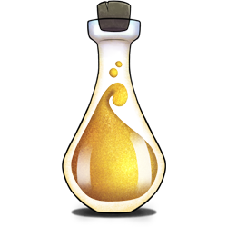

# Do science in HUNT Cloud
        
**Welcome to our official user documentation for scientists in HUNT Cloud.**

This section is aimed at lab users. It contains practical information on how to do science in HUNT Cloud. 

See our [main documentation page](/) for other sections.

::: tip Next Lab Ting

The next Lab Ting is held Tuesday 14 February 2023 - 2 to 4 p.m. CET. All Lab users are invited. [Read more >>](/do-science/community/labting)

:::
