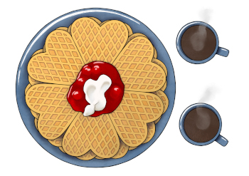

# HUNT Cloud community

**Collaborations elevate science.**

All lab users in HUNT Cloud are invited to join our HUNT Cloud community as part of your onboarding process. 

### Come join us at Slack 

Our community cafe is located at [Slack](https://slack.com/) under the name space [hunt-cloud.slack.com](hunt-cloud.slack.com).

This is a place where lab users or lab coordinators meet to advance science and to chat with us at HUNT Cloud.

Access requires that you consent to our data processing in the service. Read more about our [community consent](/do-science/community/consent-information/) here.

### Join Labting for improved user experience

All lab users are invited to join our Labting three times per year. This is the place where we meet to discuss and develop your user experience in HUNT Cloud.

[Read more about our Labting here](/do-science/community/labting/#you-should-participate).
