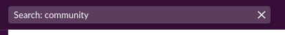

# Community cafe

**All lab users are invited to join our community cafe that is currently located at Slack. We have arranged tables both for your lab team and for your scientific interests.** 

[[toc]]

## Invitations

Scientists and scientific administrators in HUNT Cloud gets an invitation to our community cafe as part of the onboarding process. The invitation remains as long as you have an active user agreement.

::: tip Looking for a new invitation? 

[Contact us](/contact) on email, we are more than happy to resend invitations for active users.

:::

## Location

Our community cafe is located at [Slack](https://slack.com/) under the name space [hunt-genes.slack.com](hunt-genes.slack.com).

## Pre-arranged tables

You will see two pre-arranged tables (channels) when you join the cafe, our community-table and your lab-table: 

### community-table

`#cloud-community` is our main community table where all lab users, lab coordinators and data space coordinators gets invited by default. 

We use this table for announcements that affect multiple data spaces and labs, such as response information when services gets affected, information on Tingweeks, new products and similar. 

You are welcome to use this table to celebrate scientific achievements from your team, announce scientific positions, requests collaborations and similar.

### lab-table

This is a table (`lab-<yourlabname>`) that is arranged for you and your lab team together with members from our HUNT Cloud team.

We use your lab table for questions and communication that directly affect your lab.

You may use this table for all kinds of day-to-day activities in your lab, such as helping each other with scientific and technical questions, and to reach us at the HUNT Cloud team for questions and dialogues.

### dataspace-table

Scientific administrators from data spaces on the ORANGE and BLUE subscription level are invited to a table dedicated for their administrative data space team (`dataspace-<yourdataspacename>`). We use this table for dialogues and coordination of administrative activities that span labs inside the data space portfolio.

## Optional tables

Once inside you may join tables dedicated to discussions that you care about (see example list below). 

*General banter*

* community-music
* community-random

::: tip Suggest a new table topic

Missing a topic that's relevant for you? Do not worry. We are happy to add new tables. Reach us at your lab table and suggest the topic close to your heart.

:::

::: details Examples of topic tables

*Methods*

* community-ai-ml
* community-epidemiology
* community-genomics

*For roles*

* community-coordination

*For analysts*

* community-tools
* community-gpu
* community-rstudio
* community-stata

:::

### Join a community table

Click in the search bar at the top of your Slack page and type **`community`** to see a list of all community tables. Click on any topic that you think might be relevant for you and join the channel.

### Leave a community table

To leave a table, click on the channel topic at the top of the Slack page (for example `#community-random`) and click the "Leave channel" button.

## Tone of voice

We are truly proud of the warm and welcoming tone in our community discussion. Needless to say when we meet from a wide range of cultures and scientific fields, all dialogue are to happen with **care and respect**.

::: warning

Our community cafe is aimed at general communication. Do -not- share study data. 

::: 

## Communication options in Slack

Slack holds the option of both chat and video communication (`Huddle`). You are free to use both. To start a `Huddle`, click on the ear phone icon in the lower left part of your screen.

## Security and privacy

Data in HUNT Cloud Community Cafe is covered by controls in the data processor agreement that we hold with the organization that controls the data in your lab. 

The Slack subscription is part of HUNT Cloud / NTNU's Slack subscription. All communication data is stored in EU in accordance with GDPR, and Slack Inc. is listed as a subcontractor in our [subcontractors](/subcontractors/) list.

::: danger Avoid private information

As a general rule for digital communication services, limit the type of information you share to those necessary. Avoid sharing private information such on your own or others religion, sexual status, health and similar.

::: 

[Contact us](/contact) on email if you need help with data deletions.

## FAQ

#### Is Slack optional? 

Yes. Feel free to [contact us](/contact) on email if this is your communication method of choice.

