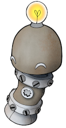

<!-- 

  This page is autogenerated to ensure 
  updated version control of the consent. 
  
  Do not add text here. The original file
  is in governance/privacy/community-consent
  as hcc-doc127 

-->

# HUNT Cloud community consent

Consent version: v1.0

**You are hereby invited to join our HUNT Cloud community!** 

The HUNT Cloud community is a place where lab users and lab coordinators can meet to discuss scientific activities, and chat with us at HUNT Cloud.

Click the **"I accept"-button** at the bottom of this page to get your Slack setup information if you consent to the terms on this page. 

### It is voluntary to join 

Community participation is voluntary. You can use our lab services without joining.

The purpose of our communication is to advance science and to guide and support you in using our services. 

We care about your privacy! This page gives you information on how your personal data is stored and processed in our community service.

### We use Slack to chat

We use [Slack](https://slack.com/) from Salesforce Inc. (California, US) for our community communication. 

Slack is an instant messaging service where you can communicate through text messaging, file sharing and voice and video calls. You can use all of these functions.

HUNT Cloud holds a an agreement with Salesforce that regulate the processing of your personal data (Data processing agreement).

### We collect and process three data types

**End-user content data**

Our community service holds your personal data that you contribute when you use the service, including your chat messages and files that you upload.

The purpose of this communication activity is to advance science and to guide and support you in using our services. This data is provided voluntarily by you to us for the above purpose. The legal basis for this processing is GDPR Article 6 (1) lit. a (consent to the processing). 

**Account data**

We do also store your Slack account data. This data includes your name, email, service identifier, channel memberships and your consent status. 

The purpose of this collection is to know whom have and have had access to the service for security and privacy purposes. The legal basis for this processing is GDPR Article 6 (1) lit. c (legal obligations). 

**Services data**

The Slack software collects data when you use the services. This includes data on how you connect to the service, the observed usage of the service, interactions with others users, system roles, IP addresses, system events and similar. 

This data is linked to you Slack user identifier. Slack use this data to fulfill contractual obligations with HUNT Cloud related to security and privacy. The legal basis for this processing is GDPR Article 6 (1) lib. b (contractual obligations) and GDPR Article 6 (1) lit. c (legal obligations).

### Visibility and access

Communication is divided in public channels that all members can read and respond to, closed channels where only invited members can join, and direct messages between two or more members.

Every lab gets their own closed channels (lab channels) where you are invited together with your lab team and us at the HUNT Cloud team. These channels are kept closed so no other community members can see what's written.

Other community members will be able to see that you are a member of the HUNT Cloud community (name and email). 

### Do -not- share study data

Our community chat is aimed at general communication. Do -not- share study data. This includes study data that do not hold personal identifiers. Our Slack subscription is not set up to handle special categories of GDPR-data such as health data.

### You data is stored in Europe

Your Slack message data is transferred to and stored in Germany and France. Our user management system is located in Trondheim, Norway.

### You messages are kept for one year

All messages older than one (1) year is automatically deleted in Slack. We have set this strict retention period to limit the amount of your personal data that we hold. 

That this means that our community version of Slack is -not- a reliable information storage area. Do -not- use Slack to store information that you care about and want to keep for a long time.

You can also delete your own messages before the one year retention period if you like. Select one of your messages for deletion, click "More actions" in the upper right corner of the message and select "Delete message". 

### You organization may request access to your messages

Please be aware that your host organization, your data controller and/or NTNU may in special cases request access to your messages - including your direct messages - for audit purposes. You will be notified in advance of any data exports should such requests arise.

### Treat others with care and respect

We are truly proud of the warm and welcoming tone in our community discussion. Needless to say when we meet from a wide range of cultures and scientific fields, all dialogue are to happen with care and respect.

### You can always withdraw your consent

You can always withdraw your community consent via our service desk. 

We will deactivate your account and delete your profile information in Slack when you withdraw you consent. Your message data will be deleted after one (1) year, and your account data will be stored for up to six (6) years.

### Read more in our privacy statement

Read more about our efforts to protect your privacy as a user of HUNT Cloud in our [privacy statement](/do-science/privacy-statement/). 

### Consent

Consent to the membership conditions stated on this page by clicking the **I accept**-button below. 

[Button]

