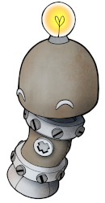

<!-- 

  This page is autogenerated to ensure 
  updated version control of the consent. 
  
  Do not add text here. The original file
  is in governance/privacy/community-consent
  as hcc-doc127 

-->

# Current community consent

::: tip About this page

This page holds a copy of our current HUNT Cloud community consent. The intention is that you can quickly assess how we process your data. 

The actual consent will be sent to you on email as a web link together with your onboarding information. Use this link to update your consent at any time. 

[Read more about our consent process here.](/do-science/community/consent-information/)
:::

  Consent version: v1.0
  

**You are hereby cordially invited to join our HUNT Cloud community!** 

This is a place where lab users and scientific administrators can meet to advance science and to chat with us at HUNT Cloud.

If you consent to the terms on this page, click the **"GIVE CONSENT"**-button at the bottom to get your Slack setup information. 

### It is voluntary to join 

Community participation is voluntary. You can use our lab services without joining.

### We care about your privacy

As scientists, we normally pay careful attention to the privacy protection of our study participants. However, here we care about *your* personal data as a scientists that uses our HUNT Cloud services.

This page gives you information on how your personal data is stored and processed in our community service so you can evaluate if you want to join.

### We use Slack to chat

We use [Slack](https://slack.com/) from Salesforce Inc. (California, US) for our community communication. 

Slack is an instant messaging service where you can communicate through text messaging, file sharing and voice and video calls. You can use all of these functions.

Salesforce's processing is regulated in an agreement with HUNT Cloud (Data processing agreement).

### We collect and process your data

We collect and process three main data categories of your personal data in our community service: 

*End-user content data*

This is the personal data that you contribute when you use the service, such as your chat messages and files that you upload. You own this data.

The purpose of this collection and processing is to enable communication between you and fellow scientists and with our HUNT Cloud team. 

This data is provided voluntarily by you to us for the above purpose. The legal basis for this processing is GDPR Article 6 (1) lit. a (consent to the processing). 

*Account data*

This is your contact information that we use to manage your community account, such as your name, organizational affiliation, email, service identifier in Slack, Slack channel memberships and your community consent status. 

The purpose of this collection and processing is to keep an overview over individuals that have access to the community for security and privacy reasons. The legal basis for this processing is GDPR Article 6 (1) lit. c (legal obligations). 

*Services data*

Slack collects data when you use the services, such as data on how you connect to the service, the observed usage of the service, interactions with others users, system roles, IP addresses, system events and similar. This data is linked to your account data via the Slack user identifier.

The purpose of this collection and processing is to monitor activities among community members for resource consumption, security and privacy reasons. The legal basis for the resource monitoring is GDPR Article 6 (1) lib. b (contractual obligations), and GDPR Article 6 (1) lit. c (legal obligations) for the security and privacy monitoring.

### Visibility and access

Your communication inside Slack is divided in three main types: (1) public channels that all members can read and respond to; (2) closed channels where only invited members can join; and (3) direct messages between two or more members.

Your lab gets their own lab channel where you and your lab team can communicate. These channels are closed for other members outside your lab. The HUNT Cloud team can read and respond to your lab communication in these channels.

You can communicate directly with other community members (direct messages). Please be aware that your host organization and NTNU may in special cases request access to all messages in Slack - including your direct messages - for audit purposes. You will be notified about such export requests should they arise.

Other community members can see that you are a member of the HUNT Cloud community, including your name, email and Slack user name. 

### Do -not- share study data

Our community chat is aimed at general communication. Do -not- share study data. This includes study data that do not hold personal identifiers. Our Slack subscription is not set up to handle special categories of GDPR-data such as health data.

### You data is stored in Europe

Your Slack message data is transferred to and stored in Germany and France. Our user management system is located in Trondheim, Norway.

### You messages are kept for one year

All messages older than one (1) year is automatically deleted in Slack. We have set this strict retention period to limit the volume of personal data that we hold in our systems. 

This means that our community version of Slack is -not- configured to be a reliable information storage area. Again, do -not- use Slack to store information that you care about and want to keep for a long time.

### You can delete your own messages

You can delete your own messages prior to the expiration date: Select a message you want to delete, click "More actions" in the upper right corner of the message and select "Delete message". 

### Treat others with care and respect

We are truly proud of the warm and welcoming tone in our community discussions. Needless to say when we meet from a wide range of cultures and scientific fields, all dialogue are to happen with care and respect.

### You can always withdraw your consent

You can request a consent link in our do science [service desk](/do-science/service-desk/#request-consent-link) to update or withdraw your consent.

### Data retention periods 

We will deactivate your account and delete your profile information in Slack when you withdraw you consent. Your message data will be deleted after one (1) year, and your account data will be stored for a minimum of six (6) years.

### Read more in our privacy statement

Read more about our efforts to preserve your privacy as a user of HUNT Cloud, and rights that you might be entitled to under GDPR in our [privacy statement](/do-science/privacy-statement/). 

### Contact us for more information

[Contact us](/contact) if you have questions about our processing of your personal data.

### Consent

Consent to the membership conditions stated on this page by clicking the **GIVE CONSENT**-button below. 

[BUTTON: GIVE CONSENT]

[BUTTON: WITHDRAW CONSENT]

