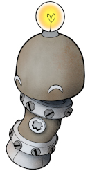

# Current questionnaire consent

::: tip About this page

This page holds a copy of our current questionnaire consent. The intention is that you can quickly assess how we process your data when we ask for your user experience. 

:::

Consent version: v1.0 from 2026-03-03.
  

**I consent that my answers can be used and processes in accordance with the following terms:**

The purpose of our user surveys is gather user experiences from our community and to use this insight to improve HUNT Cloud's  services. 

Your data will be processed and protected in accordance with our [privacy statement](/govern-science/privacy-statement), and GDPR Article 6(a), with the following addition:

* We will record the date and time of your answer. However, we will -not- ask for your name, email, IP address, or other direct identifiers. This means that we may not be able to identify your specific information for correction or deletion once submitted. 

We aim to make summary results publicly available. We kindly ask for your permission to use and publish selected deidentified answers from your text field responses for awareness and marketing purposes.

