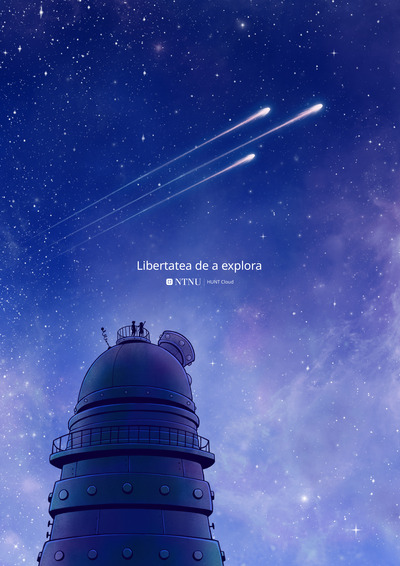
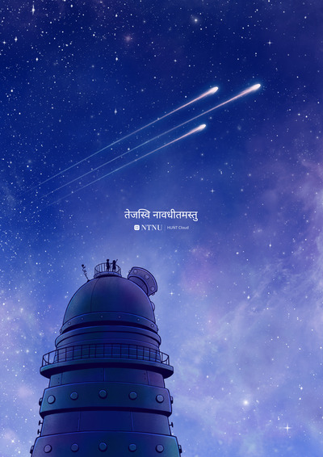

<!-- 

This is an autogenerated page. Do not edit
directly in docs.

--> 

# «Freedom to explore»

**Science is global, and so is our HUNT Cloud community. This page celebrates the global aspects and collaborative nature of data-driven science!**

We aim to translate our tagline «Freedom to explore» into every language that our community members speak or care deeply about. We are humble and proud of the current list, and we are eager to see it grow further.

**«Freedom to explore»**

We see scientists as explorers. The kind of explorers that seek towards the unknown, similar to our old [explorers](https://en.wikipedia.org/wiki/Fridtjof_Nansen). The kind of individuals that gaze at the stars, imagine new ways, and follow their own paths - not because it's easy, but precisely because it's hard. 

In these circumstances, and in the highly regulated field of data-driven science, we aim to ensure as much freedom as possible for our explorers. And, we want to be held accountable towards this bar whenever we meet to discuss improvements to your lab environments. 

**About the illustration**

The «Freedom to explore» universe illustrations are made by Ingunn B Ferstad in our HUNT Cloud team. They are published under an open license. See our [FAQ section](/do-science/community/freedom-to-explore/#faq) at the bottom for more information about these illustrations. [Click here](/about/illustrations/) to read about conditions for use and to see other illustrations. 

**One PDF to see them all**

We have collected individual languages in a low resolution PDF-file with "cheat codes" at the bottom if you want to browse them all for fun: [Freedom to explore - all languages (lowres)](https://assets.hdc.ntnu.no/assets/artworks/freedom-to-explore/hunt-cloud-freedom-to-explore-all-72dpi-screen.pdf) (PDF, 72 DPI)

::: tip Submit your language

This list is made by current and past community members. Can't find your language or a language that you care deeply about? Or do you see room for improved translations? Great! Send us your translation or update in a [general contact request](/contact).

:::

[[toc]]

## Individual languages

### Arabic (ara)

::: details Full Arabic version

**Download**:  
PDF - [Freedom to explore - Arabic](https://assets.hdc.ntnu.no/assets/artworks/freedom-to-explore/hunt-cloud-freedom-to-explore-ara-300dpi.pdf) - 300 DPI  
JPG - [Freedom to explore - Arabic](https://assets.hdc.ntnu.no/assets/artworks/freedom-to-explore/hunt-cloud-freedom-to-explore-ara-2160px.jpg) - 2160px

**Title:** Freedom to explore  
**Language:** Arabic ([ara](https://iso639-3.sil.org/code/ara))  
**Creator:** Ingunn B. Ferstad, HUNT Cloud / NTNU  
**License:** CC BY­-NC-­ND 4.0  
**Year:** 2023  
**Version:** 1.1  
**ArtworkID:** hcc-artwork26  

**Unsatisfied with the translation?** [Click here](/do-science/community/freedom-to-explore/#can-i-suggest-an-improved-translation) to suggest an upgrade.

:::

  

### Bengali (ben)

::: details Full Bengali version

**Download**:  
PDF - [Freedom to explore - Bengali](https://assets.hdc.ntnu.no/assets/artworks/freedom-to-explore/hunt-cloud-freedom-to-explore-ben-300dpi.pdf) - 300 DPI  
JPG - [Freedom to explore - Bengali](https://assets.hdc.ntnu.no/assets/artworks/freedom-to-explore/hunt-cloud-freedom-to-explore-ben-2160px.jpg) - 2160px

**Title:** Freedom to explore  
**Language:** Bengali ([ben](https://iso639-3.sil.org/code/ben))  
**Creator:** Ingunn B. Ferstad, HUNT Cloud / NTNU  
**License:** CC BY­-NC-­ND 4.0  
**Year:** 2023  
**Version:** 1.1  
**ArtworkID:** hcc-artwork26  

**Unsatisfied with the translation?** [Click here](/do-science/community/freedom-to-explore/#can-i-suggest-an-improved-translation) to suggest an upgrade.

:::

  

### Bosnian (bos)

::: details Full Bosnian version

**Download**:  
PDF - [Freedom to explore - Bosnian](https://assets.hdc.ntnu.no/assets/artworks/freedom-to-explore/hunt-cloud-freedom-to-explore-bos-300dpi.pdf) - 300 DPI  
JPG - [Freedom to explore - Bosnian](https://assets.hdc.ntnu.no/assets/artworks/freedom-to-explore/hunt-cloud-freedom-to-explore-bos-2160px.jpg) - 2160px

**Title:** Freedom to explore  
**Language:** Bosnian ([bos](https://iso639-3.sil.org/code/bos))  
**Creator:** Ingunn B. Ferstad, HUNT Cloud / NTNU  
**License:** CC BY­-NC-­ND 4.0  
**Year:** 2023  
**Version:** 1.1  
**ArtworkID:** hcc-artwork26  

**Unsatisfied with the translation?** [Click here](/do-science/community/freedom-to-explore/#can-i-suggest-an-improved-translation) to suggest an upgrade.

:::

  

### Bulgarian (bul)

::: details Full Bulgarian version

**Download**:  
PDF - [Freedom to explore - Bulgarian](https://assets.hdc.ntnu.no/assets/artworks/freedom-to-explore/hunt-cloud-freedom-to-explore-bul-300dpi.pdf) - 300 DPI  
JPG - [Freedom to explore - Bulgarian](https://assets.hdc.ntnu.no/assets/artworks/freedom-to-explore/hunt-cloud-freedom-to-explore-bul-2160px.jpg) - 2160px

**Title:** Freedom to explore  
**Language:** Bulgarian ([bul](https://iso639-3.sil.org/code/bul))  
**Creator:** Ingunn B. Ferstad, HUNT Cloud / NTNU  
**License:** CC BY­-NC-­ND 4.0  
**Year:** 2023  
**Version:** 1.1  
**ArtworkID:** hcc-artwork26  

**Unsatisfied with the translation?** [Click here](/do-science/community/freedom-to-explore/#can-i-suggest-an-improved-translation) to suggest an upgrade.

:::

  

### Catalan (cat)

::: details Full Catalan version

**Download**:  
PDF - [Freedom to explore - Catalan](https://assets.hdc.ntnu.no/assets/artworks/freedom-to-explore/hunt-cloud-freedom-to-explore-cat-300dpi.pdf) - 300 DPI  
JPG - [Freedom to explore - Catalan](https://assets.hdc.ntnu.no/assets/artworks/freedom-to-explore/hunt-cloud-freedom-to-explore-cat-2160px.jpg) - 2160px

**Title:** Freedom to explore  
**Language:** Catalan ([cat](https://iso639-3.sil.org/code/cat))  
**Creator:** Ingunn B. Ferstad, HUNT Cloud / NTNU  
**License:** CC BY­-NC-­ND 4.0  
**Year:** 2023  
**Version:** 1.1  
**ArtworkID:** hcc-artwork26  

**Unsatisfied with the translation?** [Click here](/do-science/community/freedom-to-explore/#can-i-suggest-an-improved-translation) to suggest an upgrade.

:::

  

### Czech (ces)

::: details Full Czech version

**Download**:  
PDF - [Freedom to explore - Czech](https://assets.hdc.ntnu.no/assets/artworks/freedom-to-explore/hunt-cloud-freedom-to-explore-ces-300dpi.pdf) - 300 DPI  
JPG - [Freedom to explore - Czech](https://assets.hdc.ntnu.no/assets/artworks/freedom-to-explore/hunt-cloud-freedom-to-explore-ces-2160px.jpg) - 2160px

**Title:** Freedom to explore  
**Language:** Czech ([ces](https://iso639-3.sil.org/code/ces))  
**Creator:** Ingunn B. Ferstad, HUNT Cloud / NTNU  
**License:** CC BY­-NC-­ND 4.0  
**Year:** 2023  
**Version:** 1.1  
**ArtworkID:** hcc-artwork26  

**Unsatisfied with the translation?** [Click here](/do-science/community/freedom-to-explore/#can-i-suggest-an-improved-translation) to suggest an upgrade.

:::

  

### Mandarin (cmn)

::: details Full Mandarin version

**Download**:  
PDF - [Freedom to explore - Mandarin](https://assets.hdc.ntnu.no/assets/artworks/freedom-to-explore/hunt-cloud-freedom-to-explore-cmn-300dpi.pdf) - 300 DPI  
JPG - [Freedom to explore - Mandarin](https://assets.hdc.ntnu.no/assets/artworks/freedom-to-explore/hunt-cloud-freedom-to-explore-cmn-2160px.jpg) - 2160px

**Title:** Freedom to explore  
**Language:** Mandarin ([cmn](https://iso639-3.sil.org/code/cmn))  
**Creator:** Ingunn B. Ferstad, HUNT Cloud / NTNU  
**License:** CC BY­-NC-­ND 4.0  
**Year:** 2023  
**Version:** 1.1  
**ArtworkID:** hcc-artwork26  

**Unsatisfied with the translation?** [Click here](/do-science/community/freedom-to-explore/#can-i-suggest-an-improved-translation) to suggest an upgrade.

:::

  

### Danish (dan)

::: details Full Danish version

**Download**:  
PDF - [Freedom to explore - Danish](https://assets.hdc.ntnu.no/assets/artworks/freedom-to-explore/hunt-cloud-freedom-to-explore-dan-300dpi.pdf) - 300 DPI  
JPG - [Freedom to explore - Danish](https://assets.hdc.ntnu.no/assets/artworks/freedom-to-explore/hunt-cloud-freedom-to-explore-dan-2160px.jpg) - 2160px

**Title:** Freedom to explore  
**Language:** Danish ([dan](https://iso639-3.sil.org/code/dan))  
**Creator:** Ingunn B. Ferstad, HUNT Cloud / NTNU  
**License:** CC BY­-NC-­ND 4.0  
**Year:** 2023  
**Version:** 1.1  
**ArtworkID:** hcc-artwork26  

**Unsatisfied with the translation?** [Click here](/do-science/community/freedom-to-explore/#can-i-suggest-an-improved-translation) to suggest an upgrade.

:::

  

### German (deu)

::: details Full German version

**Download**:  
PDF - [Freedom to explore - German](https://assets.hdc.ntnu.no/assets/artworks/freedom-to-explore/hunt-cloud-freedom-to-explore-deu-300dpi.pdf) - 300 DPI  
JPG - [Freedom to explore - German](https://assets.hdc.ntnu.no/assets/artworks/freedom-to-explore/hunt-cloud-freedom-to-explore-deu-2160px.jpg) - 2160px

**Title:** Freedom to explore  
**Language:** German ([deu](https://iso639-3.sil.org/code/deu))  
**Creator:** Ingunn B. Ferstad, HUNT Cloud / NTNU  
**License:** CC BY­-NC-­ND 4.0  
**Year:** 2023  
**Version:** 1.1  
**ArtworkID:** hcc-artwork26  

**Unsatisfied with the translation?** [Click here](/do-science/community/freedom-to-explore/#can-i-suggest-an-improved-translation) to suggest an upgrade.

:::

  

### Greek (ell)

::: details Full Greek version

**Download**:  
PDF - [Freedom to explore - Greek](https://assets.hdc.ntnu.no/assets/artworks/freedom-to-explore/hunt-cloud-freedom-to-explore-ell-300dpi.pdf) - 300 DPI  
JPG - [Freedom to explore - Greek](https://assets.hdc.ntnu.no/assets/artworks/freedom-to-explore/hunt-cloud-freedom-to-explore-ell-2160px.jpg) - 2160px

**Title:** Freedom to explore  
**Language:** Greek ([ell](https://iso639-3.sil.org/code/ell))  
**Creator:** Ingunn B. Ferstad, HUNT Cloud / NTNU  
**License:** CC BY­-NC-­ND 4.0  
**Year:** 2023  
**Version:** 1.1  
**ArtworkID:** hcc-artwork26  

**Unsatisfied with the translation?** [Click here](/do-science/community/freedom-to-explore/#can-i-suggest-an-improved-translation) to suggest an upgrade.

:::

  

### English (eng)

::: details Full English version

**Download**:  
PDF - [Freedom to explore - English](https://assets.hdc.ntnu.no/assets/artworks/freedom-to-explore/hunt-cloud-freedom-to-explore-eng-300dpi.pdf) - 300 DPI  
JPG - [Freedom to explore - English](https://assets.hdc.ntnu.no/assets/artworks/freedom-to-explore/hunt-cloud-freedom-to-explore-eng-2160px.jpg) - 2160px

**Title:** Freedom to explore  
**Language:** English ([eng](https://iso639-3.sil.org/code/eng))  
**Creator:** Ingunn B. Ferstad, HUNT Cloud / NTNU  
**License:** CC BY­-NC-­ND 4.0  
**Year:** 2023  
**Version:** 1.1  
**ArtworkID:** hcc-artwork26  

**Unsatisfied with the translation?** [Click here](/do-science/community/freedom-to-explore/#can-i-suggest-an-improved-translation) to suggest an upgrade.

:::

  

### Persian (fas)

::: details Full Persian version

**Download**:  
PDF - [Freedom to explore - Persian](https://assets.hdc.ntnu.no/assets/artworks/freedom-to-explore/hunt-cloud-freedom-to-explore-fas-300dpi.pdf) - 300 DPI  
JPG - [Freedom to explore - Persian](https://assets.hdc.ntnu.no/assets/artworks/freedom-to-explore/hunt-cloud-freedom-to-explore-fas-2160px.jpg) - 2160px

**Title:** Freedom to explore  
**Language:** Persian ([fas](https://iso639-3.sil.org/code/fas))  
**Creator:** Ingunn B. Ferstad, HUNT Cloud / NTNU  
**License:** CC BY­-NC-­ND 4.0  
**Year:** 2023  
**Version:** 1.1  
**ArtworkID:** hcc-artwork26  

**Unsatisfied with the translation?** [Click here](/do-science/community/freedom-to-explore/#can-i-suggest-an-improved-translation) to suggest an upgrade.

:::

  

### Finnish (fin)

::: details Full Finnish version

**Download**:  
PDF - [Freedom to explore - Finnish](https://assets.hdc.ntnu.no/assets/artworks/freedom-to-explore/hunt-cloud-freedom-to-explore-fin-300dpi.pdf) - 300 DPI  
JPG - [Freedom to explore - Finnish](https://assets.hdc.ntnu.no/assets/artworks/freedom-to-explore/hunt-cloud-freedom-to-explore-fin-2160px.jpg) - 2160px

**Title:** Freedom to explore  
**Language:** Finnish ([fin](https://iso639-3.sil.org/code/fin))  
**Creator:** Ingunn B. Ferstad, HUNT Cloud / NTNU  
**License:** CC BY­-NC-­ND 4.0  
**Year:** 2023  
**Version:** 1.1  
**ArtworkID:** hcc-artwork26  

**Unsatisfied with the translation?** [Click here](/do-science/community/freedom-to-explore/#can-i-suggest-an-improved-translation) to suggest an upgrade.

:::

  

### French (fra)

::: details Full French version

**Download**:  
PDF - [Freedom to explore - French](https://assets.hdc.ntnu.no/assets/artworks/freedom-to-explore/hunt-cloud-freedom-to-explore-fra-300dpi.pdf) - 300 DPI  
JPG - [Freedom to explore - French](https://assets.hdc.ntnu.no/assets/artworks/freedom-to-explore/hunt-cloud-freedom-to-explore-fra-2160px.jpg) - 2160px

**Title:** Freedom to explore  
**Language:** French ([fra](https://iso639-3.sil.org/code/fra))  
**Creator:** Ingunn B. Ferstad, HUNT Cloud / NTNU  
**License:** CC BY­-NC-­ND 4.0  
**Year:** 2023  
**Version:** 1.1  
**ArtworkID:** hcc-artwork26  

**Unsatisfied with the translation?** [Click here](/do-science/community/freedom-to-explore/#can-i-suggest-an-improved-translation) to suggest an upgrade.

:::

  

### Hindi (hin)

::: details Full Hindi version

**Download**:  
PDF - [Freedom to explore - Hindi](https://assets.hdc.ntnu.no/assets/artworks/freedom-to-explore/hunt-cloud-freedom-to-explore-hin-300dpi.pdf) - 300 DPI  
JPG - [Freedom to explore - Hindi](https://assets.hdc.ntnu.no/assets/artworks/freedom-to-explore/hunt-cloud-freedom-to-explore-hin-2160px.jpg) - 2160px

**Title:** Freedom to explore  
**Language:** Hindi ([hin](https://iso639-3.sil.org/code/hin))  
**Creator:** Ingunn B. Ferstad, HUNT Cloud / NTNU  
**License:** CC BY­-NC-­ND 4.0  
**Year:** 2023  
**Version:** 1.1  
**ArtworkID:** hcc-artwork26  

**Unsatisfied with the translation?** [Click here](/do-science/community/freedom-to-explore/#can-i-suggest-an-improved-translation) to suggest an upgrade.

:::

  

### Igbo (ibo)

::: details Full Igbo version

**Download**:  
PDF - [Freedom to explore - Igbo](https://assets.hdc.ntnu.no/assets/artworks/freedom-to-explore/hunt-cloud-freedom-to-explore-ibo-300dpi.pdf) - 300 DPI  
JPG - [Freedom to explore - Igbo](https://assets.hdc.ntnu.no/assets/artworks/freedom-to-explore/hunt-cloud-freedom-to-explore-ibo-2160px.jpg) - 2160px

**Title:** Freedom to explore  
**Language:** Igbo ([ibo](https://iso639-3.sil.org/code/ibo))  
**Creator:** Ingunn B. Ferstad, HUNT Cloud / NTNU  
**License:** CC BY­-NC-­ND 4.0  
**Year:** 2023  
**Version:** 1.1  
**ArtworkID:** hcc-artwork26  

**Unsatisfied with the translation?** [Click here](/do-science/community/freedom-to-explore/#can-i-suggest-an-improved-translation) to suggest an upgrade.

:::

  

### Indonesian (ind)

::: details Full Indonesian version

**Download**:  
PDF - [Freedom to explore - Indonesian](https://assets.hdc.ntnu.no/assets/artworks/freedom-to-explore/hunt-cloud-freedom-to-explore-ind-300dpi.pdf) - 300 DPI  
JPG - [Freedom to explore - Indonesian](https://assets.hdc.ntnu.no/assets/artworks/freedom-to-explore/hunt-cloud-freedom-to-explore-ind-2160px.jpg) - 2160px

**Title:** Freedom to explore  
**Language:** Indonesian ([ind](https://iso639-3.sil.org/code/ind))  
**Creator:** Ingunn B. Ferstad, HUNT Cloud / NTNU  
**License:** CC BY­-NC-­ND 4.0  
**Year:** 2023  
**Version:** 1.1  
**ArtworkID:** hcc-artwork26  

**Unsatisfied with the translation?** [Click here](/do-science/community/freedom-to-explore/#can-i-suggest-an-improved-translation) to suggest an upgrade.

:::

  

### Icelandic (isl)

::: details Full Icelandic version

**Download**:  
PDF - [Freedom to explore - Icelandic](https://assets.hdc.ntnu.no/assets/artworks/freedom-to-explore/hunt-cloud-freedom-to-explore-isl-300dpi.pdf) - 300 DPI  
JPG - [Freedom to explore - Icelandic](https://assets.hdc.ntnu.no/assets/artworks/freedom-to-explore/hunt-cloud-freedom-to-explore-isl-2160px.jpg) - 2160px

**Title:** Freedom to explore  
**Language:** Icelandic ([isl](https://iso639-3.sil.org/code/isl))  
**Creator:** Ingunn B. Ferstad, HUNT Cloud / NTNU  
**License:** CC BY­-NC-­ND 4.0  
**Year:** 2023  
**Version:** 1.1  
**ArtworkID:** hcc-artwork26  

**Unsatisfied with the translation?** [Click here](/do-science/community/freedom-to-explore/#can-i-suggest-an-improved-translation) to suggest an upgrade.

:::

  

### Italian (ita)

::: details Full Italian version

**Download**:  
PDF - [Freedom to explore - Italian](https://assets.hdc.ntnu.no/assets/artworks/freedom-to-explore/hunt-cloud-freedom-to-explore-ita-300dpi.pdf) - 300 DPI  
JPG - [Freedom to explore - Italian](https://assets.hdc.ntnu.no/assets/artworks/freedom-to-explore/hunt-cloud-freedom-to-explore-ita-2160px.jpg) - 2160px

**Title:** Freedom to explore  
**Language:** Italian ([ita](https://iso639-3.sil.org/code/ita))  
**Creator:** Ingunn B. Ferstad, HUNT Cloud / NTNU  
**License:** CC BY­-NC-­ND 4.0  
**Year:** 2023  
**Version:** 1.1  
**ArtworkID:** hcc-artwork26  

**Unsatisfied with the translation?** [Click here](/do-science/community/freedom-to-explore/#can-i-suggest-an-improved-translation) to suggest an upgrade.

:::

  

### jav;Javanese;ꦏꦼꦧꦺꦧꦱꦤ꧀ꦏꦁꦒꦺꦴꦔꦼꦭ꧀ꦩꦸꦭꦤ꧀ꦔ꧀ꦭꦼꦩꦫꦶ;NotoSansJavanese;NotoSansJavanese-Regular.ttf;22;12.8cm;; (jav;Javanese;ꦏꦼꦧꦺꦧꦱꦤ꧀ꦏꦁꦒꦺꦴꦔꦼꦭ꧀ꦩꦸꦭꦤ꧀ꦔ꧀ꦭꦼꦩꦫꦶ;NotoSansJavanese;NotoSansJavanese-Regular.ttf;22;12.8cm;;)

::: details Full jav;Javanese;ꦏꦼꦧꦺꦧꦱꦤ꧀ꦏꦁꦒꦺꦴꦔꦼꦭ꧀ꦩꦸꦭꦤ꧀ꦔ꧀ꦭꦼꦩꦫꦶ;NotoSansJavanese;NotoSansJavanese-Regular.ttf;22;12.8cm;; version

**Download**:  
PDF - [Freedom to explore - jav;Javanese;ꦏꦼꦧꦺꦧꦱꦤ꧀ꦏꦁꦒꦺꦴꦔꦼꦭ꧀ꦩꦸꦭꦤ꧀ꦔ꧀ꦭꦼꦩꦫꦶ;NotoSansJavanese;NotoSansJavanese-Regular.ttf;22;12.8cm;;](https://assets.hdc.ntnu.no/assets/artworks/freedom-to-explore/hunt-cloud-freedom-to-explore-jav;Javanese;ꦏꦼꦧꦺꦧꦱꦤ꧀ꦏꦁꦒꦺꦴꦔꦼꦭ꧀ꦩꦸꦭꦤ꧀ꦔ꧀ꦭꦼꦩꦫꦶ;NotoSansJavanese;NotoSansJavanese-Regular.ttf;22;12.8cm;;-300dpi.pdf) - 300 DPI  
JPG - [Freedom to explore - jav;Javanese;ꦏꦼꦧꦺꦧꦱꦤ꧀ꦏꦁꦒꦺꦴꦔꦼꦭ꧀ꦩꦸꦭꦤ꧀ꦔ꧀ꦭꦼꦩꦫꦶ;NotoSansJavanese;NotoSansJavanese-Regular.ttf;22;12.8cm;;](https://assets.hdc.ntnu.no/assets/artworks/freedom-to-explore/hunt-cloud-freedom-to-explore-jav;Javanese;ꦏꦼꦧꦺꦧꦱꦤ꧀ꦏꦁꦒꦺꦴꦔꦼꦭ꧀ꦩꦸꦭꦤ꧀ꦔ꧀ꦭꦼꦩꦫꦶ;NotoSansJavanese;NotoSansJavanese-Regular.ttf;22;12.8cm;;-2160px.jpg) - 2160px

**Title:** Freedom to explore  
**Language:** jav;Javanese;ꦏꦼꦧꦺꦧꦱꦤ꧀ꦏꦁꦒꦺꦴꦔꦼꦭ꧀ꦩꦸꦭꦤ꧀ꦔ꧀ꦭꦼꦩꦫꦶ;NotoSansJavanese;NotoSansJavanese-Regular.ttf;22;12.8cm;; ([jav;Javanese;ꦏꦼꦧꦺꦧꦱꦤ꧀ꦏꦁꦒꦺꦴꦔꦼꦭ꧀ꦩꦸꦭꦤ꧀ꦔ꧀ꦭꦼꦩꦫꦶ;NotoSansJavanese;NotoSansJavanese-Regular.ttf;22;12.8cm;;](https://iso639-3.sil.org/code/jav;Javanese;ꦏꦼꦧꦺꦧꦱꦤ꧀ꦏꦁꦒꦺꦴꦔꦼꦭ꧀ꦩꦸꦭꦤ꧀ꦔ꧀ꦭꦼꦩꦫꦶ;NotoSansJavanese;NotoSansJavanese-Regular.ttf;22;12.8cm;;))  
**Creator:** Ingunn B. Ferstad, HUNT Cloud / NTNU  
**License:** CC BY­-NC-­ND 4.0  
**Year:** 2023  
**Version:** 1.1  
**ArtworkID:** hcc-artwork26  

**Unsatisfied with the translation?** [Click here](/do-science/community/freedom-to-explore/#can-i-suggest-an-improved-translation) to suggest an upgrade.

:::

  

### Javanese (jav)

::: details Full Javanese version

**Download**:  
PDF - [Freedom to explore - Javanese](https://assets.hdc.ntnu.no/assets/artworks/freedom-to-explore/hunt-cloud-freedom-to-explore-jav-300dpi.pdf) - 300 DPI  
JPG - [Freedom to explore - Javanese](https://assets.hdc.ntnu.no/assets/artworks/freedom-to-explore/hunt-cloud-freedom-to-explore-jav-2160px.jpg) - 2160px

**Title:** Freedom to explore  
**Language:** Javanese ([jav](https://iso639-3.sil.org/code/jav))  
**Creator:** Ingunn B. Ferstad, HUNT Cloud / NTNU  
**License:** CC BY­-NC-­ND 4.0  
**Year:** 2023  
**Version:** 1.1  
**ArtworkID:** hcc-artwork26  

**Unsatisfied with the translation?** [Click here](/do-science/community/freedom-to-explore/#can-i-suggest-an-improved-translation) to suggest an upgrade.

:::

  

### Japanese (jpn)

::: details Full Japanese version

**Download**:  
PDF - [Freedom to explore - Japanese](https://assets.hdc.ntnu.no/assets/artworks/freedom-to-explore/hunt-cloud-freedom-to-explore-jpn-300dpi.pdf) - 300 DPI  
JPG - [Freedom to explore - Japanese](https://assets.hdc.ntnu.no/assets/artworks/freedom-to-explore/hunt-cloud-freedom-to-explore-jpn-2160px.jpg) - 2160px

**Title:** Freedom to explore  
**Language:** Japanese ([jpn](https://iso639-3.sil.org/code/jpn))  
**Creator:** Ingunn B. Ferstad, HUNT Cloud / NTNU  
**License:** CC BY­-NC-­ND 4.0  
**Year:** 2023  
**Version:** 1.1  
**ArtworkID:** hcc-artwork26  

**Unsatisfied with the translation?** [Click here](/do-science/community/freedom-to-explore/#can-i-suggest-an-improved-translation) to suggest an upgrade.

:::

  

### Korean (kor)

::: details Full Korean version

**Download**:  
PDF - [Freedom to explore - Korean](https://assets.hdc.ntnu.no/assets/artworks/freedom-to-explore/hunt-cloud-freedom-to-explore-kor-300dpi.pdf) - 300 DPI  
JPG - [Freedom to explore - Korean](https://assets.hdc.ntnu.no/assets/artworks/freedom-to-explore/hunt-cloud-freedom-to-explore-kor-2160px.jpg) - 2160px

**Title:** Freedom to explore  
**Language:** Korean ([kor](https://iso639-3.sil.org/code/kor))  
**Creator:** Ingunn B. Ferstad, HUNT Cloud / NTNU  
**License:** CC BY­-NC-­ND 4.0  
**Year:** 2023  
**Version:** 1.1  
**ArtworkID:** hcc-artwork26  

**Unsatisfied with the translation?** [Click here](/do-science/community/freedom-to-explore/#can-i-suggest-an-improved-translation) to suggest an upgrade.

:::

  

### Latin (lat)

::: details Full Latin version

**Download**:  
PDF - [Freedom to explore - Latin](https://assets.hdc.ntnu.no/assets/artworks/freedom-to-explore/hunt-cloud-freedom-to-explore-lat-300dpi.pdf) - 300 DPI  
JPG - [Freedom to explore - Latin](https://assets.hdc.ntnu.no/assets/artworks/freedom-to-explore/hunt-cloud-freedom-to-explore-lat-2160px.jpg) - 2160px

**Title:** Freedom to explore  
**Language:** Latin ([lat](https://iso639-3.sil.org/code/lat))  
**Creator:** Ingunn B. Ferstad, HUNT Cloud / NTNU  
**License:** CC BY­-NC-­ND 4.0  
**Year:** 2023  
**Version:** 1.1  
**ArtworkID:** hcc-artwork26  

**Unsatisfied with the translation?** [Click here](/do-science/community/freedom-to-explore/#can-i-suggest-an-improved-translation) to suggest an upgrade.

:::

  

### Lithuanian (lit)

::: details Full Lithuanian version

**Download**:  
PDF - [Freedom to explore - Lithuanian](https://assets.hdc.ntnu.no/assets/artworks/freedom-to-explore/hunt-cloud-freedom-to-explore-lit-300dpi.pdf) - 300 DPI  
JPG - [Freedom to explore - Lithuanian](https://assets.hdc.ntnu.no/assets/artworks/freedom-to-explore/hunt-cloud-freedom-to-explore-lit-2160px.jpg) - 2160px

**Title:** Freedom to explore  
**Language:** Lithuanian ([lit](https://iso639-3.sil.org/code/lit))  
**Creator:** Ingunn B. Ferstad, HUNT Cloud / NTNU  
**License:** CC BY­-NC-­ND 4.0  
**Year:** 2023  
**Version:** 1.1  
**ArtworkID:** hcc-artwork26  

**Unsatisfied with the translation?** [Click here](/do-science/community/freedom-to-explore/#can-i-suggest-an-improved-translation) to suggest an upgrade.

:::

  

### Malayalam (mal)

::: details Full Malayalam version

**Download**:  
PDF - [Freedom to explore - Malayalam](https://assets.hdc.ntnu.no/assets/artworks/freedom-to-explore/hunt-cloud-freedom-to-explore-mal-300dpi.pdf) - 300 DPI  
JPG - [Freedom to explore - Malayalam](https://assets.hdc.ntnu.no/assets/artworks/freedom-to-explore/hunt-cloud-freedom-to-explore-mal-2160px.jpg) - 2160px

**Title:** Freedom to explore  
**Language:** Malayalam ([mal](https://iso639-3.sil.org/code/mal))  
**Creator:** Ingunn B. Ferstad, HUNT Cloud / NTNU  
**License:** CC BY­-NC-­ND 4.0  
**Year:** 2023  
**Version:** 1.1  
**ArtworkID:** hcc-artwork26  

**Unsatisfied with the translation?** [Click here](/do-science/community/freedom-to-explore/#can-i-suggest-an-improved-translation) to suggest an upgrade.

:::

  

### Nepali (nep)

::: details Full Nepali version

**Download**:  
PDF - [Freedom to explore - Nepali](https://assets.hdc.ntnu.no/assets/artworks/freedom-to-explore/hunt-cloud-freedom-to-explore-nep-300dpi.pdf) - 300 DPI  
JPG - [Freedom to explore - Nepali](https://assets.hdc.ntnu.no/assets/artworks/freedom-to-explore/hunt-cloud-freedom-to-explore-nep-2160px.jpg) - 2160px

**Title:** Freedom to explore  
**Language:** Nepali ([nep](https://iso639-3.sil.org/code/nep))  
**Creator:** Ingunn B. Ferstad, HUNT Cloud / NTNU  
**License:** CC BY­-NC-­ND 4.0  
**Year:** 2023  
**Version:** 1.1  
**ArtworkID:** hcc-artwork26  

**Unsatisfied with the translation?** [Click here](/do-science/community/freedom-to-explore/#can-i-suggest-an-improved-translation) to suggest an upgrade.

:::

  

### Dutch (nld)

::: details Full Dutch version

**Download**:  
PDF - [Freedom to explore - Dutch](https://assets.hdc.ntnu.no/assets/artworks/freedom-to-explore/hunt-cloud-freedom-to-explore-nld-300dpi.pdf) - 300 DPI  
JPG - [Freedom to explore - Dutch](https://assets.hdc.ntnu.no/assets/artworks/freedom-to-explore/hunt-cloud-freedom-to-explore-nld-2160px.jpg) - 2160px

**Title:** Freedom to explore  
**Language:** Dutch ([nld](https://iso639-3.sil.org/code/nld))  
**Creator:** Ingunn B. Ferstad, HUNT Cloud / NTNU  
**License:** CC BY­-NC-­ND 4.0  
**Year:** 2023  
**Version:** 1.1  
**ArtworkID:** hcc-artwork26  

**Unsatisfied with the translation?** [Click here](/do-science/community/freedom-to-explore/#can-i-suggest-an-improved-translation) to suggest an upgrade.

:::

  

### Norwegian nynorsk (nno)

::: details Full Norwegian nynorsk version

**Download**:  
PDF - [Freedom to explore - Norwegian nynorsk](https://assets.hdc.ntnu.no/assets/artworks/freedom-to-explore/hunt-cloud-freedom-to-explore-nno-300dpi.pdf) - 300 DPI  
JPG - [Freedom to explore - Norwegian nynorsk](https://assets.hdc.ntnu.no/assets/artworks/freedom-to-explore/hunt-cloud-freedom-to-explore-nno-2160px.jpg) - 2160px

**Title:** Freedom to explore  
**Language:** Norwegian nynorsk ([nno](https://iso639-3.sil.org/code/nno))  
**Creator:** Ingunn B. Ferstad, HUNT Cloud / NTNU  
**License:** CC BY­-NC-­ND 4.0  
**Year:** 2023  
**Version:** 1.1  
**ArtworkID:** hcc-artwork26  

**Unsatisfied with the translation?** [Click here](/do-science/community/freedom-to-explore/#can-i-suggest-an-improved-translation) to suggest an upgrade.

:::

  

### Norwegian bokmål (nob)

::: details Full Norwegian bokmål version

**Download**:  
PDF - [Freedom to explore - Norwegian bokmål](https://assets.hdc.ntnu.no/assets/artworks/freedom-to-explore/hunt-cloud-freedom-to-explore-nob-300dpi.pdf) - 300 DPI  
JPG - [Freedom to explore - Norwegian bokmål](https://assets.hdc.ntnu.no/assets/artworks/freedom-to-explore/hunt-cloud-freedom-to-explore-nob-2160px.jpg) - 2160px

**Title:** Freedom to explore  
**Language:** Norwegian bokmål ([nob](https://iso639-3.sil.org/code/nob))  
**Creator:** Ingunn B. Ferstad, HUNT Cloud / NTNU  
**License:** CC BY­-NC-­ND 4.0  
**Year:** 2023  
**Version:** 1.1  
**ArtworkID:** hcc-artwork26  

**Unsatisfied with the translation?** [Click here](/do-science/community/freedom-to-explore/#can-i-suggest-an-improved-translation) to suggest an upgrade.

:::

  

### Kirike (okr)

::: details Full Kirike version

**Download**:  
PDF - [Freedom to explore - Kirike](https://assets.hdc.ntnu.no/assets/artworks/freedom-to-explore/hunt-cloud-freedom-to-explore-okr-300dpi.pdf) - 300 DPI  
JPG - [Freedom to explore - Kirike](https://assets.hdc.ntnu.no/assets/artworks/freedom-to-explore/hunt-cloud-freedom-to-explore-okr-2160px.jpg) - 2160px

**Title:** Freedom to explore  
**Language:** Kirike ([okr](https://iso639-3.sil.org/code/okr))  
**Creator:** Ingunn B. Ferstad, HUNT Cloud / NTNU  
**License:** CC BY­-NC-­ND 4.0  
**Year:** 2023  
**Version:** 1.1  
**ArtworkID:** hcc-artwork26  

**Unsatisfied with the translation?** [Click here](/do-science/community/freedom-to-explore/#can-i-suggest-an-improved-translation) to suggest an upgrade.

:::

  

### Panjabi (pan)

::: details Full Panjabi version

**Download**:  
PDF - [Freedom to explore - Panjabi](https://assets.hdc.ntnu.no/assets/artworks/freedom-to-explore/hunt-cloud-freedom-to-explore-pan-300dpi.pdf) - 300 DPI  
JPG - [Freedom to explore - Panjabi](https://assets.hdc.ntnu.no/assets/artworks/freedom-to-explore/hunt-cloud-freedom-to-explore-pan-2160px.jpg) - 2160px

**Title:** Freedom to explore  
**Language:** Panjabi ([pan](https://iso639-3.sil.org/code/pan))  
**Creator:** Ingunn B. Ferstad, HUNT Cloud / NTNU  
**License:** CC BY­-NC-­ND 4.0  
**Year:** 2023  
**Version:** 1.1  
**ArtworkID:** hcc-artwork26  

**Unsatisfied with the translation?** [Click here](/do-science/community/freedom-to-explore/#can-i-suggest-an-improved-translation) to suggest an upgrade.

:::

  

### Polish (pol)

::: details Full Polish version

**Download**:  
PDF - [Freedom to explore - Polish](https://assets.hdc.ntnu.no/assets/artworks/freedom-to-explore/hunt-cloud-freedom-to-explore-pol-300dpi.pdf) - 300 DPI  
JPG - [Freedom to explore - Polish](https://assets.hdc.ntnu.no/assets/artworks/freedom-to-explore/hunt-cloud-freedom-to-explore-pol-2160px.jpg) - 2160px

**Title:** Freedom to explore  
**Language:** Polish ([pol](https://iso639-3.sil.org/code/pol))  
**Creator:** Ingunn B. Ferstad, HUNT Cloud / NTNU  
**License:** CC BY­-NC-­ND 4.0  
**Year:** 2023  
**Version:** 1.1  
**ArtworkID:** hcc-artwork26  

**Unsatisfied with the translation?** [Click here](/do-science/community/freedom-to-explore/#can-i-suggest-an-improved-translation) to suggest an upgrade.

:::

  

### Portuguese (por)

::: details Full Portuguese version

**Download**:  
PDF - [Freedom to explore - Portuguese](https://assets.hdc.ntnu.no/assets/artworks/freedom-to-explore/hunt-cloud-freedom-to-explore-por-300dpi.pdf) - 300 DPI  
JPG - [Freedom to explore - Portuguese](https://assets.hdc.ntnu.no/assets/artworks/freedom-to-explore/hunt-cloud-freedom-to-explore-por-2160px.jpg) - 2160px

**Title:** Freedom to explore  
**Language:** Portuguese ([por](https://iso639-3.sil.org/code/por))  
**Creator:** Ingunn B. Ferstad, HUNT Cloud / NTNU  
**License:** CC BY­-NC-­ND 4.0  
**Year:** 2023  
**Version:** 1.1  
**ArtworkID:** hcc-artwork26  

**Unsatisfied with the translation?** [Click here](/do-science/community/freedom-to-explore/#can-i-suggest-an-improved-translation) to suggest an upgrade.

:::

  

### Romanian (ron)

::: details Full Romanian version

**Download**:  
PDF - [Freedom to explore - Romanian](https://assets.hdc.ntnu.no/assets/artworks/freedom-to-explore/hunt-cloud-freedom-to-explore-ron-300dpi.pdf) - 300 DPI  
JPG - [Freedom to explore - Romanian](https://assets.hdc.ntnu.no/assets/artworks/freedom-to-explore/hunt-cloud-freedom-to-explore-ron-2160px.jpg) - 2160px

**Title:** Freedom to explore  
**Language:** Romanian ([ron](https://iso639-3.sil.org/code/ron))  
**Creator:** Ingunn B. Ferstad, HUNT Cloud / NTNU  
**License:** CC BY­-NC-­ND 4.0  
**Year:** 2023  
**Version:** 1.1  
**ArtworkID:** hcc-artwork26  

**Unsatisfied with the translation?** [Click here](/do-science/community/freedom-to-explore/#can-i-suggest-an-improved-translation) to suggest an upgrade.

:::

  

### Russian (rus)

::: details Full Russian version

**Download**:  
PDF - [Freedom to explore - Russian](https://assets.hdc.ntnu.no/assets/artworks/freedom-to-explore/hunt-cloud-freedom-to-explore-rus-300dpi.pdf) - 300 DPI  
JPG - [Freedom to explore - Russian](https://assets.hdc.ntnu.no/assets/artworks/freedom-to-explore/hunt-cloud-freedom-to-explore-rus-2160px.jpg) - 2160px

**Title:** Freedom to explore  
**Language:** Russian ([rus](https://iso639-3.sil.org/code/rus))  
**Creator:** Ingunn B. Ferstad, HUNT Cloud / NTNU  
**License:** CC BY­-NC-­ND 4.0  
**Year:** 2023  
**Version:** 1.1  
**ArtworkID:** hcc-artwork26  

**Unsatisfied with the translation?** [Click here](/do-science/community/freedom-to-explore/#can-i-suggest-an-improved-translation) to suggest an upgrade.

:::

  

### Sanskrit (san)

::: details Full Sanskrit version

**Download**:  
PDF - [Freedom to explore - Sanskrit](https://assets.hdc.ntnu.no/assets/artworks/freedom-to-explore/hunt-cloud-freedom-to-explore-san-300dpi.pdf) - 300 DPI  
JPG - [Freedom to explore - Sanskrit](https://assets.hdc.ntnu.no/assets/artworks/freedom-to-explore/hunt-cloud-freedom-to-explore-san-2160px.jpg) - 2160px

**Title:** Freedom to explore  
**Language:** Sanskrit ([san](https://iso639-3.sil.org/code/san))  
**Creator:** Ingunn B. Ferstad, HUNT Cloud / NTNU  
**License:** CC BY­-NC-­ND 4.0  
**Year:** 2023  
**Version:** 1.1  
**ArtworkID:** hcc-artwork26  

**Unsatisfied with the translation?** [Click here](/do-science/community/freedom-to-explore/#can-i-suggest-an-improved-translation) to suggest an upgrade.

:::

  

### Slovak (slk)

::: details Full Slovak version

**Download**:  
PDF - [Freedom to explore - Slovak](https://assets.hdc.ntnu.no/assets/artworks/freedom-to-explore/hunt-cloud-freedom-to-explore-slk-300dpi.pdf) - 300 DPI  
JPG - [Freedom to explore - Slovak](https://assets.hdc.ntnu.no/assets/artworks/freedom-to-explore/hunt-cloud-freedom-to-explore-slk-2160px.jpg) - 2160px

**Title:** Freedom to explore  
**Language:** Slovak ([slk](https://iso639-3.sil.org/code/slk))  
**Creator:** Ingunn B. Ferstad, HUNT Cloud / NTNU  
**License:** CC BY­-NC-­ND 4.0  
**Year:** 2023  
**Version:** 1.1  
**ArtworkID:** hcc-artwork26  

**Unsatisfied with the translation?** [Click here](/do-science/community/freedom-to-explore/#can-i-suggest-an-improved-translation) to suggest an upgrade.

:::

  

### Slovenian (slv)

::: details Full Slovenian version

**Download**:  
PDF - [Freedom to explore - Slovenian](https://assets.hdc.ntnu.no/assets/artworks/freedom-to-explore/hunt-cloud-freedom-to-explore-slv-300dpi.pdf) - 300 DPI  
JPG - [Freedom to explore - Slovenian](https://assets.hdc.ntnu.no/assets/artworks/freedom-to-explore/hunt-cloud-freedom-to-explore-slv-2160px.jpg) - 2160px

**Title:** Freedom to explore  
**Language:** Slovenian ([slv](https://iso639-3.sil.org/code/slv))  
**Creator:** Ingunn B. Ferstad, HUNT Cloud / NTNU  
**License:** CC BY­-NC-­ND 4.0  
**Year:** 2023  
**Version:** 1.1  
**ArtworkID:** hcc-artwork26  

**Unsatisfied with the translation?** [Click here](/do-science/community/freedom-to-explore/#can-i-suggest-an-improved-translation) to suggest an upgrade.

:::

  

### Southern sami (sma)

::: details Full Southern sami version

**Download**:  
PDF - [Freedom to explore - Southern sami](https://assets.hdc.ntnu.no/assets/artworks/freedom-to-explore/hunt-cloud-freedom-to-explore-sma-300dpi.pdf) - 300 DPI  
JPG - [Freedom to explore - Southern sami](https://assets.hdc.ntnu.no/assets/artworks/freedom-to-explore/hunt-cloud-freedom-to-explore-sma-2160px.jpg) - 2160px

**Title:** Freedom to explore  
**Language:** Southern sami ([sma](https://iso639-3.sil.org/code/sma))  
**Creator:** Ingunn B. Ferstad, HUNT Cloud / NTNU  
**License:** CC BY­-NC-­ND 4.0  
**Year:** 2023  
**Version:** 1.1  
**ArtworkID:** hcc-artwork26  

**Unsatisfied with the translation?** [Click here](/do-science/community/freedom-to-explore/#can-i-suggest-an-improved-translation) to suggest an upgrade.

:::

  

### Northern sami (sme)

::: details Full Northern sami version

**Download**:  
PDF - [Freedom to explore - Northern sami](https://assets.hdc.ntnu.no/assets/artworks/freedom-to-explore/hunt-cloud-freedom-to-explore-sme-300dpi.pdf) - 300 DPI  
JPG - [Freedom to explore - Northern sami](https://assets.hdc.ntnu.no/assets/artworks/freedom-to-explore/hunt-cloud-freedom-to-explore-sme-2160px.jpg) - 2160px

**Title:** Freedom to explore  
**Language:** Northern sami ([sme](https://iso639-3.sil.org/code/sme))  
**Creator:** Ingunn B. Ferstad, HUNT Cloud / NTNU  
**License:** CC BY­-NC-­ND 4.0  
**Year:** 2023  
**Version:** 1.1  
**ArtworkID:** hcc-artwork26  

**Unsatisfied with the translation?** [Click here](/do-science/community/freedom-to-explore/#can-i-suggest-an-improved-translation) to suggest an upgrade.

:::

  

### Spanish (spa)

::: details Full Spanish version

**Download**:  
PDF - [Freedom to explore - Spanish](https://assets.hdc.ntnu.no/assets/artworks/freedom-to-explore/hunt-cloud-freedom-to-explore-spa-300dpi.pdf) - 300 DPI  
JPG - [Freedom to explore - Spanish](https://assets.hdc.ntnu.no/assets/artworks/freedom-to-explore/hunt-cloud-freedom-to-explore-spa-2160px.jpg) - 2160px

**Title:** Freedom to explore  
**Language:** Spanish ([spa](https://iso639-3.sil.org/code/spa))  
**Creator:** Ingunn B. Ferstad, HUNT Cloud / NTNU  
**License:** CC BY­-NC-­ND 4.0  
**Year:** 2023  
**Version:** 1.1  
**ArtworkID:** hcc-artwork26  

**Unsatisfied with the translation?** [Click here](/do-science/community/freedom-to-explore/#can-i-suggest-an-improved-translation) to suggest an upgrade.

:::

  

### Serbian (srp)

::: details Full Serbian version

**Download**:  
PDF - [Freedom to explore - Serbian](https://assets.hdc.ntnu.no/assets/artworks/freedom-to-explore/hunt-cloud-freedom-to-explore-srp-300dpi.pdf) - 300 DPI  
JPG - [Freedom to explore - Serbian](https://assets.hdc.ntnu.no/assets/artworks/freedom-to-explore/hunt-cloud-freedom-to-explore-srp-2160px.jpg) - 2160px

**Title:** Freedom to explore  
**Language:** Serbian ([srp](https://iso639-3.sil.org/code/srp))  
**Creator:** Ingunn B. Ferstad, HUNT Cloud / NTNU  
**License:** CC BY­-NC-­ND 4.0  
**Year:** 2023  
**Version:** 1.1  
**ArtworkID:** hcc-artwork26  

**Unsatisfied with the translation?** [Click here](/do-science/community/freedom-to-explore/#can-i-suggest-an-improved-translation) to suggest an upgrade.

:::

  

### Swedish (swe)

::: details Full Swedish version

**Download**:  
PDF - [Freedom to explore - Swedish](https://assets.hdc.ntnu.no/assets/artworks/freedom-to-explore/hunt-cloud-freedom-to-explore-swe-300dpi.pdf) - 300 DPI  
JPG - [Freedom to explore - Swedish](https://assets.hdc.ntnu.no/assets/artworks/freedom-to-explore/hunt-cloud-freedom-to-explore-swe-2160px.jpg) - 2160px

**Title:** Freedom to explore  
**Language:** Swedish ([swe](https://iso639-3.sil.org/code/swe))  
**Creator:** Ingunn B. Ferstad, HUNT Cloud / NTNU  
**License:** CC BY­-NC-­ND 4.0  
**Year:** 2023  
**Version:** 1.1  
**ArtworkID:** hcc-artwork26  

**Unsatisfied with the translation?** [Click here](/do-science/community/freedom-to-explore/#can-i-suggest-an-improved-translation) to suggest an upgrade.

:::

  

### Tamil (tam)

::: details Full Tamil version

**Download**:  
PDF - [Freedom to explore - Tamil](https://assets.hdc.ntnu.no/assets/artworks/freedom-to-explore/hunt-cloud-freedom-to-explore-tam-300dpi.pdf) - 300 DPI  
JPG - [Freedom to explore - Tamil](https://assets.hdc.ntnu.no/assets/artworks/freedom-to-explore/hunt-cloud-freedom-to-explore-tam-2160px.jpg) - 2160px

**Title:** Freedom to explore  
**Language:** Tamil ([tam](https://iso639-3.sil.org/code/tam))  
**Creator:** Ingunn B. Ferstad, HUNT Cloud / NTNU  
**License:** CC BY­-NC-­ND 4.0  
**Year:** 2023  
**Version:** 1.1  
**ArtworkID:** hcc-artwork26  

**Unsatisfied with the translation?** [Click here](/do-science/community/freedom-to-explore/#can-i-suggest-an-improved-translation) to suggest an upgrade.

:::

  

### Turkish (tur)

::: details Full Turkish version

**Download**:  
PDF - [Freedom to explore - Turkish](https://assets.hdc.ntnu.no/assets/artworks/freedom-to-explore/hunt-cloud-freedom-to-explore-tur-300dpi.pdf) - 300 DPI  
JPG - [Freedom to explore - Turkish](https://assets.hdc.ntnu.no/assets/artworks/freedom-to-explore/hunt-cloud-freedom-to-explore-tur-2160px.jpg) - 2160px

**Title:** Freedom to explore  
**Language:** Turkish ([tur](https://iso639-3.sil.org/code/tur))  
**Creator:** Ingunn B. Ferstad, HUNT Cloud / NTNU  
**License:** CC BY­-NC-­ND 4.0  
**Year:** 2023  
**Version:** 1.1  
**ArtworkID:** hcc-artwork26  

**Unsatisfied with the translation?** [Click here](/do-science/community/freedom-to-explore/#can-i-suggest-an-improved-translation) to suggest an upgrade.

:::

  

### Ukrainian (ukr)

::: details Full Ukrainian version

**Download**:  
PDF - [Freedom to explore - Ukrainian](https://assets.hdc.ntnu.no/assets/artworks/freedom-to-explore/hunt-cloud-freedom-to-explore-ukr-300dpi.pdf) - 300 DPI  
JPG - [Freedom to explore - Ukrainian](https://assets.hdc.ntnu.no/assets/artworks/freedom-to-explore/hunt-cloud-freedom-to-explore-ukr-2160px.jpg) - 2160px

**Title:** Freedom to explore  
**Language:** Ukrainian ([ukr](https://iso639-3.sil.org/code/ukr))  
**Creator:** Ingunn B. Ferstad, HUNT Cloud / NTNU  
**License:** CC BY­-NC-­ND 4.0  
**Year:** 2023  
**Version:** 1.1  
**ArtworkID:** hcc-artwork26  

**Unsatisfied with the translation?** [Click here](/do-science/community/freedom-to-explore/#can-i-suggest-an-improved-translation) to suggest an upgrade.

:::

  

### Urdu (urd)

::: details Full Urdu version

**Download**:  
PDF - [Freedom to explore - Urdu](https://assets.hdc.ntnu.no/assets/artworks/freedom-to-explore/hunt-cloud-freedom-to-explore-urd-300dpi.pdf) - 300 DPI  
JPG - [Freedom to explore - Urdu](https://assets.hdc.ntnu.no/assets/artworks/freedom-to-explore/hunt-cloud-freedom-to-explore-urd-2160px.jpg) - 2160px

**Title:** Freedom to explore  
**Language:** Urdu ([urd](https://iso639-3.sil.org/code/urd))  
**Creator:** Ingunn B. Ferstad, HUNT Cloud / NTNU  
**License:** CC BY­-NC-­ND 4.0  
**Year:** 2023  
**Version:** 1.1  
**ArtworkID:** hcc-artwork26  

**Unsatisfied with the translation?** [Click here](/do-science/community/freedom-to-explore/#can-i-suggest-an-improved-translation) to suggest an upgrade.

:::

  

## FAQ

### My language is missing!

Let's add it to the list! Send us your translation in a [general contact request](/contact). We will update this page and notify you when your new version is in place.

### Can I suggest an improved translation?  

Absolutely! We are aware that «Freedom to explore» can be translated in several ways. We have received up to five translations for individual languages, and would love to hear your take. Send us your translation in a [general contact request](/contact). 

### Can I submit more than one language? 

Yes.  The intention is to collect languages that reflect individual members of our community. You may submit any language that you deeply care about, even if this is not your first language. For example, we have versions both for Latin and Sanskrit.

### What is the three letter language identifiers? 

They are ISO abbreviations. We use the three letter identifiers from [ISO 639-3](https://iso639-3.sil.org/) to include and name individual languages.

### The list don't seem to be in alphabetical order 

Correct. The list is sorted by the three letter language identifiers from [ISO 639-3](https://iso639-3.sil.org/). These letters may sometimes diverge from the official language name. To illustrate, Persian use the "fas" identifier (Farsi).

