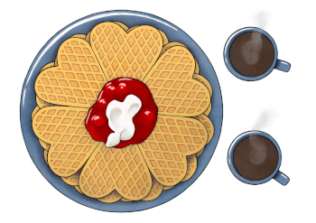

# HUNT Cloud community

**Collaborations elevate science.**

All lab users in HUNT Cloud are invited to join our HUNT Cloud community as part of your onboarding process. 

<NavigationCards :buttons="$frontmatter.buttons" />

### Come join us at Slack 

Our community is located at [Slack](https://slack.com/) under the name space [hunt-cloud.slack.com](https://hunt-cloud.slack.com).

This is a place where lab users and lab coordinators meet to advance science and to chat with us at HUNT Cloud.

### Consents

Participation in our cloud community is voluntary and consent-based. Read more here:

* [Community consent information](/do-science/community/community-consent-information)
* [Current community consent](/do-science/community/current-community-consent)

From time to time we ask our community about their user experience in questionnaires so we can use this insight to improve our services.

* [Current questionnaire consent](/do-science/community/current-questionnaire-consent)

