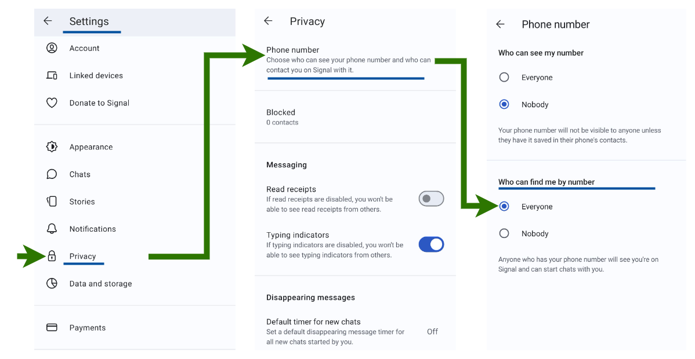

# FAQ on VPN update

**This page lists frequently asked questions related to the VPN update in 2026. [Contact us](/contact) with questions to help us expand this FAQ.**

[[toc]]

## General

### Why do we need to upgrade?

Our current services have reached a new milestone: 10 years!

That itself is an achievement, but it also means that we have to update our first VPN root certificates. That again means that we have to issue new VPN user certificates for all active lab users at the same time.

### When?

We plan to send you a new HUNT Cloud VPN configuration on 2026-10-07.

### How should I set my Signal privacy settings?

To be able to ship credentials to you we need to see your phone number as registered in Signal.
You can allow finding your account in Signal app settings:

