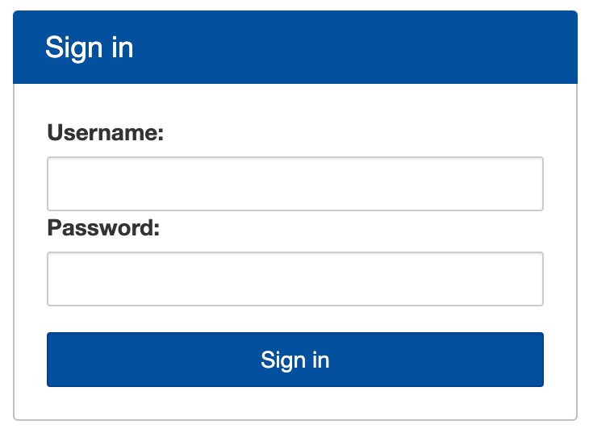
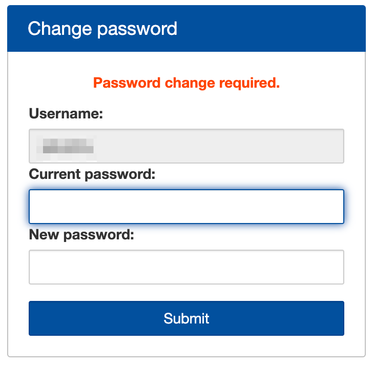
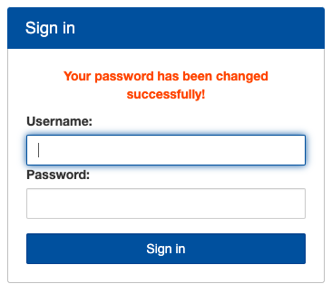

# SSH passphrase reset in Workbench

**This guide describes how to reset your SSH passphrase in Workbench.**

::: warning Pilot phase

This guide is currently in pilot phase. Noticed an issue ? Share feedback with us on Slack !

::: 

[[toc]]

::: tip Need a passphrase reset? 

Order a SSH passphrase reset in our do-science [service desk](/do-science/service-desk/#ssh-passphrase-reset).

:::

## 1. Requirements

1.1 A running VPN connection to HUNT Cloud as described in our [Configure your VPN](/do-science/lab-access/configure-vpn/) guide.

1.2 An established connection to [Workbench](/do-science/hunt-workbench/principles). If you have not used Workbench before, order your certificate [here](/do-science/service-desk/#hunt-workbench-access)


## 2. Design a passphrase

::: expander "Create your own passphrase" id="pass-1"

You will need to update your **`SSH temporary key`** in the steps below. We prefer that you design a **`passphrase`** instead of a password. A passphrase is a series of words that creates a phrase. It should be:

- long enough to be hard to guess
- not a famous quotation from the literature (but could be pretty close)
- hard to guess by intuition (even by someone who knows you well)
- easy to remember

Oh, and, it should be unique to this site only (not to mention at least
_12 characters_ long and include both _lower_ and _upper_ cases).

Making a good passphrase is great fun and good security hygiene. Here's one to get you going:

```bash
AnalysingPokemon4FunInTheMorning
```
:::

::: expander "Password management" id="pass-2"

Safest way for you to create a passphrase is to generate and store it using some of the recommended tools below:

[KeePassXC](https://keepassxc.org/) and [LastPass](https://www.lastpass.com/) available on all common platforms.

[GoogleChrome](https://support.google.com/chrome/answer/7570435?hl=en&co=GENIE.Platform%3DDesktop) password generator.

:::

::: warning Expected outcome

A unique **`passphrase`** of minimum 12 characters containing both lower and upper cases.

:::

## 3. Reset your passphrase using Workbench

After you have successfully completed above steps, you can login to your Workbench using workbench link. You can find this link in your initial onboarding email in part `Access link`.

::: tip Cannot find your access link ?

Request reissue [here](/do-science/service-desk/#request-lab-access-reissue)

::: 

Example:
```
<lab_name>.lab.hdc.ntnu.no
```

3.1 You should be welcomed by a following screen.

3.2 Type in your username and your temporary SSH passphrase. 



3.3 Afterwards, you should be prompted for a passhprase change. Type in your temporary SSH key again, then your new passhprase which you created in previous steps.



Your password change will be confirmed by following screen.



3.4 You can login to workbench now with your new passphrase.

3.5 All finished ! You now have full access to your HUNT Workbench and its features. 


## Troubleshooting

WIP

