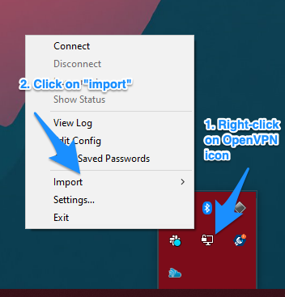
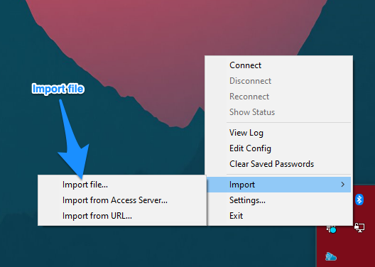
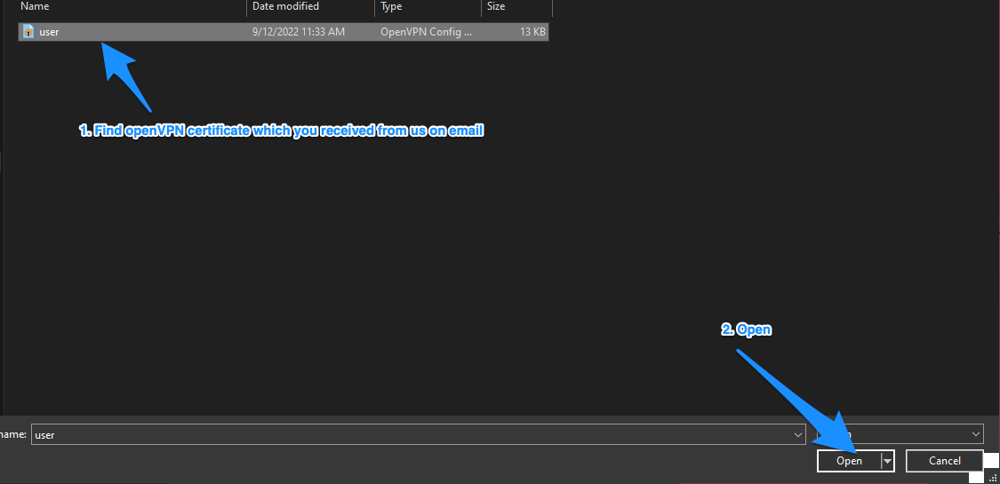

# VPN certificate reset

**This guide describes how to reset your VPN certificate and passphrase required to access your lab when you receive your shipments from the [VPN certificate reset](/do-science/service-desk/#vpn-certificate-reset) order.**

[[toc]]

## 1. Requirements

::: warning Shipments from the VPN certificate reset order 

1.1 Your new VPN certificate and VPN profile in a compressed `7z`-file sent over filesender.no

1.2. Your new `VPN passphrase` and your `7-ZIP file key` sent over Signal.

:::

**Required software**. The following required software should already be installed during your initial onboarding: 

1.3. Working VPN software (if not, head over to our Getting started guide to [install the VPN software](/do-science/lab-access/configure-vpn/#_2-1-install-the-vpn-software).

1.4. A working Google authenticator application on your phone that provide time-based VPN verification codes (if not, you can order a [Google authenticator key reset](/do-science/service-desk/#google-authenticator-key-reset) in our service desk).

## 2. Download and unpack your new certificate

We will communicate your VPN certificate over your organizational email. You will receive a link to an encrypted file archive (7z-file).

::: expander "Windows" id="2-windows"

2.1 Click on the link in the email to download the file and save this on your local computer.

2.2 Unpack (extract) the file using [7-zip](https://www.7-zip.org/download.html)

2.3 Use the key named **`7-ZIP file key`** from your Signal transfer to decrypt the archive folder.

:::

::: expander "MacOS" id="2-macos"

2.1 Click on the link in the email to download the file and save this on your local computer.

2.2 Unpack (extract) the file with compatible archive software

We recommend downloading [Keka](https://www.keka.io/en/download) to successfully unpack your archive folder

alternatively, you can install keka using brew command below

```bash
brew install keka
```

2.3 Use the key named **`7-ZIP file key`** from your Signal transfer to decrypt the archive folder.

:::

::: danger OS X and MacOS - Passphrase not working?

Note that the default archive utility on MacOS does not recognize the passphrase of the 7z files. You will need to install the 7z-compatible software from the link above.


:::

::: expander "Ubuntu linux" id="2-linux"

2.1 Click on the link in the email to download the file and save this on your local computer.

2.2 Unpack (extract) the file with compatible archive software

install p7zip

```bash
sudo apt update && sudo apt-get install p7zip-full
```

2.3 Use the key named **`7-ZIP file key`** from your Signal transfer to decrypt the archive folder.

::: 


## 3. Remove your old VPN certificate

You will need to remove your old VPN certificate and passwords before you install a new one. 

::: expander "Windows" id="3-windows"

1. Right click on the OpenVPN icon in the task bar in the lower right corner of your screen and select **`Clear Saved Passwords`** 
2. Open your file explorer and manually remove the folder with the old OpenVPN configurations. It's usually located here: 

```
C:\Users\<MYUSERNAME>\OpenVPN\config\<folder-with-username-that-you-should-remove>
```

:::

::: expander "MacOS" id="3-macos"

To remove old VPN configuration on MacOS using Tunnelblick, follow our guide below

1. Click on running Tunnelblick icon in upper menu bar and select `VPN details...`


2. Select your VPN profile on the left side of the window. Then, in the bottom left corner, select expansion window marked with 3 dots in a circle


3. At the very bottom of the newly opened widow, select `Delete configuration's credentials in keychain`


4. Afterwards, select your VPN profile and delete it from Tunnelblick app as described on below picture


5. You can now continue with next step


:::

## 4. Setup the new VPN profile

::: expander "Windows" id="4-windows"

1. Start the OpenVPN client (if it is not running already)


2. Expand pane on taskbar


3. Select **`Import file...`**



4. Click on Import file and select OpenVPN profile file **`<username>.ovpn`** that you collected in Step 1.





:::


::: expander "MacOS" id="4-macos"

**4.1  If you 'do' get prompted with the `Welcome to Tunnelblick` message, follow these steps:**
  1. Select **`I have configuration files`**.
  2. In the **`Welcome to Tunnelblick`** prompt, select **`I have configuration files`**.
  3. When prompted for which type of configuration you have, select **`OpenVPN Configurations`**.
  4. Select the OpenVPN profile named. **`<username>.ovpn`** in the collection of credentials given from HUNT Cloud.
  5. Continue with the **`Connecting to the VPN section`** below.

**4.2 If you 'do not' get prompted with the `Welcome to Tunnelblick` message, follow these steps:**
   1. Find the OpenVPN profile named **`<username>.ovpn`** that you collected in Step 1.
   2. Right-click the file OpenVPN profile named **`<username>.ovpn`**.
   3. Select **`Open With -> Tunnelblick`**.
   4. When prompted for **`Install Configuration For All Users`**, select **`Only Me`**.
   5. Enter your macOS password to allow Tunnelblick to install the OpenVPN configuration.
   6. Continue with the **`Connecting to the VPN section`** below.

:::


::: expander "Ubuntu linux" id="4-linux"

1. Click on the _Network Manager_ icon in the task bar.
2. Select _Edit Connections..._.
3. Click _Add_.
4. Choose _Import a saved VPN configuration_ and click _Create_.
5. Select the OpenVPN profile named **`<username>.ovpn`** that you collected in Step 1.
6. Enter your user name (same as the OpenVPN profile file name).
7. Click on the person icon in the _Password_ field and select **`Ask for this password every time`**.
8. Enter the _Private Key Password_ with the **`VPN passphrase`** sent to you from HUNT over Signal.
9. Click on the _IPv4 Settings_ tab.
10. Click _Routes..._.
11. Select the _Use this connection only for resources on its network_ and click _OK_.
12. Click _Apply_.

:::


## 5. Connect to the VPN

::: expander "Windows" id="5-windows"

1. Right-click on the OpenVPN notification icon on the taskbar.

2. Select _Connect_.


3. Enter your user name (same as the OpenVPN profile file name).

4. Enter a rotating **`verification code`** from Google Authenticator as your password.

    

5. When prompted for a _Private Key Password_, insert the **`VPN passphrase`** that your collected in Step 1. 
   Your authentication will fail when you complete your passphrase below. This is expected since your verification code timed out while you typed your passphrase.

    

6. Now try again to connect with a fresh **`verfication code`** from Google Authenticator.

You should now be connected to the VPN.

:::


::: expander "macOS" id="5-macos"

1. Start Tunnelblick and **`Connect`**.
2. Enter your user name (same as the OpenVPN profile file name).
3. Enter the **`verification code`** from Google Authenticator as your password.

    

    ::: warning
    Make sure that the _Save password_ checkbox is **`unchecked`**.

4. When prompted for a _Private Key Password_ or _Passphrase_, insert the **`VPN passphrase`** that you collected in Step 1.

    ::: tip
    Save this passphrase.

Your authentication will fail when you complete your passphrase above. This is expected since your verification code timed out while you typed your passphrase.

6. Now try again to connect with a fresh **`verfication code`** from Google Authenticator.

You should now be connected to the VPN.

:::


::: expander "Ubuntu Linux" id="5-linux"


1. Click on the _Network Manager_ icon in the task bar.
2. Select _VPN Connections >_ and the name of your profile.
3. In the _Authenticate VPN_ window, enter the **`verification code`** from Google Authenticator in the _Password_ field.
4. Click _OK_ to connect.

:::

## 6. Verify your VPN connection


::: expander "Windows" id="6-windows"

The OpenVPN notification icon on the taskbar should be green.


:::


::: expander "MacOS" id="6-macos"

A small Tunnelblick window should state "Connected" in green letters with a timer that count the connection length.

:::


::: expander "Ubuntu Linux" id="6-linux"

If you received the notification _VPN connection has been successfully established_, then you are good to go.

:::

::: danger Access list

We allow connection from known IP addresses only. This means that your VPN connection may be blocked if you connect from a (for us) unknown network outside Norway. [Click here](/do-science/service-desk/#vpn-access-list) to request an opening for your location in our Do science service desk.

:::

::: tip Next step

If you successfully completed this step, head over to Step 3 to [Configure your SSH](/do-science/lab-access/configure-ssh) connection. If you did not succeed, start with a quick look in our Immediate troubleshooting section below.

:::

## Troubleshooting

Below are a few immediate things to try if your VPN connection did not succeed:

### Authenticate VPN

If the _Authenticate VPN_ prompt pops up again, then try to log in again with a new **`verification code`**.

### VPN connection failed

If you received the notification _VPN Connection Failed_ after 60 seconds, please check the following

- Verify that you have an active internet connection.
- Verify that the _Private Key Password_ is correct.

### Could not read Private Key error

The error messages below indicates that there is a typo in the _Private Key Password_ (step 2.3.5) and you need to type it in again.

```
ERROR: could not read Private Key username/password/ok/string from management interface
```

```
Cannot load private key file
```

### Unable to apply changes

If you are unable to click _Apply_ after your changes, try to re-enter your _Private Key Password_ using your **`VPN passphrase`** that you collected in Step 1.

::: tip
If nothing works, please head over to our main [troubleshooting](/do-science/troubleshooting/connection/#vpn) section for more information on how to troubleshoot connections.
:::

### Tunnelblick does not respond

If Tunnelblick stopped responding, you can try following command in your terminal to stop Tunnelblick app

```bash
sudo pkill -9 -i 'Tunnelblick|openvpn'
```
