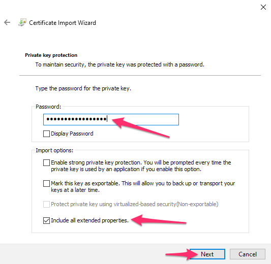
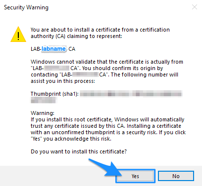
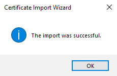
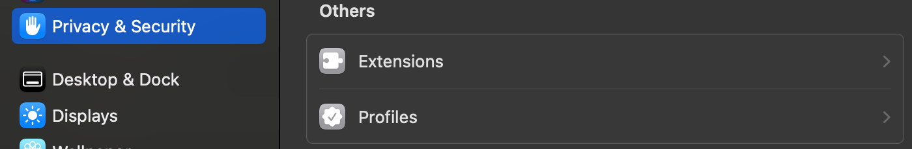
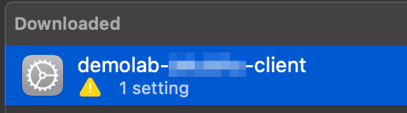
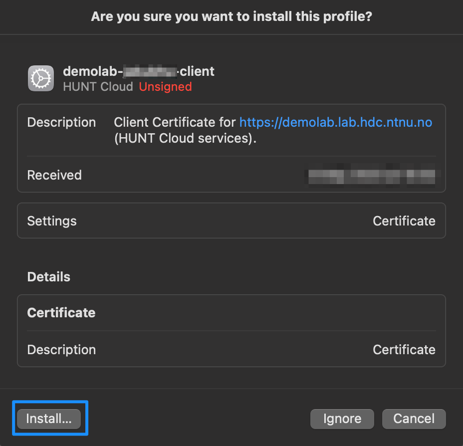
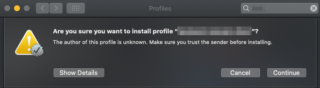

# HUNT Workbench reissue certificate

**This guide describes how to replaced an expired web browser certificate for your HUNT Workbench.**

::: tip When to use

This guide applys when you have requested a reissue of your expired HUNT Workbench certificate in our do science [service desk](/do-science/service-desk/#hunt-workbench-reissue). 

:::

::: expander "Windows" id="windows"

1. Open the p12 certificate. Make sure the store location is set to Current User and click next:

   

2. Continue clicking on next

   

3. Fill in the **`TLS passphrase`** that you received on signal, and make sure only the same option is checked exactly as in the image. Then click next:

   

4. Keep the first option to Automatically select the certificate store based on the type of certificate. Click next:

   

5. Your client certificate is imported and you can hit finish:

   

6. Wizard might require additional confirmation for installation of your Lab CA, and your Lab name should appear. Click yes to confirm if asked, or continue to the next step.

   

7. Quit your browser and restart it again for the certificate to get recognized.

   

:::

::: expander "macOS Ventura 13+" id="macos"

1. Open your system profile config file that you got from Filesender (**`<your_user_name>.mobileconfig`**).

2. In **`System settings`** open section **`Privacy & Security`**, scroll to the bottom of the page and sellect **`Profiles`**

   

3. Select certificate required for installation.

   

4. Click **`Install`**  when prompted. Then enter the **`TLS passphrase`** that you received on Signal and confirm.

   

5. Quit your browser and restart it again for the certificate to get recognized.

6. When you open your HUNT Workbench for the first time you will be asked for your local macOS password. This allows the browser to access your client certificate stored in your local Keychain. After filling in the password, confirm by clicking **`Always allow`** / **`Tillat alltid`**.

   

:::

::: expander "macOS Monterey and older" id="macos-monterey-and-older"

1. Open the system profile config (.mobileconfig) attached in archive.

2. Confirm the installation of profile.

   

3. Enter the passphrase that you received on signal and then confirm.

   

4. Quit your browser and restart it again for the certificate to get recognized.

5. When opening Workbench for the first time you will be asked for macOS password,
   allowing the browser to access your client certificate stored in Keychain.
   After filling in the password you can confirm by clicking on **`Always allow`** / **`Tillat alltid`**.

   

:::

::: expander "Ubuntu Linux"

We recommend that you use the [Google Chrome browser](https://www.google.com/chrome/) for predictability.

1. Open Chrome on your local computer.

2. Open url **`chrome://settings/certificates`** and click the **`Import`** button on the right side of the screen.

3. Browse and select your **`.p12`** file on your local computer and enter the **`TLS passphrase`** that you got on Signal.

4. Restart Chrome.

After the restart of Google Chrome the certificate is ready for network or secure web site client authentication.

:::

With a little bit of luck, you should now be able to continue your work as before. Enjoy! [Click here](/do-science/hunt-workbench/) to get back to the HUNT Workbench section. 

