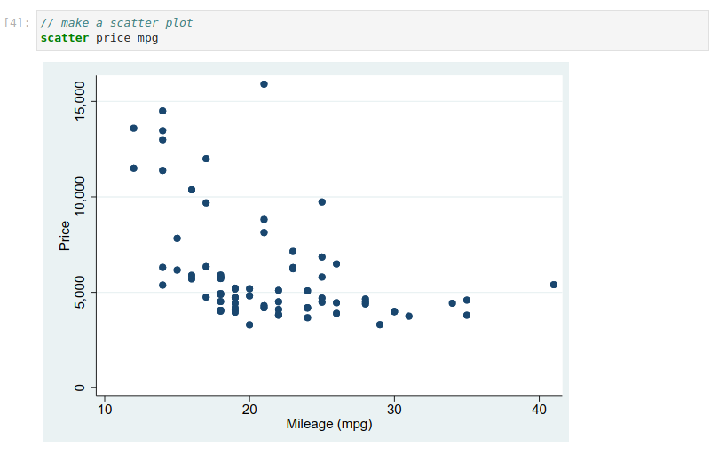

# Stata guide

**[Stata](https://www.stata.com/) is a handy general-purpose statistical tool from StataCorp. This guide aims to get you up and running with Stata in your HUNT Workbench.**

[[toc]]

## Introduction

Stata in your HUNT Workbench runs in a Jupyter notebook. This means that you can write known Stata commands and that you can view your plots directly on your screen. 

On the technical side, Stata runs on your lab home machine and connect with your workbench via [stata_kernel](https://kylebarron.dev/stata_kernel/) developed by Kyle Barron.

::: tip Recommended browser

We recommend that you open your workbench in the **`Google Chrome`** browser for this guide to ensure predictable results. 

:::

## Start

### Open a Stata notebook

To get going, open your workbench and click on the Stata icon. This opens a new workbench that runs the `stata_kernel`.


Look at the bottom of your screen to verify that Stata is loaded (`conda-stata`) and that your notebook is in an `Idle` state, meaning that it's ready to process your Stata commands.


 
::: details More on notebook states

* **Idle**. This means that your kernel is loaded and that your notebook is ready to process your commands.

* **Busy**. This means that your notebook is processing your commands. You should wait until it's back to `idle` before you run more code.

* **Connecting**. This means that your notebook is unable to connect to the kernel. You will not be able to run code until this is cleared. If it gets hung in a `connecting` state, click `Controal Panel` in the top right corner and stop and start your workbench to reset the connections.

* **Disconnected**. This means that your notebook is no longer connected to a kernel and you can not run your code until your restart your kernel.

:::

## Data

### Load data

Now that your new notebook is open, let's try to load data. Click on the first cell in your notebook and add the Stata command.

```python
// load example data
sysuse auto
```

Your command should look similar to this when included in the notebook:


Now click on the cell and hit `shift+enter` on your keyboard, or click the `play-button` at the top of your notebook, to run the code. This will load the standard Stata `auto` dataset and acknowledge with the text `(1978 Automobile Data)` which means that the command was completed successfully.


::: details Load data from your lab

You may load data that's stored in your lab with the following command: 

```python
// principal example
use "/mnt/archive/<folder>/<file>.dta"

// practical example 
use "/mnt/archive/data/test.dta"
```

Note that you need to add the path to your own data in the example above to make it work. 

**TIP**. To ease the navigation, start writing **`/mnt/`** and then double click on your "tab" key to autocomplete your paths.

:::

::: details Save data to your lab

You may save your data with the following command: 

```python
// principal example
save "/mnt/archive/<folder>/<filename>"

// practical example 
save "/mnt/archive/stata-auto-testfile"
```

We recommend that you store your dta-files outside  your workbench folder so it becomes accessible for all your lab colleagues. One good option is to store your data some place in the **`/mnt/archive/`**-folder. 

**TIP**. To ease the navigation, start writing **`/mnt/`** and then double click on your "tab" key to autocomplete your paths.

::::


### Describe data

The `auto` data set is now available in your notebook for further investigation. Let's run a few examples to get us going. 

First, let's cut and paste the following text and hit `shift+enter` to describe your data variables: 

```python
// describe your variables
describe
```

This should return a description of data variables: 


Then, let's try the `summarize` command to describe your data: 

```python
// summarize your data
summarize
```

This should return a summary of your data: 


## Graphs 

### View graphs

The Stata graph functions are similar, you run them in a cell and view the output in your notebook. To illustrate, let's test with a few plots from UCLA's great [introduction to Stata plotting](https://stats.oarc.ucla.edu/stata/modules/graph8/intro/introduction-to-graphs-in-stata/): 

```python
// make a scatter plot
scatter price mpg
```

This should print a scatter plot on your screen: 



::: warning No plot?

[Contact us](/contact) if you don't see the plot.

:::

Next, let's do a histogram: 

```python
// make a histogram
histogram mpg
```
And before we head to the next section, a slightly more advanced graph example:

```python
// Twoway linear prediction plots with CIs
twoway (scatter mpg weight) (lfitci mpg weight), by(foreign)
```

You output should look similar to this: 


The generation of this plot uses a tiny bit more compute resources than the previous once, so depending on your home machine type, the notebook state at the bottom of your notebook may shift from `Idle` to `Busy` in a few seconds while the graph is printed. Your notebook may be unresponsive as long as the state is `Busy`.

### Save graphs

You may save your graphs on your lab home machine with the `export` command: 

```python
// save your latest graph
graph export mygraph.svg
```

The above command will save the latest graph that you viewed in your notebook in your workbench folder (red arrow on the new file). 


Click on the `mygraph.svg` file to view the graph in your workbench, or right click on the file and select `Download` to export the graph to your local computer. 

You may also save your graphs in other folders on your lab machine to make them accessible for your lab colleagues:

```python
// Principal example of code that saves your 
// latest graph in a lab folder:
graph export /mnt/work/<folder>/mygraph.svg

// Practical example:
graph export /mnt/work/graphs/mygraph.svg
```


## Analysis

We will not dive into data analytics in this guide since there are so many other great guides out there, for example the once from [UCLA Advanced Research Computing](https://stats.oarc.ucla.edu/?s=stata)). Although, let's do two quick examples for fun: 

```python
// get mean value from a variable
mean mpg
```

The expected output should be like this: 


And let's end the guide with a regression example from [Statology](https://www.statology.org/multiple-linear-regression-stata/): 

```python
// run multiple linear regression with mpg and
// weight as explanatory variables and price
// as a response variable:
regress price mpg weight
```


::: tip Time for coffee!

It's great to see that you followed the guide all the way to the end. Time to celebrate with a cup of fresh coffee before your start your exploration into your new workbench Stata world!

:::

## Going further

If you want to learn more about the Stata kernel, head over to Kayle Barron's [Example stata_kernel Jupyter notebook](https://nbviewer.org/github/kylebarron/stata_kernel/blob/master/examples/Example.ipynb). The notebook includes more examples, including the `magics` commands that gives you special powers. Cut and paste the text from the cells into your current stata_kernel workbench notebook to get going. 

#### Community discussions

Head over to our **`#community-stata`** channel in Slack to chat with other Stata users from the [cloud community](/community) or  ask questions directly to us.

#### Help us improve this page

If you miss something, please [contact us](/contact) so we can improve this Stata guide content for the next scientists in line.

## Troubleshooting

#### I am unable to run the magics commands

[Magics](https://kylebarron.dev/stata_kernel/using_stata_kernel/magics/) are special commands provided by stata_kernel that start with **`%`**, for example the **`%head`**-command. If you are unable to run the magic commands, confirm that your are running Stata 16 with the **`version`** command and [contact us](/contact) for further investigations.

```python
\\ Stata version
version
```

#### The notebook is unresponsive when I run a cell 

If you are unable to run any Stata commands, check that your notebook is in an [Idle state](/do-science/guides/stata/#open-a-stata-notebook). If not try to [restart your workbench environment](/do-science/hunt-workbench/faq/#how-can-i-restart-my-workbench-environment), and [contact us](contact) if it persist after the restart.


