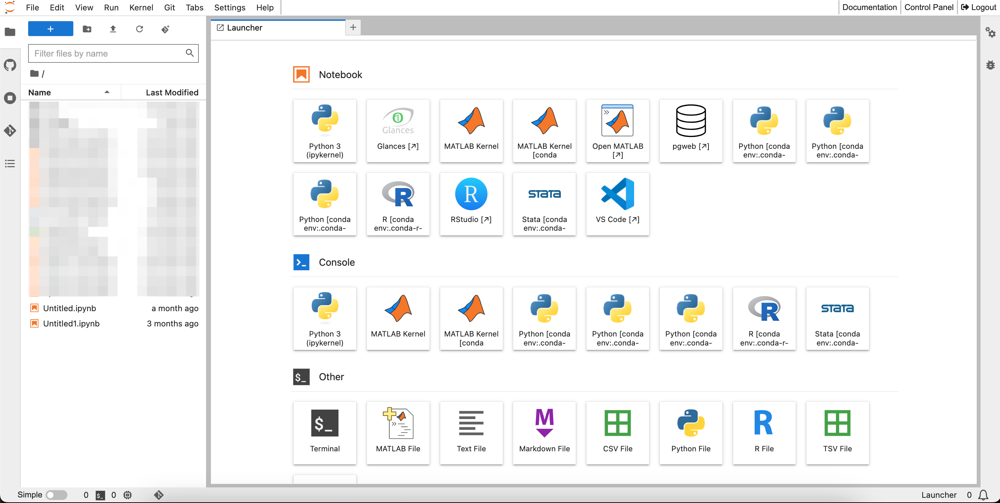

# HUNT Workbench

**HUNT Workbench provides you with web-based access to modern data science tools such as Jupyter Notebooks, Python, RStudio, R and MATLAB.**

## About

HUNT Workbench enables interactive web-based computing built around Jupyter, with access to applications such as _Jupyter Notebook_, _Python_, _RStudio_, _R_ and _Conda_. We have also include support for _MATLAB_ and _Stata_ for those that bring their own license.

## Request access

::: tip Service desk

Head over to the service desk and click the blue button to [request your HUNT Workbench access](/do-science/service-desk/#hunt-workbench-access).

