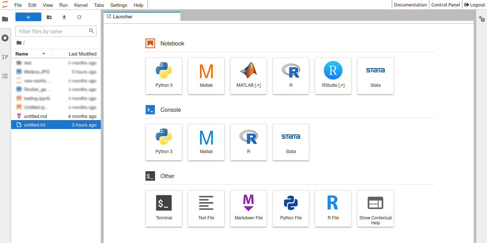

# HUNT Workbench

**HUNT Workbench provides you with a simple and secure place to explore your data and tools together with your team.**

## About

Workbench is web-based lab designed for interactive computing and built around Jupyter, with access to applications such as _Jupyter Notebook_, _Python_, _RStudio_, _R_ and _Conda_. We have also included support for _MATLAB_ and _Stata_ for those that bring their own license.

## Request access

::: tip Service desk

Head over to the service desk and click the blue button to [request your Workbench access](/service-desk/user-orders#workbench-access).
