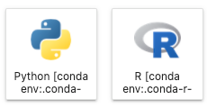
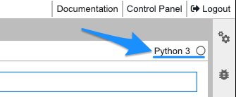
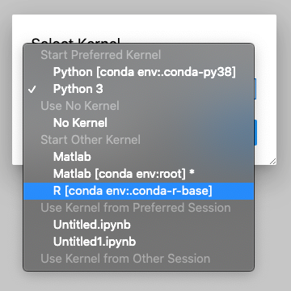
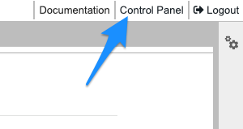
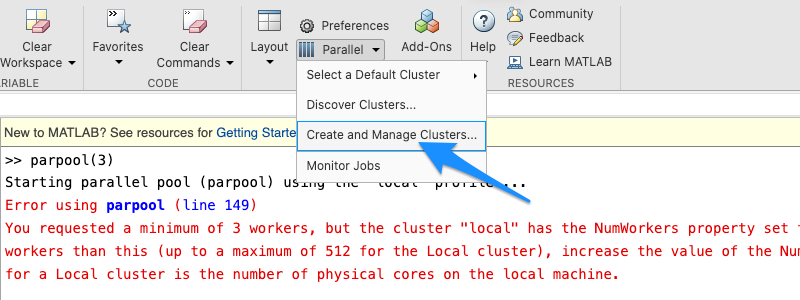
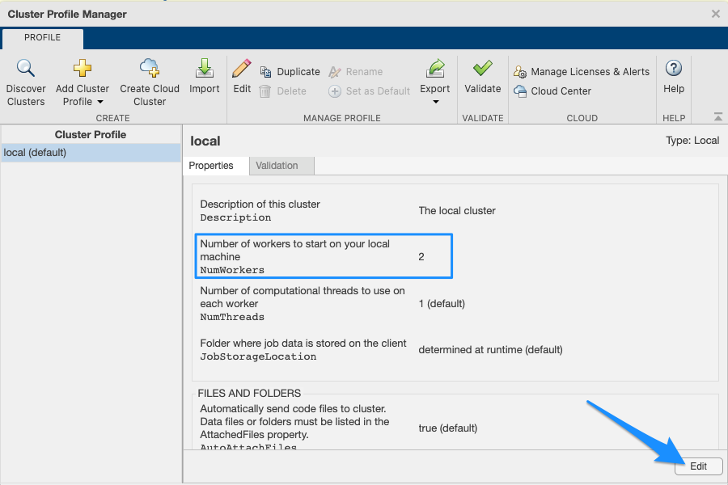
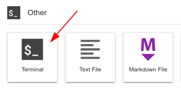

# HUNT Workbench FAQ

**This page contain frequently asked questions about Workbench. Help us expand this section by [sending us questions and ideas](/contact) for new content.**

[[toc]]

::: tip Troubleshooting

Head over to our [HUNT Workbench troubleshooting](/do-science/hunt-workbench/troubleshooting/) section if something is not working as expected.

:::


## Storage

### Where is my data?

HUNT Workbench uses the same storages volumes as your home machine. This means that you can access all lab data, including your **`home`**-directory, using the same paths in your scripts, for example:

```bash
/mnt/archive/<my-data-folder>
```

### Where is my code stored?

Your Jupyter Notebooks and code files are stored in the following shared **`work`**-volume on your home machine:

```bash
/mnt/work/workbench
```


## Reproducibility

### Can I create my own Conda environment for Jupyter?

Yes. This allows you to install packages and package versions of your choice.

Below is an example on how you create a Conda environments with _Python_ and _IPython_ kernel from your [workbench terminal](/do-science/hunt-workbench/faq/#terminal)::

```bash
mamba create -n <name> 'python~=3.10.*' 'ipykernel'
```
If you have older setup and missing mamba, you can use conda command instead:

```bash
mamba create -n <name> 'python~=3.10.*' 'ipykernel'
```

And here's an example on how to create a Conda environment with _R_ and _R-IRkernel_ kernel and commonly used packages:

```bash
mamba create -n <name> 'r-base>=4.0,<5.0' 'r-irkernel' 'r-devtools' 'r-remotes' 'r-dplyr' 'r-tidyverse' 'r-haven'
```

You need to replace **`<name>`** with your own environment name in the example above, such as **`conda-test-environment`**.

### How can I start a Notebook with my new Conda environment?

You should see Notebooks with the **`conda env`**-tag. Here are two examples of such Notebooks that are connected to custom Conda environments.



### How can I change a Conda environment for my Notebook?

You can change the Conda environment for your Jupyter Notebook when it is open: Open your Jupyter Notebook of choice and switch the kernel in the top right corner of menu:



You will be able to select default environments including MATLAB kernel and custom environments which contain either **`ipykernel`** (Python) or **`r-irkernel`** (R 4.0):



### Can others use packages I have installed?

Not directly. The packages you install in your Workbench are usually not shared. The separation prevent others from breaking your packages, for example during upgrades. However, you may utilize the powers of Conda to export the definition of your environments so others can use restore function to be able to use the very same packages that you use. Learn how to manage environments on [docs.conda.io](https://docs.conda.io/projects/conda/en/latest/user-guide/tasks/manage-environments.html) or skip directly to [sharing an environment guide](https://docs.conda.io/projects/conda/en/latest/user-guide/tasks/manage-environments.html#sharing-an-environment).

### How can I share my Conda environments with others?

It might be handy to share your exact setup with your lab colleagues when you have perfected your workflows.

The packages that you have installed in your HUNT Workbench environment are usually not shared. The separation prevent others from breaking your packages and it allows you to explore packages without breaking the workflows of others.

So, to share environments you will need to export your environments definition to your colleagues so they can reuse them. Read more on how to [share](https://docs.conda.io/projects/conda/en/latest/user-guide/tasks/manage-environments.html#sharing-an-environment) and manage Code environments on [docs.conda.io](https://docs.conda.io/projects/conda/en/latest/user-guide/tasks/manage-environments.html). Below is a principle guide run in your [workbench terminal](/do-science/hunt-workbench/faq/#terminal):

1. In your Workbench:

```bash
# -- export your active environment
conda env export > /mnt/scratch/test-environment.yml
```

2. In your lab colleague's Workbench (run by your lab-colleague):

```bash
# -- create a new environment from the saved environment file
conde env create -f /mnt/scratch/test-environment.yml

# -- activate the environment (it will have the same name as your original environment)
conda activate <name>

# -- verify the installation
conda env list
```


### How can I install apt packages?

We recommend that instead of using apt, you install your packages into your environment using Conda since these will be installed on disk and such be persistent during restarts. Regular **`apt`** commands run in terminal will be removed during your next restart. Search [Conda repository](https://anaconda.org/) to identify your package name and get going with your installation.

Example with [plink2](https://anaconda.org/bioconda/plink2) package:

```
mamba install -n default -c bioconda -y plink2
conda activate default
plink2 --help
```


## Management

### How can I restart my workbench environment?

Sometimes you might want to start over with a fresh environment:

(1) Select control panel in top right corner:



(2) Then in the control panel hit stop server:


You can either start the new instance by hitting the button or by logging in again.

### Can I install Jupyter extensions?

No. Due to security reasons, we have disabled the Jupyter extension manager. [Contact us](/contact) if you would like useful extensions to be added to the HUNT Workbench.


## MATLAB

### Are there any limitations to MATLAB in HUNT Workbench?

Yes, there are some limitations to the web-based version of MATLAB (_MATLAB Online_). Read more in the [official documentation](https://se.mathworks.com/products/matlab-online/limitations.html) from MathWorks.

### How do I report issues with MATLAB?

Try to document the time when the issue occurred and save the error logs from your Status information window. Additionally, it would also help if you could take a screenshot of the error logs in the browser console. Usually you can open the console with the shortcuts: **`CTRL + SHIFT + J`** (MacOS: **`CMD + Option + J`**), although this may vary between browsers. Share the information with us on [Slack or email](/contact).

### How can I increase the number of parallel workers?

If you already have "_Parallel Computing Toolbox_" and cannot set the higher number parallel workers in the pool, select **`Parallel`** menu and click on **`Create and Manage Clusters`**:



Then, hit **`Edit`** and update the **`NumWorkers`** value (usually number of CPUs):



### Can I install new toolboxes

We need to initiate such installation. [Contact us](/contact) on email if you need new toolboxes in your MATLAB installation.


## RStudio

### Which R version is available in RStudio?

RStudio is configured to use packages installed in the conda environment named **`r-base`**. You can identify your current _R version_ packages in your [Workbench Terminal](/do-science/hunt-workbench/faq/#terminal) following these steps:

1. Open your Workbench Terminal.



2. List the packages in your r-base conda environment.

```bash
conda list -n r-base | grep r-base
```

### Which R packages are preinstalled?

Currently, we install your **`r-base`** environment with the following conda packages:

```bash
- r-base
- r-haven
- r-irkernel
- r-devtools
- r-dplyr
- r-remotes
- r-tidyverse
```

If you have older setup and missing some of these packages you can follow the "_How do I install additional R packages_"-answer below to add them to your conda environment.

### How do I install additional R packages?

If you want to install your own R packages, we recommend that you use [Conda](/do-science/tools/analytical/conda/) where ever possible:

1. Open [Workbench Terminal](/do-science/hunt-workbench/faq/#terminal):


2. Activate r-base environment

```bash
conda activate r-base
```

3. Add packages to your **`r-base`** code environment:

```bash
# -- Principal example
conda install -n r-base -c conda-forge r-'<package-name>' r-'<another-package-name>'

# -- Practical example*
mamba install -n r-base -c conda-forge r-dplyr
```

For example, the above example installs the [dplyr package](https://anaconda.org/conda-forge/r-dplyr).

3. When the installation is complete, open _RStudio_ or _R_ in your workbench and load your new package:

```bash
# -- Principal example
library(<package-name>)

# -- Practical example
library(dplyr)
```

You can defer to alternative methods such as `install.packages()` when the package is not available in Conda (see below).

### How do I install R packages not found in Conda?

If you don't find a _R package_ in Conda as described above, you may need to defer to running the **`install.packages()`** command inside R. We recommend to use **`R`** in your [workbench terminal](/do-science/hunt-workbench/faq/#terminal) for such installations (instead of installing directly in RStudio) to avoid broken environment states in RStudio. Packages installed into your **`r-base`** environment through _R_ in terminal should be available in _RStudio_.

Packages installed into `r-base` environment through **R** in [terminal](/working-in-your-lab/workbench/faq/#terminal) will be available in **RStudio**.

Make sure to activate the `r-base` environment before running **R** command.

```bash
conda activate r-base
```

### How can I use R in my Workbench Terminal?

First, open your [Workbench Terminal](/do-science/hunt-workbench/faq/#terminal).

Start by activating `r-base` environment:

```bash
conda activate r-base
```

Then run **R** inside your `r-base` environment:

```bash
R
```

Enjoy!

### How can I recover my R environment in case of broken package installation?

Sometimes you may get errors about the **`GLIBCXX`** library not being found and/or essential R packages are not working. This happens typically after installation of custom package. In such cases, you might consider to recreate your **`r-base`** environment from scratch:

1. Open your [workbench terminal](/do-science/hunt-workbench/faq/#terminal) and run the following code to reset your **`r-base`** environment:

```bash
mamba create --yes -n r-base 'r-base>=4.0,<5.0' 'compilers' 'cmake' 'gmp' 'r-irkernel' 'r-devtools' 'r-remotes' 'r-dplyr' 'r-tidyverse' 'r-haven'
```

If you have older setup without mamba, use conda command instead:
```bash
conda create --yes -n r-base 'r-base>=4.0,<5.0' 'compilers' 'cmake' 'gmp' 'r-irkernel' 'r-devtools' 'r-remotes' 'r-dplyr' 'r-tidyverse' 'r-haven'
```

::: warning

This removes custom packages that you might have installed.

:::

### Can others use my R packages?

When you have perfected your workflows, you can share your setup with your colleagues, although not directly.

The R-packages in your HUNT Workbench environment are usually not shared. This separation prevent others from breaking your packages and it allows you to explore packages without breaking the workflow of others.

So, to share environments you will need to export your environments definitions so others can reuse them:

Learn how to manage environments on [docs.conda.io](https://docs.conda.io/projects/conda/en/latest/user-guide/tasks/manage-environments.html).

### How do I reset my user state in RStudio?

When you [restart your HUNT Workbench](/do-science/hunt-workbench/faq/#how-can-i-restart-my-workbench-environment), your _RStudio_ user state might still be preserved. Read the _RStudio_ support pages about how you can [manually remove your user state](https://support.rstudio.com/hc/en-us/articles/218730228-Resetting-a-user-s-state-on-RStudio-Workbench-RStudio-Server) to achieve a complete reset.


## Terminal

### Can I use a terminal from my Workbench?

Yes. You can find your **`Workbench Terminal`** in the main view of applications under the section: **`Other`**.


### When do I need to use a terminal?

**`Workbench Terminal`** can be handy when it comes to managing [Conda packages](/do-science/tools/analytical/conda/), monitoring resources (**`htop`**), or handling other tasks.


