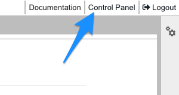

# JupyterLab

> [JupyterLab](https://jupyter.org/) is the latest web-based interactive development environment for notebooks, code, and data. Its flexible interface allows users to configure and arrange workflows in data science, scientific computing, computational journalism, and machine learning.

## The path to solving outstanding problems

If you are starting with Jupyter or your research track in general we highly recommend [Keynote from Juan Klopper: Jupyter - The path to solving outstanding problems](https://www.youtube.com/watch?v=gmBRzi6hjhI).

<iframe width="768" height="432" src="https://www.youtube-nocookie.com/embed/gmBRzi6hjhI?si=Mm4HbAsFEEfg5x-G" title="YouTube video player" frameborder="0" allow="accelerometer; autoplay; clipboard-write; encrypted-media; gyroscope; picture-in-picture; web-share" allowfullscreen></iframe>

Here we try to summarize basics of what you should know when starting with Jupyter.

We recommend official JupyterLab guides to get familiar with the interface:
- [The JupyterLab Interface](https://jupyterlab.readthedocs.io/en/latest/user/interface.html)
- [Working with Files](https://jupyterlab.readthedocs.io/en/latest/user/files.html)
- [Notebooks](https://jupyterlab.readthedocs.io/en/latest/user/notebook.html)

> Jupyter notebooks are documents that combine live runnable code with narrative text (Markdown), equations (LaTeX), images, interactive visualizations and other rich output.


## Working with Notebooks

You can find useful explanations and video guides in official documentation:

- [Notebooks](https://jupyterlab.readthedocs.io/en/latest/user/notebook.html)
- [Code consoles](https://jupyterlab.readthedocs.io/en/latest/user/code_console.html)
- [Terminals](https://jupyterlab.readthedocs.io/en/latest/user/terminal.html)
- [Documents and kernels](https://jupyterlab.readthedocs.io/en/latest/user/documents_kernels.html)
- [Text editor](https://jupyterlab.readthedocs.io/en/latest/user/file_editor.html)

## Logging out and stopping the server

When you are ready to stop working inside Workbench, please stop your server in control panel and logout.

Stopping your Workbench is the same as shutting down your computer. If you stop your Workbench environment and come back the next day (or even the next week), all your files will still be there and you can resume processing your data.

### Why stop the server?

Do your part to reduce resource use and ease the burden on the environment by stopping your Workbench server when you are finished working for the day. This will also allow your lab mates to use those compute resources while you are away.

**In some cases, you may need to leave your Workbench server running.** For example, you have a notebook performing a very time intensive analysis and wish to let it run overnight. It is acceptable for you to keep your Workbench running in cases like this.

> Summary:
>
> Unless you intend to run your analysis for a long period of time, make sure to stop the server before you leave.

### How can I stop the server and log out?

1. While logged in Workbench select **`Control panel`** in top right corner.



2. In the Control panel hit **`Stop My Server`** button.


3.  Then click on the **`Logout`** button in the top right corner.
    
    The next time you log in to your Workbench, click start my server from control panel

## Working with lab mates

Typically your lab has more users and you all are sharing [compute](https://docs.hdc.ntnu.no/do-science/faq/compute/) and [storage resources](/do-science/faq/storage).
For this to work efficiently you will need to know how to check your resource usage and free up resources if needed.

### Monitoring resources

One way to monitor resources is using Glances. We have included [Glances proxy extension](https://github.com/huntdatacenter/jupyter-glances-proxy) in JupyterLab installation.

You can also you Terminal app inside your Workbench and run standard commands like [HTOP](https://docs.hdc.ntnu.no/do-science/tools/technical/htop/) and [others](/do-science/faq/compute#can-i-monitor-my-resource-consumption)

For checking storage capacity and how much data are written on disk have a look at [df -h --type=ext4](/do-science/faq/storage#resources) and [ncdu](/do-science/tools/technical/ncdu).

### Managing resources

Read more in the official JupyterLab guide about [Managing Kernels and Terminals](https://jupyterlab.readthedocs.io/en/latest/user/running.html) to find out about Kernels in JupyterLab and how you can stop them to free up RAM (operational memory) once you do not use them.

### Long running notebooks

If your Jupyter Notebook takes too long to execute (more than VPN session), you should consider running it from terminal. You will also need to use [terminal multiplexers](https://docs.hdc.ntnu.no/do-science/tools/technical/terminal-multiplexers/#tmux) to assure that you can always reconnect to your session.

Activate your Conda environment first:

```
conda activate py310
```

Then run your notebook:

```
jupyter run your_notebook.ipynb
```
