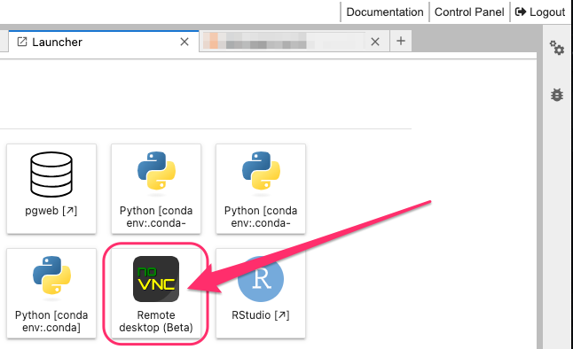
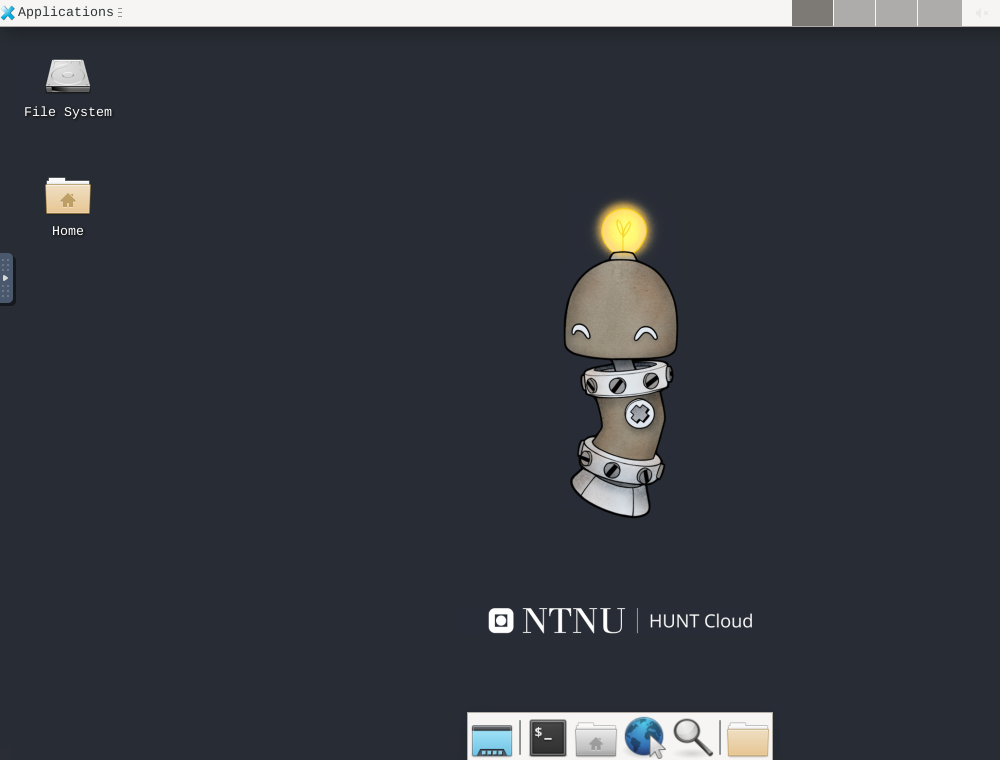

# Remote desktop

Remote desktop (VNC) is now included in Workbench so you can more easily browse directories, move data within the lab by drag-and-drop and use apps with graphical interface.

Tools that come bundled with remote desktop in Workbench:
- LibreOffice
- PSPP (Open source alternative to SPSS)
- File browser
- PDF viewer
- Image viewer

Tools that you can request:
- STATA, Send request through [general service request](/do-science/service-desk/#tingweek:~:text=data%20space%20subscription.-,%23,-General%20service%20request)

Tools that you can download yourself:
- ITKsnap (version 4.2.0 or higher)
- 3d slicer
