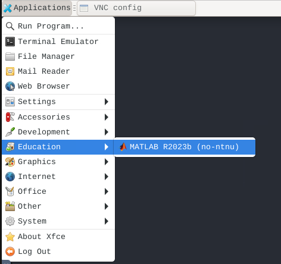

# MATLAB

**You can run MATLAB both from Jupyterlab or from the remote desktop (VNC).**

To be able to run MATLAB in Workbench you need to bring your own license. In most cases such license is already provided by your institution and you can request it from your IT department.

::: tip NTNU employees

We already have the license for NTNU employees, so you can just request MATLAB in Workbench from the do science Service desk.

:::

### In JupyterLab

MATLAB installation in Workbench comes with the MATLAB kernel, you can read about it [https://blogs.mathworks.com/matlab/2023/01/30/official-mathworks-matlab-kernel-for-jupyter-released/](on this page).

### In Remote desktop

MATLAB is available in your Workbench VNC desktop under the "Education" tab. 

## Managing resources

Read more in our guide about [parallel computing settings](/do-science/hunt-workbench/faq/#how-can-i-increase-the-number-of-parallel-workers) in MATLAB.

## FAQ

See our dedicated [MATLAB FAQ](/do-science/hunt-workbench/faq/#matlab).

