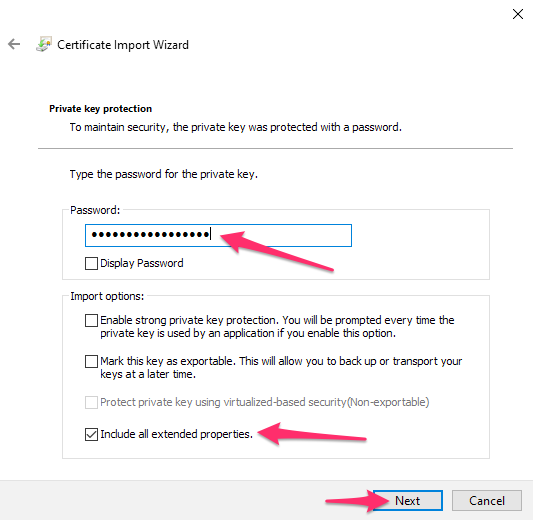
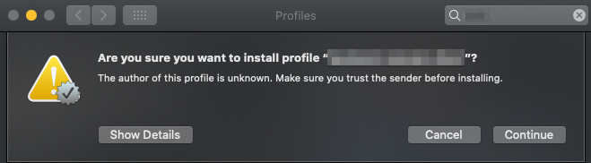
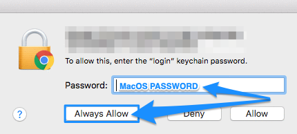

# HUNT Workbench installation

**This guide will help you to connect to your HUNT Workbench over a web browser. Allow for 30 minutes to complete this installation and some playtime in your new environment.**

[[toc]]

## Before you start

::: warning Requirements

- A working VPN and SSH configuration as described in our [Getting started](/getting-started/) guide.
- A HUNT Workbench certificate as described in the [HUNT Workbench certificate request](/do-science/guides/workbench-request/).

**Without these, it will be impossible to complete this guide.**

:::

::: tip Time estimate

:::


## 1. Edit hosts file

We are sending hosts record in onboarding email. You will need to make sure that your hosts file contains this line.

Example of hosts record:

```
10.42.130.X <lab_name>.lab.hdc.ntnu.no
```

::: details Windows

1. Press the Windows key.

2. Type `Notepad` in the search field.

3. In the search results, **right-click** Notepad and select Run as administrator.

   

   

4. From Notepad, open the following file: `C:\Windows\System32\Drivers\etc\hosts`.

   Start by selecting `File` > `Open`.

   

   Find the directory, and then change `Text documents` to view `All files`.
   When hosts file appears in the list select it and click Open:

   

5. Add the line that you received from us on email.

6. Select `File` > `Save` to save your changes.

:::


::: details OS X and macOS

On your local machine, edit `/etc/hosts` file in your preferred text editor, and add the line that you received from us on email.

Example with text editor:

```
EDITOR='open -Wne' sudo -e /etc/hosts
```

Example with vim:

```
sudo vim /etc/hosts
```


:::

::: details Ubuntu Linux

On your local machine, edit `/etc/hosts` file in your preferred text editor, and add the line that you received from us on email.

Example with gedit

```
sudo gedit /etc/hosts
```

Example with vim

```
sudo vim /etc/hosts
```
:::


## 2. Install certificates

::: details Windows

1. Open the p12 certificate. Make sure the store location is set to Current User and click next:

   

2. Continue clicking on next

   

3. Fill in the **`TLS passphrase`** that you received on signal, and make sure only the same option is checked exactly as in the image. Then click next:

   

4. Keep the first option to Automatically select the certificate store based on the type of certificate. Click next:

   

5. Your client certificate is imported and you can hit finish:

   

6. Wizard will require additional confirmation for installation certification authority HCTS CA 1
   (HUNT Cloud Trust Services).
   HUNT Cloud certificate is required to safely access Workbench in your lab.
   If you see LAB instead of `HCTS CA 1` skip to step 7.
   Usually you are asked to confirm only when setting up Workbench for the first time.
   Before clicking yes you should confirm that you see this thumbprint (fingerprint):
   `ADD9DFEC C998BE44 AC2F254E 75E5EB98 D91879A6`

   

7. Same step is required for your Lab CA, where your Lab name should appear:

   

8. Quit your browser and restart it again for the certificate to get recognized.

   

:::

::: details OS X and macOS

1. Open the system profile config (.mobileconfig) attached in archive.

2. In `System Preferences` open section `Profiles`.

   ::: warning NTNU managed Macbook

   If your Macbook is managed by NTNU and you do not see section Profiles in your System Preferences
   you will need to request access to Profile through NTNU Hjelp.
   If you are not NTNU affiliated you can contact IT department of your organisation / university.

3. Confirm the installation of profile.

   

4. Enter the passphrase that you received on signal and then confirm.

   

5. Quit your browser and restart it again for the certificate to get recognized.

6. When opening Workbench for the first time you will be asked for macOS password,
   allowing the browser to access your client certificate stored in Keychain.
   After filling in the password you can confirm by clicking on `Always allow` / `Tillat alltid`.

   

:::

::: details Ubuntu Linux

We recommend that you use the [Google Chrome browser](https://www.google.com/chrome/) for predictability.

1. Open Google Chrome on your local machine.

2. Open url `chrome://settings/certificates` and click the `Import` button on the right side of the screen.

3. Browse and select your `.p12` file on your local machine and enter the `TLS passphrase` that you got on Signal.

4. Restart Chrome.

After the restart of Google Chrome the certificate is ready for network or secure web site client authentication.

:::

## 3. Open your new Workbench

::: tip

Make sure you are connected to the VPN before accessing Workbench.
:::

1. Open your web browser (we recommend [Google Chrome browser](https://www.google.com/chrome/)).

2. Type in the URL address to your lab in your browser.

```bash
# -- Principal example
https://<labname>.lab.hdc.ntnu.no

# -- Demo example
https://demolab.lab.hdc.ntnu.no
```

Click `OK` if you get a `User Identification Request` for your new certificate and ensure that the `Remember this decision` is checked.
The certificates are to be issued by:

```
Organization: "HUNT Cloud"
Issued Under: "HUNT Cloud Trust Services"
```


3. Sign in with your HUNT Cloud lab username and lab passphrase. This is the passphrase that you made on your first login.

4. With a little bit of luck you should now see your new Workbench. Click around and explore your new world!

::: tip

Read [Principles](/working-in-your-lab/hunt-workbench/principles/) and [FAQ](/working-in-your-lab/hunt-workbench/faq/) sections to learn more about Workbench.

:::


## Immediate troubleshooting

This section includes only main questions regarding first time setup.

You should also look into [FAQ](/working-in-your-lab/hunt-workbench/faq/) and [Troubleshooting](/working-in-your-lab/hunt-workbench/troubleshooting/) if you do not find your answers here.

### I don't remember my passphrase

::: details Read more
Don't worry. [Contact us](/service-desk/user-orders/#ssh-passphrase-reset) on email for an SSH passphrase reset.
:::

### Firefox - Did Not Connect

::: details Read more

Firefox may require manually importing HUNT Cloud Certificate Authority to consider it trusted.
If you see Error code: `SEC_ERROR_UNKNOWN_ISSUER` when accessing Workbench follow these steps:
1. Download our public CA certificate: [https://pki.hdc.ntnu.no/hctsca1.crt](https://pki.hdc.ntnu.no/hctsca1.crt)
2. Open Firefox url: `about:preferences#privacy`
3. Scroll down to section `Certificates` and click on `View Certificates`:
   
4. Switch to tab `Authorities` and click on `Import`:
   
5. Select `hctsca1.crt` and check option `Trust this CA to identify websites`:
   
:::

### 502 Bad gateway

::: details Read more

Something is wrong with configuration of the server, reach out in your lab channel on Slack or [Contact us](/contact) us for further investigation.

:::


