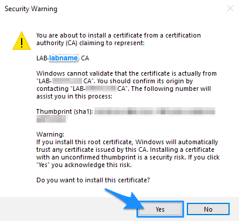
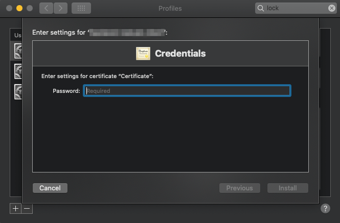

# HUNT Workbench installation

**This guide will help you to connect to your HUNT Workbench over a web browser.**

[[toc]]

## 1. Before you start

You will need the following to complete this guide: 

::: warning Requirements

- A working VPN and SSH configuration as described in our [Getting started](/do-science/getting-started/) guide.
- A HUNT Workbench certificate as described in the [HUNT Workbench certificate request](/do-science/guides/hunt-workbench-request/).

Without these it's impossible to complete this guide. 

:::

::: tip Time 

Allow for **30 minutes** to complete this installation and some playtime in your new environment.

:::

## 2. Edit your hosts file

First, let's set up your hosts file on your local computer. This allows you to connect to the HUNT workbench 
in your lab using a URL name, for example **`demolab.lab.hdc.ntnu.no`**, in your web-browser rather than an IP address.

Your **`host record`**, the record of your lab IP address and your lab host name, are included in your HUNT Workbench onboardig email. Example of a hosts record:

```bash
# -- Principal example of a host record
10.42.X.Y <lab_name>.lab.hdc.ntnu.no
```

Select steps for your operating system:

::: details Windows

1. Press the Windows key.

2. Type **`Notepad`** in the search field.

3. In the search results, **right-click** Notepad and select Run as administrator.

   

   

4. From Notepad, open the following file: **`C:\Windows\System32\Drivers\etc\hosts`**.

   Start by selecting **`File`** > **`Open`**.

   

   Then find the (1.) directory and change **`Text documents`** to view (2) **`All files`**. When a file named **`hosts`** appears in the list (3), select it and click **`Open`** (4):

   

5. Add your **`hosts record`** to the text file. This is the line that you received from us in your HUNT Workbench onboarding email (see above).

6. Select **`File`** > **`Save`** to save your changes and close the **`Notepad`** application.

:::


::: details OS X and macOS

1. On your local computer, open your **`/etc/hosts`** file in your preferred text editor.

Example with text editor:

```
EDITOR='open -Wne' sudo -e /etc/hosts
```

Example with vim:

```
sudo vim /etc/hosts
```

2. Add (append) the **`host record`** line that you received from us on email.

3. Close your text editor.

:::


::: details Ubuntu Linux

1. On your local computer, open your **`/etc/hosts`** file in your preferred text editor.

Example with gedit:

```
sudo gedit /etc/hosts
```

Example with vim:

```
sudo vim /etc/hosts
```

2. Add (append) the **`host record`** line that you received from us on email.

3. Close your text editor.

:::


## 3. Install your certificates

Let's install the certificates that is required to allow traffic with your HUNT Workbench that is located in your lab. 

::: details Windows

1. Open your **`p12 certificate`** that you downloaded from Filesender. Make sure the store location is set to **`Current User`** and click **`Next`**:

   

2. Click **`Next`** one more time.

   

3. Fill in the **`TLS passphrase`** that you received on signal, and make sure the options are checked exactly as in the image. Then click **`Next`**:

   

4. Check the first option: _Automatically select the certificate store based on the type of certificate_. Click **`Next`**:

   

5. You should now get a _Completing the Certificate Import Wizard_ message. Click **`Finish`** to complete the the iport:

   

6. The wizard will require a confirmation to install a certification from us: **`HCTS CA 1`** (_HUNT Cloud Trust Services_). Our certificate is required to safely access your workbench environment.

   You will normally be asked to confirm our certificate only when you set up the HUNT Workbench for the first time. Thus, if you see **`LAB`** instead of **`HCTS CA 1`** skip to step 7.
   
   Before clicking **`YES`**, confirm that you see our thumbprint (fingerprint):
   
   ```
   ADD9DFEC C998BE44 AC2F254E 75E5EB98 D91879A6
   ```

   

7. Similar to Step 6, you will also need to install a certificate for your lab (**`Lab CA`**), where your Lab name should appear. Click **`YES`**.

   

8. Now quit your browser and restart it for the certificate to get recognized.

   

:::


::: details OS X and macOS

1. Open your system profile config file that you got from Filesender (**`<your_user_name>.mobileconfig`**).

2. In **`System Preferences`** open section **`Profiles`**.

   ::: warning NTNU managed Macbook

   If your Macbook is managed by NTNU and you do not see section Profiles in your System Preferences you will need to request access to Profile through NTNU Hjelp. If you are not NTNU affiliated, can contact your IT department for assistance.

3. Click **`Continue`** to confirm your profile installation.

   

4. Enter the **`TLS passphrase`** that you received on Signal and the click **`Install`** to confirm.

   

5. Quit your browser and restart it again for the certificate to get recognized.

6. When you open your HUNT Workbench for the first time you will be asked for your local macOS password. This allows the browser to access your client certificate stored in your local Keychain. After filling in the password, confirm by clicking **`Always allow`** / **`Tillat alltid`**.

   

:::

::: details Ubuntu Linux

We recommend that you use the [Google Chrome browser](https://www.google.com/chrome/) for predictabe access to your HUNT Workbench.

1. Open **`Google Chrome`** on your local computer.

2. In Google Chrome, open the URL **`chrome://settings/certificates`** and click the **`Import`** button on the right side of the screen.

3. Browse and select your **`.p12`** file that you downloaded to your local computer, and enter the **`TLS passphrase`** that we sent you on Signal.

4. Restart Chrome.

:::


## 4. Open your HUNT Workbench

::: tip

Make sure you are connected to the VPN before you access your HUNT Workbench.
:::

1. Open your web browser (we recommend [Google Chrome browser](https://www.google.com/chrome/)).

2. Type in the URL address to your lab in your browser.

```bash
# -- Principal example
https://<labname>.lab.hdc.ntnu.no

# -- Demo example
https://demolab.lab.hdc.ntnu.no
```

You may get a **`User Identification Request`** for your new certificate. Verify that the certificates are issued by:

```bash
Organization: "HUNT Cloud"
Issued Under: "HUNT Cloud Trust Services"
```

Ensure that the **`Remember this decision`** box is checked, and click **`OK`**.


3. Sign in with your HUNT Cloud lab username and lab passphrase. This is the passphrase that you made on your first login.

4. With a little bit of luck you should now see your new HUNT Workbench. **Click around and explore your new world!**


::: tip Further reading

See our HUNT Workbench [principles](/do-science/hunt-workbench/principles/) and [FAQ](/do-science/hunt-workbench/faq/) sections to learn more about your new environment.

:::


## Immediate troubleshooting

This section includes issues that you might encounter during your first setup. See our HUNT Workbench [FAQ](/do-science/hunt-workbench/faq/) and HUNT Workbench [Troubleshooting](/do-science/hunt-workbench/troubleshooting/) if you do not find your answers below.

#### This site can’t be reached

::: details Read more

If you are getting `DNS_PROBE_FINISHED_NXDOMAIN` error you need to repeat the [Step 2](#_2-edit-your-hosts-file) of this guide.

On MacOS or Linux you can also assure hosts return IP address using the command below:

```
# -- Principal example
getent hosts <labname>.lab.hdc.ntnu.no

# -- Demo example
getent hosts demolab.lab.hdc.ntnu.no
```
:::

#### I don't remember my passphrase

::: details Read more

Don't worry. Request a [SSH passphrase rest](/do-science/service-desk/#ssh-passphrase-reset) in our do-science service desk.
:::

#### Firefox - Did Not Connect

::: details Read more

_(We recommend to use Google Chrome as your HUNT Workbench browser.)_

Firefox may require that you manually import the **`HUNT Cloud Certificate Authority`** to consider it trusted.

If you see Error code: **`SEC_ERROR_UNKNOWN_ISSUER`** when accessing Workbench follow these steps:

1. Download our public CA certificate from [https://pki.hdc.ntnu.no/hctsca1.crt](https://pki.hdc.ntnu.no/hctsca1.crt)

2. Open the following Firefox URL: **`about:preferences#privacy`**

3. Scroll down to section **`Certificates`** and click on **`View Certificates`**.

   
   
4. Switch to tab **`Authorities`** and click on **`Import`**.

   

5. Select **`hctsca1.crt`** and check option **`Trust this CA to identify websites`**.

   

:::

#### 502 Bad gateway

::: details Read more

A **`502 Bad gateway`** error is an indication that something is wrong with the configuration on the server side. [Contact us](/contact) in your lab channel on Slack or email further investigations.

:::


