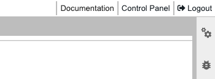

# HUNT Workbench principles

**HUNT Workbench aims to improve your day to day work experience with modern data science tools such as Python, R code, and MATLAB.**

To achieve this, we have built HUNT Workbench using [Jupyter](https://jupyter.org/), an open source solution designed for interactive computing across all programming languages. We have included MATLAB and RStudio development environments as you know them from before.

<!-- see main page for licensing -->

## A safe place to experiment

We are spawning your HUNT Workbench in an isolated container on your home machine. This allows you to experiment, and if something breaks you can always stop the ephemeral container and start a new one in your control panel.



You should be able to access all the paths that you would expect on your home machine. HUNT Workbench is preconfigured with access to data in lab volumes and your home directory, and you have a dedicated HUNT Workbench directory on your work volume:

```
/mnt/work/workbench/<username>
```

## Reproducible science

HUNT Workbench is designed with a smooth experience when you work on your code. Thus, not everything should be ephemeral and you should still store data in volumes mounted from your home machine.

HUNT Workbench comes with the Conda package manager which is configured to store packages in your work volume.

You will find Conda very helpful when it comes to Python and R packages. Conda is a great way to help you take control over your dependencies, and to avoid unwanted surprises over time. We recommend you to start with their guide on how to [manage environments](https://conda.io/projects/conda/en/latest/user-guide/tasks/manage-environments.html).

## Flexibility

All your Jupyter Notebooks and code will be stored on work volume, where it can be shared with your lab
colleagues. Work volume is ideal place if you want your things to be backed up. You can use this setup to your advantage, but you will also be able to override this at your own risk.

You will get a set of default Conda environments for Python (**`py310`**) and R (**`r-base`**) that you can use in your Jupyter notebooks. From there, it's easy to expand on them or create your own using the Terminal tool.

