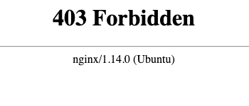
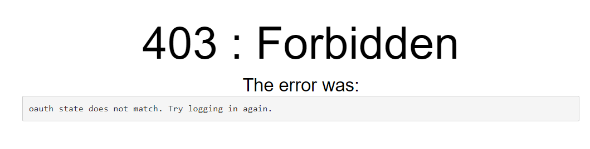
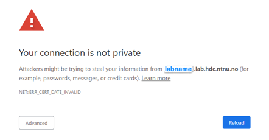
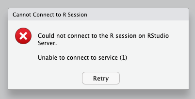

# HUNT Workbench troubleshooting

**Unfortunately, things don't always work as intended. Here is a collection of known issues that you might encounter in your HUNT Workbench. Contact us if you are still stuck after reading up.**

[[toc]]

::: tip

See our [HUNT Workbench FAQ](/do-science/hunt-workbench/faq) for general questions, and our [Immediate troubleshooting](/do-science/hunt-workbench/installation#immediate-troubleshooting) for issues during your first installation.

:::


## Access

### Unable to access HUNT Workbench applications

If you were previously able to access your applications (such as _RStudio_), and then the application suddenly stopped working, one quick approach is to check your available diskspace with following command:

```bash
df -h /mnt/work
```

If you have enough resources, try restarting your HUNT Workbench environment. Follow this guide to [restart your workbench](/do-science/hunt-workbench/faq#how-can-i-restart-my-workbench-environment).

If this does not help, you may have a look at our [FAQ](/do-science/hunt-workbench/faq) or [Troubleshooting](/do-science/hunt-workbench/troubleshooting) sections.  [Contact us](/contact) on email or reach out in your lab channel on Slack for further investigation if this does not help.


### 400: Bad request

Try to restart your browser. If the error changes to 403 after restart head over to service desk and [request Workbench reissue](/do-science/service-desk/#hunt-workbench-reissue).

### 400: Bad request - Firefox

Try with Chrome or check troubleshooting guide for Firefox in your Lab access link to install HUNT Cloud CA certificate.

### 403: Forbidden - Expired client certificate

Your HUNT Workbench certificate is time limited. You will meet the **`403 Forbidden`** message when your certificate expire (example image below). Head over our do science [service desk](/do-science/service-desk/#hunt-workbench-reissue) to order a certificate reissue.



### 403: Forbidden - oauth state does not match

Try to logout and login again. If logging in does not help, try different browser. We usually recommend Chrome, but here it is important to confirm whether it works in different browser. If this issue appear in all do not hesitate to reach out in your lab channel on Slack and remember to specify the error message `oauth state does not match`.



### 404: Page Not Found Error

Your workbench stopped working for no apparent reason and you are printed the NTNU logo with error **`404 error`**? Follow the link to your control panel. Click on the red button to stop your sever, this may take some time. Click on the green/blue button to launch your server again, this may also take some time. Reach out to us on [Slack or email](/contact) if the problem is not resolved.

### 502: Bad gateway

Reach out to us on [Slack or email](/contact) if you get the **`502 error`** while trying to login to your HUNT Workbench. In such a case we may need to investigate potential causes on our end.


### 504: Gateway Timeout Error

Reach out to us on [Slack or email](/contact) if you get the **`504 error`** while trying to login to your HUNT Workbench. In such a case we may need to investigate potential causes on our end.

### Your connection is not private

If you were previously able to access your HUNT Workbench and your browser suddenly reports expired/unsafe certificates, e.g.: **`Your connection is not private`** or **`ERR_CERT_DATE_INVALID`**, [contact us](/contact) in your lab channel on Slack or contact us on email. We need to sign a new lab certificate and update the service.




If your disk space is full, discuss with your lab leader/coordinator if you should cleanup your disk space, or order a volume extension in [Service Desk](/administer-science/service-desk/lab-orders#expand-existing-volume)

## RStudio

### Cannot connect to R session

This warning popup usually appears after the change of R version.

```
Could not connect to the R session on RStudio Server.

Unable to connect service (1)

[Retry]
```

Clicking on Retry button should resolve the problem.



If the Rstudio does not start after clicking on Retry button, don't hesitate to reach out in your lab channel on Slack or [contact us](/contact) for further assistance.

### 500: Internal Server Error - RStudio

If you are a fast clicker and get to an app before it's initialized in the background you might get the following error message:

```
500: Internal Server Error
Could not start rstudio in time
```

Try reloading the page (**`Ctrl + R`** / **`CMD + R`**) to reconnect with your _RStudio_ session. [Contact us](/contact) if the error message persists.

### 504: Gateway Timeout Error - RStudio

#### Solution 1

The **`504 error`** may be shown when you access **`/user/<username>/rstudio/`** but _RStudio_ fails to start. If you were previously able to access your _RStudio_ in HUNT Workbench it is possible that _RStudio_ saved more data in your environment files than it is able to load into memory.

One potential approach is to (1) first utilize your [workbench terminal](/do-science/hunt-workbench/faq#terminal) to manually resetting your _RStudio_ settings:

```bash
mv "/mnt/work/workbench/${USER}/.local/share/rstudio" "/mnt/work/workbench/${USER}/.local/share/rstudio-$(date +%Y-%m-%d)"
```

And then (2) [restart your HUNT Workbench environment](/do-science/hunt-workbench/faq#how-can-i-restart-my-workbench-environment-and-start-from-scratch). If the error still persists, don't hesitate to reach out in your lab channel on Slack or [contact us](/contact) for further assistance.

#### Solution 2

Other potential issue might be full disk space in your `work` directory. You can check your disk space using following command:

```bash
df -h /mnt/work
```

## MATLAB

### Error - 'matlab' executable not found in PATH

Access to MATLAB requires the application to be installed and activated in your lab.

If you click on the MATLAB icon and the application is missing you will meet a red error box stating that "_matlab executable not found in PATH_".

Contact your lab coordinator to investigate your licensing options and [contact us](/contact) in Slack or email us with your installation request.

::: tip NTNU users

NTNU holds licenses for all employees and students, so contact us if you want MATLAB in your lab.

:::

### Icons in user interface disappeared

You will need to reset your user settings if the MATLAB icons disappeared and your application is stuck loading. Removing user settings can be done in your [workbench terminal](/do-science/hunt-workbench/faq#terminal):


<!-- [matlab icons missing](./images/matlab_icons_missing.png) -->


```bash
ls /mnt/work/workbench/$USER/.matlab
rm -r /mnt/work/workbench/$USER/.matlab
```

### Missing toolboxes

You will most likely not be able to install these yourself. [Contact us](/contact) on Slack or email if you need new toolboxes in your MATLAB installation.


## LibreOffice

### Stuck while loading the LibreOffice application

If stuck while loading the LibreOffice application, try to restart Workbench to make sure that all instances of LibreOffice are stopped.
Then open Workbench Terminal and remove lock files from past sessions using this command:

```bash
find ~/.local/config/libreoffice -type f -name ".lock" -print -delete
```

## Remote desktop

### Accidentally disabled mouse/touchbar

1. Open your [workbench terminal](/do-science/hunt-workbench/faq#terminal).

2. Copy paste this command to your terminal to reenable the mouse pointer device:
```bash
DISPLAY=0 dbus-run-session xfconf-query -c pointers -p /TigerVNC_pointer/Properties/Device_Enabled -s 1
```

3. Follow the guide to [Restart your Workbench environment](/do-science/hunt-workbench/faq#how-can-i-restart-my-workbench-environment).

## Experience

### Unresponsive environment

An unresponsive or slow HUNT Workbench may be caused by several things. Here's a small checklist to narrow down potential causes:

- Use Google Chrome as your browser. Other browsers don't support all features and might cause potential silent failures.
- Restart your HUNT Workbench environment to start fresh in the case something got hung up. [Click here](/do-science/hunt-workbench/faq#how-can-i-restart-my-workbench-environment) to see how.
- Check the resource consumption on your **`home`**-machine to ensure that you have available free CPU and memory resources, for example in [HTOP](/do-science/tools/technical/htop) (see below).

::: expander Check your resources

One way to check your resource consumption is to log into your lab **`home`**-machine and run [HTOP](/do-science/tools/technical/htop). Consider to upgrade the machine size in the administer science [Service desk](/administer-science/service-desk/lab-orders#update-cpu-machine-size) if you are low on free resources.

:::

[Contact us](/contact) for further investigation if none of these works.

### Workbench is missing features or does not respond after restart

If your Workbench doesn't want to start up even after [restart](/do-science/hunt-workbench/faq#how-can-i-restart-my-workbench-environment) or is missing features that worked before, you can run following command to clear your environment:

```bash
rm -vf /mnt/work/workbench/${USER}/.jupyter/lab/workspaces/*.jupyterlab-workspace
```

If you are logging in first time and you miss some icons or menus you need to update your internet browser (e.g. Google Chrome).

## Need help

Did not find a solution to your problem?

<SDButton form="request_workbench_troubleshooting" />
