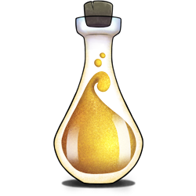

# Do science in HUNT Cloud

**Welcome to our official user documentation for scientists in HUNT Cloud.**

This section is for active lab users. It contains practical information on how to do science in HUNT Cloud.

<NavitationCards :buttons="$frontmatter.buttons" />

 

<!--  -->

See our [main documentation page](/) for other sections.

<!-- ::: tip Next Tingweek #13 (2024-10)

- **Labting**: Tuesday 15 October 2024 - 2 to 4 p.m. CET ([agenda](https://assets.hdc.ntnu.no/assets/tingweek/hunt-cloud-tingweek13-labting-agenda.pdf))

::: -->
