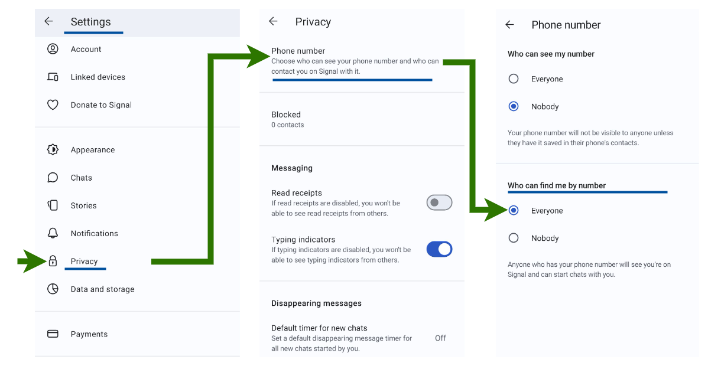

# Step 1. Collect your keys

**This step ensures that you have the correct keys and config files before you invest time in the remaining setup.**

::: warning Requirements

- Signed user agreement forwarded to us over the administer science [service desk](/administer-science/service-desk/lab-orders#add-a-new-lab-user) for account activation.
- Private phone to receive your lab keys.
- Organizational email to receive your lab configuration files.

**Without these, it will be impossible to complete step 1.**

:::

## 1.1 Secrets to your phone

We will communicate your system keys over the Signal mobile app.

### 1.1.1 Install the Signal application

Signal is a private messenger app for your phone that provide a secret communication channel. Search for **`Signal`** in the iOS or Android app stores, or use the links below to install the application on your phone:

  - [Download and install for **iOS** here](https://itunes.apple.com/us/app/signal-private-messenger/id874139669?mt=8)
  - [Download and install for **Android** here](https://play.google.com/store/apps/details?id=org.thoughtcrime.securesms&hl=en)

### 1.1.2 Activate your Signal account

You need to activate your Signal account before we can ship you keys.

- Open the Signal application
- **Activate your Signal account** using the phone number attached in your user agreement.
- To be able to receive your credentials we need to see your phone number as registered in Signal.
Make sure you allow us to find your account in the settings:

- Check if you have any received messages.

::: tip
Notify us when your Signal account is activated by replying to your service desk request for onboarding. This allows us to quickly forward your lab keys when they are ready.

Example message:

> Hi, I have installed and activated Signal and are looking forward to receive my keys.

:::

### 1.1.3 Key transfer

As soon as your account is set up on our side, we will forward your lab keys over Signal from phone number **`91001893`**. This number is registered on '[Norges teknisk-naturvitenskapelige universitet NTNU](https://www.1881.no/?query=91001893)'. We will notify you on your organizational email if this number change.

::: tip Time estimate

Allow for a week to pass before your lab send us your user agreement and you need the keys.

:::

We are aware that science never sleeps, so your lab leader may request immediate access when needed.

::: warning Expect these keys on your phone

A successful transfer to your phone should include four (4) keys:

- **`7-ZIP file key`** - your key for unlocking [the 7z archive file](/do-science/tools/transfer/7z/) sent on email.
- **`Google Authenticator key`** - your key for generating Google Authenticator verification codes.
- **`VPN passphrase`** - your passphrase for unlocking your OpenVPN certificate.
- **`SSH temporary key`** - your temporary passphrase when logging in to your lab with SSH for the first time.

:::

## 1.2 Secrets on your email

We will communicate your VPN certificate and SSH configuration over your organizational email. You will receive a link to an encrypted file archive (7z-file).

- 1.2.1. Click on the link in the email to download the file and save this on your local computer.
- 1.2.2. Unpack (extract) the file with software that recognizes [the 7z archive format](/do-science/tools/transfer/7z/) (see below).
- 1.2.3. Use the key named **`7-ZIP file key`** from your Signal transfer to decrypt [the 7z archive](/do-science/tools/transfer/7z/).

::: tip Decryption guides

Click on these links for installation guidance if your current software don't recognize the 7z-format: [Windows](/do-science/tools/transfer/7z/#windows), [mac](/do-science/tools/transfer/7z/#mac-os-x), [Linux](https://www.google.no/search?q=unpack+7z+linux).

:::

::: danger Troubleshooting: OS X and macOS

You will need to install 7z-compatible software from the decryption guides link above. The default archive utility will -not- recognize the passphrase of 7z-files.

:::

::: warning Expect these files on your local computer

A successful extraction on your local computer should include three (3) files:

- **`<your-username>.ovpn`** - your personal VPN certificate to be used in step 2.
- **`ssh-config.txt`** - your SSH configuration to be used in step 3.
- **`<your-username>.mobaxterm`** - your MobaXterm configuration file (Windows).

:::

## 1.3 One-time verification codes

You will use one-time verification codes for your system access to HUNT Cloud (VPN). We use Google Authenticator for this purpose. Google Authenticator is a multi-factor app for phones that generates one-time verification codes every 30 seconds. We call this the **`verification code`**.

### 1.3.1 Install Google Authenticator on your phone

Search for **`Google Authenticator`** in the iOS or Android app stores, or use the links below.

- [Download and install for **iOS** here](https://itunes.apple.com/us/app/google-authenticator/id388497605?mt=8)
- [Download and install for **Android** here](https://play.google.com/store/apps/details?id=com.google.android.apps.authenticator2&hl=en)

### 1.3.2 Setup the app and add a new account

1. Start the Google Authenticator app.
2. Tap _Begin setup_ (first time setup) or _Add an account_ (additional accounts).
3. Select _Enter a provided key_.
4. Enter **`HUNT CLOUD VPN`** as the _account name_.
5. Enter the **`Google Authenticator key`** sent to you over Signal.
6. Make sure _Time based_ is selected.
7. Tap _Add_ to finish the setup of the new account.

::: warning Expect this one-time verification

A 6 digit **`verification code`** that refreshes ever 30 seconds in the Google Authenticator app on your phone.

:::

## 1.4 Verify your key collection

A successful completion of this step should give you:

- Four (4) keys on your phone stored in Signal
- Three (3) files stored on your local computer
- Rotating verification codes on your phone

Without these, it will be impossible to complete the remaining steps.

::: tip Time for coffee!

If you successfully completed this step, celebrate with fresh coffee and head over to the Lab access link in your onboarding email, or order one in [Service desk](/do-science/service-desk/#request-lab-access-link-reissue). If you did not succeed, start with a quick look in our Immediate troubleshooting section below.

:::

## Immediate troubleshooting

### Signal

#### I am unable to install or run Signal on my phone.

Steps to resolve issues with Signal may vary by phone model and OS. Signal has a handy guide for [Troubleshooting Installs or Updates](https://support.signal.org/hc/en-us/articles/360007211952-Troubleshooting-Installs-or-Updates) as a starting point. [Contact us](/about/contact) if this do not resolve your issue.

### 7z file

#### Windows: I am unable to unpack the 7z-file forwarded on email

If the [decryption guides](/do-science/lab-access/collect-your-keys/#_1-2-secrets-on-your-email) above did solve the issue at hand, this is the time to reach out to your local IT support for help.

#### OS X, macOS: The 7z archive password do not seem to work?

The default archive utility will give you an error message when unpacking the `7z-format` locked with a passphrase. You need to download and unpack with the
`7z software` or `Keka` described in [the 7z installation guide](/do-science/tools/transfer/7z/). [Contact us](/about/contact) if this does not work.

#### Debian Linux (Ubuntu): I am unable to unpack the 7z archive file forwarded on email

The default archive utility may give you an error message when unpacking the `7z-format` locked with a passphrase. Try to download and unpack with the
`7z software` described in [the 7z guide](/do-science/tools/transfer/7z/). [Contact us](/about/contact) if this does not work.

### More information

See our main [troubleshooting](/do-science/troubleshooting/connection/) section for more information. Please [contact us](/about/contact) if you encounter issues that we have not yet documented.
