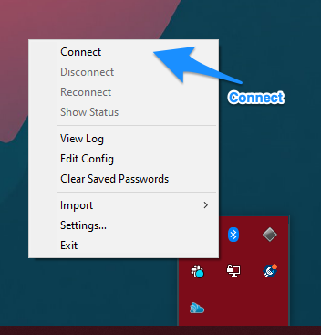
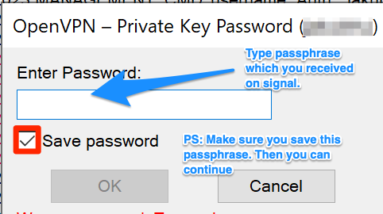

# Step 2. Configure your VPN

::: danger Use Lab access link instead

If you are configuring access to your lab use Lab access link sent to you in onboarding email with other credentials. You can also request Lab access link in [Service desk](/do-science/service-desk/#request-lab-access-link-reissue)

:::

**This step configure an encrypted connection between your local computer and HUNT Cloud. The specific steps are dependent on the operating system on your local computer.**

[[toc]]

## Requirements

1. Confirmed [collection of secret keys](/do-science/lab-access/collect-your-keys/#step-1-collect-your-keys) in Step 1 of onboarding process.

2. Successful setup of [Google authenticator](/do-science/lab-access/collect-your-keys/#_1-3-one-time-verification-codes) app. 


## 2.1 Install the VPN software


::: details Windows

We use the open-source application **`OpenVPN`** to ensure encrypted communication between your local computer and us.

[Download and install OpenVPN using the latest stable Windows Installer (Avoid beta versions)](https://openvpn.net/community-downloads/)

Click on the link above, scroll down to the file named **`OpenVPN-<version-number>-i601-amd64.msi`** (Windows 10 users), download the file and follow the on-screen installation instructions.

**NTNU users**: Windows users from NTNU can install OpenVPN community edition using NTNU Software Center even without administrative rights.
  
  ::: warning
  **You will need administrative rights on your local computer to successfully install OpenVPN.**

Click on the link below if you do not hold administrative rights on your local computer, or don't know if you have such rights.

  ::: details Installing OpenVPN without administrative rights

You can check if you have administrative rights on your local computer by running **`net localgroup "Administrators"`** in a [command prompt](https://www.howtogeek.com/235101/10-ways-to-open-the-command-prompt-in-windows-10/) and see if your username is listed.

**Request assistance from your local IT personnel if you do not hold administrative rights on your local computer and request that they:**

(1) assist you in the OpenVPN installation, or

(2) grant you administrative rights on your local computer so you can install OpenVPN yourself.

<b>For simplicity, we have outlined the steps they need to perform, which you can attach to your request:</b>
<a href="/do-science/guides/openvpn-admin-group/" target="_blank">https://docs.hdc.ntnu.no/do-science/guides/openvpn-admin-group/</a>

:::


::: details OS X and macOS

We use Tunnelblick to ensure encrypted communication between your local computer and HUNT Cloud.

[Download and install the latest **'stable release'** from this page](https://tunnelblick.net/iprelease/Latest_Tunnelblick_Stable.dmg)

<!-- https://tunnelblick.net/downloads.html -->

:::


::: details Ubuntu Linux

We use OpenVPN to ensure encrypted communication between your local computer and HUNT Cloud.

Install the **`openvpn`** and **`network-manager-openvpn-gnome`** packages from the standard repositories.

```bash
sudo apt install openvpn network-manager-openvpn-gnome
```
:::


::: details Other Linux distributions

You have a few options on how to install OpenVPN clients in other distributions:

- Install the **`openvpn`** package from the official distribution repository.
- Add the [OpenVPN community repository](https://community.openvpn.net/openvpn/wiki/OpenvpnSoftwareRepos) and install the **`openvpn`** package.
- Download the latest [source tarball](https://openvpn.net/index.php/open-source/downloads.html) from OpenVPN and install.

After the installation, follow the "Ubuntu Linux" guides below on how to setup and connect.

:::


## 2.2 Setup the VPN profile

::: details Windows

1. Start the OpenVPN client (if it is not running already)


2. Expand pane on taskbar


3. Select **`Import file...`**


4. Click on Import file and select OpenVPN profile file **`<username>.ovpn`** that you collected in Step 1.


:::


::: details OS X and macOS

**2.2.1 If you 'do' get prompted with the `Welcome to Tunnelblick` message, follow these steps:**
  1. Select **`I have configuration files`**.
  2. In the **`Welcome to Tunnelblick`** prompt, select **`I have configuration files`**.
  3. When prompted for which type of configuration you have, select **`OpenVPN Configurations`**.
  4. Select the OpenVPN profile named. **`<username>.ovpn`** in the collection of credentials given from HUNT Cloud.
  5. Continue with the **`Connecting to the VPN section`** below.

**2.2.2 If you 'do not' get prompted with the `Welcome to Tunnelblick` message, follow these steps:**
   1. Find the OpenVPN profile named **`<username>.ovpn`** that you collected in Step 1.
   2. Right-click the file OpenVPN profile named **`<username>.ovpn`**.
   3. Select **`Open With -> Tunnelblick`**.
   4. When prompted for **`Install Configuration For All Users`**, select **`Only Me`**.
   5. Enter your macOS password to allow Tunnelblick to install the OpenVPN configuration.
   6. Continue with the **`Connecting to the VPN section`** below.

:::


::: details Ubuntu Linux

1. Click on the _Network Manager_ icon in the task bar.
2. Select _Edit Connections..._.
3. Click _Add_.
4. Choose _Import a saved VPN configuration_ and click _Create_.
5. Select the OpenVPN profile named **`<username>.ovpn`** that you collected in Step 1.
6. Enter your user name (same as the OpenVPN profile file name).
7. Click on the person icon in the _Password_ field and select **`Ask for this password every time`**.
8. Enter the _Private Key Password_ with the **`VPN passphrase`** sent to you from HUNT over Signal.
9. Click on the _IPv4 Settings_ tab.
10. Click _Routes..._.
11. Select the _Use this connection only for resources on its network_ and click _OK_.
12. Click _Apply_.

:::


## 2.3 Connect to the VPN

::: details Windows

1. Right-click on the OpenVPN notification icon on the taskbar.

2. Select _Connect_.



3. Enter your user name (same as the OpenVPN profile file name).

4. Enter a rotating **`verification code`** from Google Authenticator as your password.

    

5. When prompted for a _Private Key Password_, insert the **`VPN passphrase`** that your collected in Step 1. 
   Your authentication will fail when you complete your passphrase below. This is expected since your verification code timed out while you typed your passphrase.

    

6. Now try again to connect with a fresh **`verfication code`** from Google Authenticator.

You should now be connected to the VPN.

:::


::: details OS X and macOS

1. Start Tunnelblick and **`Connect`**.
2. Enter your user name (same as the OpenVPN profile file name).
3. Enter the **`verification code`** from Google Authenticator as your password.

    

    ::: warning
    Make sure that the _Save password_ checkbox is **`unchecked`**.

4. When prompted for a _Private Key Password_ or _Passphrase_, insert the **`VPN passphrase`** that you collected in Step 1.

    ::: tip
    Save this passphrase.

Your authentication will fail when you complete your passphrase above. This is expected since your verification code timed out while you typed your passphrase.

6. Now try again to connect with a fresh **`verfication code`** from Google Authenticator.

You should now be connected to the VPN.

:::


::: details Ubuntu Linux


1. Click on the _Network Manager_ icon in the task bar.
2. Select _VPN Connections >_ and the name of your profile.
3. In the _Authenticate VPN_ window, enter the **`verification code`** from Google Authenticator in the _Password_ field.
4. Click _OK_ to connect.

:::


## 2.4 Verify your VPN connection

::: warning

Please invest some time to verify a successful VPN connection as you will not be able to complete Step 3 before your VPN is working.

:::


::: details Windows

The OpenVPN notification icon on the taskbar should be green.


:::


::: details OS X and macOS

A small Tunnelblick window should state "Connected" in green letters with a timer that count the connection length.

:::


::: details Ubuntu Linux

If you received the notification _VPN connection has been successfully established_, then you are good to go.

:::

::: danger Access list

We allow connection from known IP addresses only. This means that your VPN connection may be blocked if you connect from a (for us) unknown network outside Norway. [Click here](/do-science/service-desk/#vpn-access-list) to request an opening for your location in our Do science service desk.

:::

::: tip Next step

If you successfully completed this step, head over to Step 3 to [Configure your SSH](/do-science/lab-access/configure-ssh/) connection. If you did not succeed, start with a quick look in our Immediate troubleshooting section below.

:::


## Immediate troubleshooting

Below are a few immediate things to try if your VPN connection did not succeed:

### Authenticate VPN

If the _Authenticate VPN_ prompt pops up again, then try to log in again with a new **`verification code`**.

### VPN connection failed

If you received the notification _VPN Connection Failed_ after 60 seconds, please check the following

- Verify that you have an active internet connection.
- Verify that the _Private Key Password_ is correct.

### Could not read Private Key error

The error messages below indicates that there is a typo in the _Private Key Password_ (step 2.3.5) and you need to type it in again.

```
ERROR: could not read Private Key username/password/ok/string from management interface
```

```
Cannot load private key file
```

### Unable to apply changes

If you are unable to click _Apply_ after your changes, try to re-enter your _Private Key Password_ using your **`VPN passphrase`** that you collected in Step 1.

::: tip
If nothing works, please head over to our main [troubleshooting](/do-science/troubleshooting/connection/#vpn) section for more information on how to troubleshoot connections.
:::


