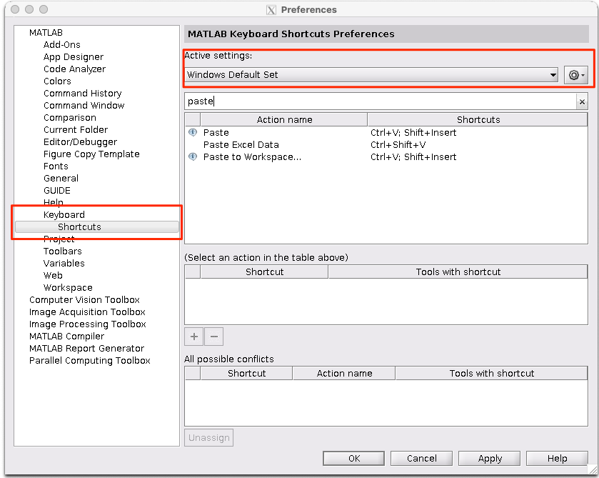

# MATLAB

**[MATLAB](https://www.mathworks.com/) is a computing environment developed by MatWorks for efficient matrix manipulations and other handy computing tools.**

This guide covers the installation of MATLAB on unmanaged On-demand and BLUE machines. [Contact us](/contat) for installations on your [home machine](/do-science/faq/compute/#machine-types).

::: tip MATLAB in HUNT Workbench

Head over to the [MATLAB FAQ](/do-science/hunt-workbench/faq/#matlab) in our HUNT Workbench section to learn more about the setup in your workbench environment.

:::


[[toc]]


::: warning Requirements

- An unmanaged On-demand or BLUE machine where you have root access.
- A working [X2Go server](/do-science/tools/technical/x2go/) installation on this on this machine.
- Access to the MATLAB software binaries for Linux from your organizaton.
- Access to a MATLAB license for the users in your lab.

:::

## 1. Download

1.1 Download the MATLAB software for Linux on your local computer (client). We recommend that you choose a stable `beta` version (for example, 2022b) to ensure a reliable installation.

   ::: tip For NTNU users
   
   Log into [NTNU's software repository for MATLAB](https://software.ntnu.no/ntnu/MATLAB),
   choose your desired version in the top right corner and download on your local computer.
   
   :::

1.2. Transfer MATLAB to your preferred folder in your lab machine (for example `/mnt/scratch/MATLAB/`)

1.3. Log into your lab machine and unpack the zip file in your folder.

   Install dependencies:

   ```bash
   sudo apt install unzip libnss3
   ```

   Unzip MATLAB installer:

   ```bash
   unzip <MATLABfile.zip>
   ```

4. Make all files in your MATLAB-folder executables: `chmod -R 777 <MATLAB-folder>` (e.g. /mnt/scratch/MATLAB/). This is a simple fix so you can run the files within subfolders as required by MATLAB.

## 2. Activate the license

2.1 Identify the required license information from your host organization. The content is dependent on your organizations license. 

::: tip For NTNU users
The exact content of this files is described in [NTNU's repository for MATLAB](https://software.ntnu.no/ntnu/MATLAB).
:::

2.2 Create a file named `license.dat` with your license information in your `<MATLAB-folder>`. 

In the principal example below, you will need you to replace `<license-server-address>`, `<key1>` and `<key2>` with an URL-address and strings provided by your host institutions license:

```ini
SERVER <license-server-address> <key1> <key2>
USE_SERVER

```

::: warning
Make sure you add a new/empty line after "USE_SERVER".
:::


## 3. Install

The below steps require the code to be run in `xterm` started from X2GO on the machine holding the MATLAB files downloaded in the above steps.

3.1. Prepare target directory:

   ```bash
   mkdir -p /mnt/work/software/matlab_r2022b
   mkdir -p /mnt/scratch/tmp
   ```

3.2 Go to your MATLAB installation folder (e.g. /mnt/scratch/software/matlab_r2022b) and run the installer:

   ```bash
   bash ./install -downloadFolder /mnt/scratch/software/matlab_r2022b -tmpdir /mnt/scratch/tmp -destinationFolder /mnt/work/software/matlab_r2022b
   ```
   
   Note that you will need to update the MATLAB version in the above code to the version your are installing.

3.3 During the installation choose: `Use a File Installation Key`

3.4. Choose `I have the File Installation Key for my license` and enter the key (these are found on you software repository)

3.5. Follow the installer and choose the packages you want.

3.6. When the installer asks for your product activation, choose the `non internet` option and provide the location of the `license.dat` file previously generated.

3.7. If successful, your should see `product activation message`.

## 4. Run

**Run in command line**

If you're fine with command lines, run `MATLAB` directly in your shell. Read more in [MathWorks documentation](https://se.mathworks.com/help/matlab/ref/matlablinux.html).

**Run in the graphical interface**

If you prefer MATLAB's graphical interface, run `MATLAB` in your terminal (`xterm`) started in [X2GO](/do-science/tools/technical/x2go/).

Open X2Go, connect to your lab machine where you installed MATLAB and run the following command in `xterm`:

  ```bash
  /usr/bin/xterm -e matlab
  ```
  
  or with full path e.g.:

  ```bash
  /usr/bin/xterm -e /mnt/work/software/matlab_r2022b/bin/matlab
  ```

For the example above, you will need to update the MATLAB version to the one you just installed.


## Troubleshooting

Here are are collection of known issues.

#### Why can't MATLAB find the packages I choose to install?

::: details Read more

One known issue is that sometimes the latest MATLAB version compiled by some universities do miss some packages. Try to install a slightly older version. [Contact us](/contact) for assistance if this do not work.

:::

#### Can I install the code without sudo?

::: details Read more

No, not in an easy way. Thus, either we have to install on `home` machines, or your can install these yourself on unmanaged iaas and blue machines where you get root. [Contact us](/contact) if you need MATLAB on your home machine.

:::

#### My product activation do not seem to work?

::: details Read more

We need to open for traffic from your lab to your organization's license server. [Contact us](/contact) for network openings.

:::

#### Why is the live editor not working?

::: details Read more

If MATLAB complains that Live editor is unable to run in the current system configuration it is important to check if libnss3 is installed.

```bash
dpkg -s libnss3
# If not installed run
sudo apt install libnss3
```
:::

#### Why is my MATLAB installation stuck?

::: details Read more

If the installation was progressing and then stuck at some point it is important to check disk space `df -h`. In some cases `/tmp` directory may get filled up. We usually recommend setting alternative tmp before running install:

```bash
mkdir -p /mnt/scratch/tmp
export TMP=/mnt/scratch/tmp
export TEMP_DIR=/mnt/scratch/tmp
```

:::

####  MacOS - cannot copy-paste in MATLAB

::: details Read more

If standard copy-pasting is not working for you, you might want to change your keyboard shortcuts settings in MATLAB

`Matlab --> Preferences --> Keyboard --> Shortcuts --> select preffered keyboard`



:::

