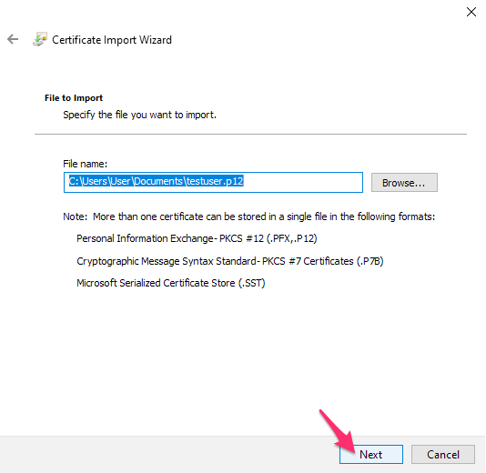
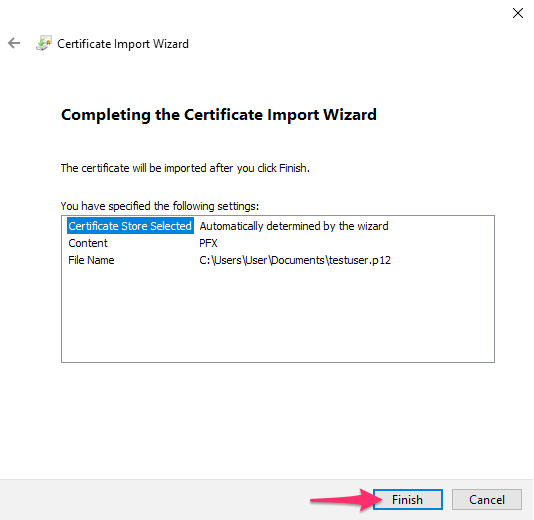

# Client certificate

You will need to install a certificate to access your lab from a browser.
[[toc]]

## Installation on OS X and macOS

1. Open the system profile config (.mobileconfig) attached in archive.

2. Confirm the installation of profile.

3. Enter the passphrase that you received on signal and then confirm.

4. Quit your browser and restart it again for the certificate to get recognized.

## Installation on Windows

1. Open the p12 certificate. Make sure the store location is set to Current User and click next:

   

2. Continue clicking on next

   

3. Fill in the passphrase that you received on signal, and make sure only the same option is checked exactly as in the image. Then click next:

   

4. Keep the first option to Automatically select the certificate store based on the type of certificate. Click next:

   

5. Your certificate is imported and you can hit finish:

   

6. Quit your browser and restart it again for the certificate to get recognized.

## Installation on Linux (Firefox)

1. Open Firefox. Click `Edit` > `Preferences` or open url `about:preferences#privacy`.

   

2. Click Options > Advanced > Encryption. Click View Certificates.

   

3. Select the Your Certificates tab. Click Import.

   

4. Browse for and select your PFX file. Enter the password.

   

5. Click OK.

   

6. The certificate is now installed and can be used for network or secure web site client authentication
   after the restart of Firefox.
