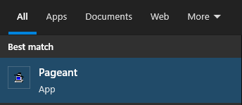
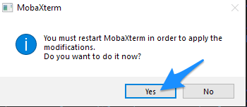

# MobaXterm

**[MobaXterm](https://mobaxterm.mobatek.net/) is an application that simplifies SSH connections to your lab from your local Windows machine.**

[[toc]]

::: warning Requirements

(1) A Windows operating system on your local computer.

(2) A working connection to your lab over SSH as described in the [Configure SSH](/do-science/getting-started/configure-ssh/) guide section of the _How to connect to your lab_ guide.

(3) The IP address to your lab. This was included in your [SSH configuration file](/do-science/getting-started/configure-ssh/#_3-1-identify-required-info) that you got on email during your initial onboarding.

(4) The [MobaXterm configuration file](/do-science/getting-started/collect-your-keys/#_1-2-secrets-on-your-email) that your that you got on email during your initial onboarding.

**Missing the files?** Worry not. You can order a new [SSH configuration](/do-science/service-desk/#ssh-configuration) file and a new [MobaXterm](/do-science/service-desk/#mobaxterm-configuration-file) configuration file in our do science service desk.

:::


## 1. How to install

::: tip
Lab users from NTNU can install MobaXterm using the software center.
:::

1.1. Download the **`Home edition (installer edition)`** from [mobaxterm.mobatek.net](https://mobaxterm.mobatek.net/download.html).

1.2. Unzip the file and install the software.

## 2. Generating SSH Key

This section generates SSH keys that allow you connect to your lab without typing passwords. Jump to section 2.3 if you know you already have a SSH that you want to use.

### 2.1 Open Local terminal

Clicking on Local terminal button opens MobaXterm command line:


### 2.2 Generate SSH key in local terminal

When you click "Start local terminal", you should see a window similar to this:


2.2.1 Check if you already have a ssh keys in place by running this command in the local terminal:

```bash
cat "${USERPROFILE}/.ssh/id_rsa.pub"
```

::: warning
Run the above command as is. Keep **`${USERPROFILE}`** (do -not- write your user name).
:::

**If you see random letters, jump to section 2.3**

If the above command prints several rows of random letters on the screen, you already have a ssh key that can be used. Great! Jump to section 2.3.

**If you see no output or an error message (No such file or directory), continue here:**

2.2.2 Assure your **`.ssh`** directory exists by running:

```bash
mkdir -p "${USERPROFILE}/.ssh"
```

2.2.3 Create your new SSH key:

```bash
ssh-keygen -b 4096 -t rsa -f "${USERPROFILE}/.ssh/id_rsa" -q -N ""
```

### 2.3 Upload your SSH key

2.3.1 Upload your SSH key to your lab machine.

```bash
# -- Principal example
ssh-copy-id -i "${USERPROFILE}/.ssh/id_rsa.pub" <username>@<entry-IP>
```

**Note. You need to add your username and lab IP in the above command**.

Replace **`<username>`** with your username, and replace **`<entry-IP>`** with your lab IP address that was included in your [ssh-config.txt file](/do-science/getting-started/configure-ssh/#_3-1-identify-required-info). A (non-working) example of the would be: **`joedeomuser@10.42.2.32`**.

**Note. Do -not- save your passphrase**.

You will be asked to type in your [SSH passphrase](/do-science/getting-started/configure-ssh/#_3-2-design-a-passphrase) that you made during your initial lab onboarding.

If you get asked to save your password, refuse by clicking on **`No`** to make sure that MobaXterm will authenticate with your SSH keys instead of your passphrase.


## 3. Connect

3.1. Locate your **`MobaXterm configuration file`** on your local computer: **`<your-username>.mobaxterm`**.

3.2 Click on the file for MobaXterm to pick up your lab session.


With a little bit of luck, you should now be able to connect directly from your client computer to the home machine in your lab.


## Troubleshooting


#### Mktemp error

::: details More information

- If you are getting this error when trying **`ssh-copy-id`**:
  

- Run this command with `TMPDIR` variable:
  ```
  # -- Non-working example
  TMPDIR="${USERPROFILE}" ssh-copy-id -i "${USERPROFILE}/.ssh/id_rsa.pub" <username>@<entry-IP>
  ```

**Note.** You need to replace `<username>` with you username (without the brackets), and `<entry-IP>` with your entry IP from the SSH config file.

- If permissions error still appears try this alternative approach
  ```
  cat "${USERPROFILE}/.ssh/id_rsa.pub" | ssh <username>@<entry-IP> "cat >> ~/.ssh/authorized_keys"
  ```

**Note.** You need to replace `<username>` with you username (without the brackets), and `<entry-IP>` with your entry IP from the SSH config file.

:::


#### Check SSH keys in session configuration

::: details More information

- Right click on the session that you want to edit and choose option **`Edit session`**.
  
- Assure **`SSH`** option under the **`Session settings`** is selected.
- In **Advanced SSH settings** make sure that private key option is checked. Then select the path to SSH key file (**`id_rsa`**).
  
- Under **`Network settings`**, click on **`Connect through SSH gateway (jump host)`**.
  
- Check **`Use SSH key`** option and select the path to SSH key file (**`id_rsa`**).
  
- Confirm session settings by clicking **`OK`**.

:::

#### Agent refused operation

::: details More information

If you see the error message saying: **`Agent refused operation`** you need to install Putty.


Once Putty is installed, make sure that MobaXterm is closed and started Pageant. Pageant is part of Putty installation.



Once Pageant is running, you can start MobaXterm.

:::

#### Configure custom SSH config

::: details More information

This part might be needed if you plan to use SSH tunneling to other lab machines. It is not part of the recommended workflow.

To setup ssh config to be used in local terminal of MobaXterm use:

```bash
cat <<-EOF > /home/mobaxterm/.ssh/config

<Paste content of your ssh-config.txt here>

EOF
```

:::


## Advanced

#### Configure custom session

::: details More information

- Open MobaXterm
- Select a new session and click on the `SSH` image on the `Session settings`.
- In **Basic SSH settings**, add `10.5.5.12` as `Remote host` and type your username into `Specify username` field. Under **Advanced SSH settings** uncheck `X11-forwarding` if not used. Select ssh (private) key file if you already have one.
  
- Under `Network settings`, click on `Connect through SSH gateway (jump host)`
  
- Add your labs IP-address to the `Gateway SSH server` and your user name to the `User` field (the 10.42.-address from the ssh-config). Select ssh (private) key file if you already have one. Click OK to confirm SSH jump host.
  
- In **Bookmark settings**, Name your lab session. Click OK to confirm Session settings.
  

:::


#### Configure MobaAgent

::: details More information

1. Start MobaXterm and open Settings:


2. Choose SSH tab and make sure that option `Use internal SSH agent "Mobagent"` is checked. Then click OK to save the settings.


3. If you are asked to confirm restart of MobaXterm click `Yes` to confirm.



4. (optional) if you have not setup ssh before, follow section 2 above (generating SSH key)

5. Add SSH key into Mobagent

Check the list of Mobagent SSH keys and make sure that SSH key (`id_rsa` file) is included.


If MobaXterm included the new key automatically, you can continue to the next step. If your `SSH agents` list is empty, click on the plus sign (arrow marked "2.") and add your new `id_rsa` file (key) to the list. You will find the file on your local machine under this path: `C:\Users\<yourlocalusername>\.ssh\id_rsa`.

:::

#### Configure custom session for On-Demand and BLUE machines

::: details More information

1. Duplicate your current lab session


2. Edit duplicated session (feel free to rename it as well)


3. Set options as described below


4. Add jump host for home machine.


5. Save and enjoy !

:::
