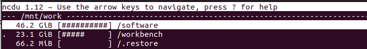

# NCDU

**[Ncdu](https://dev.yorhel.nl/ncdu/man) is a disk usage analyzer that you can use to find space hogs in your lab.**

Ncdu aims to be fast, simple and easy to use. It uses a ncurses interface, and should be able to run in any minimal POSIX-like environment with ncurses installed.

Although this guide for your lab, Ncdu is a useful tool even on regular desktop systems such as OS X and MacOS and Linux. 

[[toc]]

## Installation

Log into your lab and install `ncdu` using the following command:

```bash
sudo apt install ncdu
```

## Usage

### General usage

Start `ncdu` in the directory that you want to analyze:

```bash
ncdu
```

Depending on your volume sizes and number of files, the initial scanning may last from seconds to several minutes.



This is an example of a scan of a **`/mnt/work`** volume where the software (46GB) and workbench (23GB) folders take up most of your space.

### Analyse your root volume

To find what's taking space on your root volume (/), use the **`-x`** paramter. This excludes other volumes mounted on your machine (such as /mnt/work):

```bash
ncdu -x /
```

### Analyze specific volumes

You may use this example to analyze disk usage on specific volumes:

```bash
ncdu -x /mnt/archive
```


