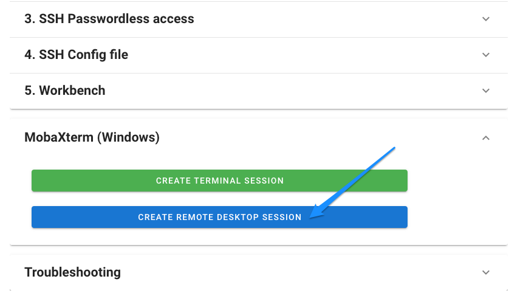

# Remote Desktop (Windows) 

At HUNT Cloud, we offer a preconfigured remote desktop (RDP) environment which is connected to your lab using [MobaXterm](https://mobaxterm.mobatek.net/). With this setup you are able to work safely in your lab using a graphical interface.

[[toc]]

## Requirements 

You need to have an installed [MobaXterm](https://mobaxterm.mobatek.net/download.html) on your local machine.

## What tools are availble in RDP ?

This mobaXterm session is preconfigured with [Stata](/do-science/tools/analytical/stata.md), [SPSS](https://www.ibm.com/products/spss-statistics) and Spreadsheets by [LibreOffice](https://www.libreoffice.org/)

## How do I order a mobaxterm RDP ? 

You can find your preconfigured RDP MobaXterm session in your access link which you received in your onboarding email.

