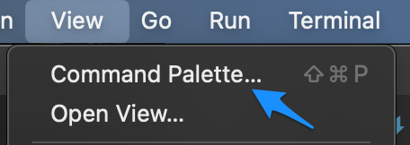
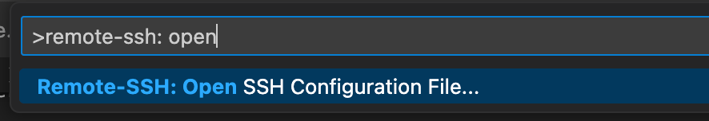
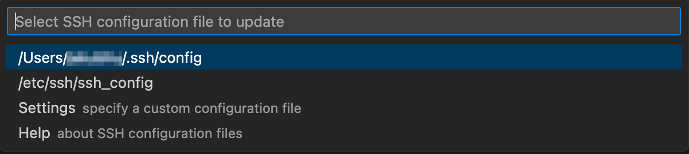
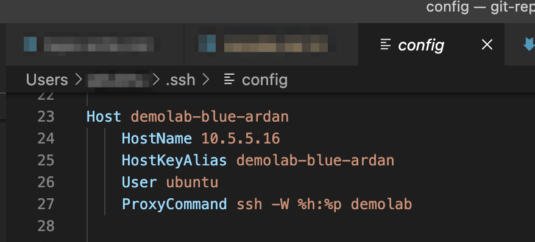
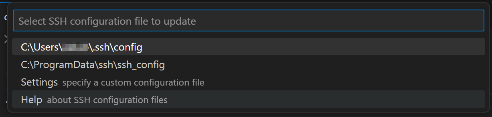
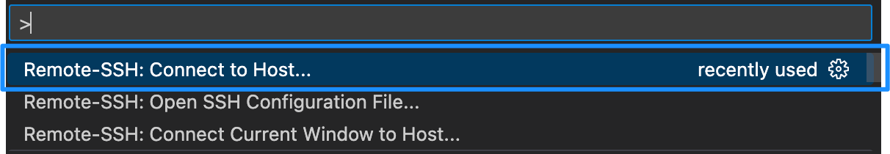
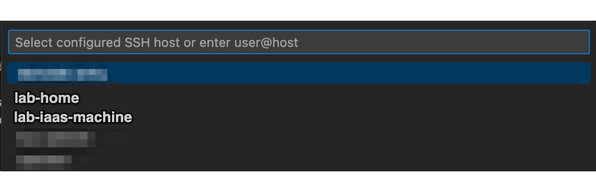
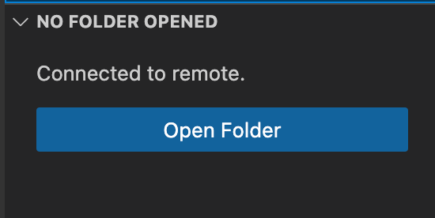

# Visual Studio Code

**[VS Code](https://code.visualstudio.com/) is a source-code editor made by Microsoft that supports features such as debugging, syntax highlighting, intelligent code completion, snippets, code refactoring, and embedded Git. Lab users may for example use VSCode to run GPU accelerators inside their labs.**

[[toc]]


## Connecting to IaaS machine from your local machine

This guide describes a setup where you use VSCode installed on your local computer to connect and analyze data that is located inside a lab machine in HUNT Cloud.

### Requirements

::: warning Requirements

To complete this guide, you will need (1) [VS Code](https://code.visualstudio.com/) installed on your local computer, and (2) a running [IAAS](/do-science/faq/compute/#what-is-an-IAAS-machine) machine inside your lab, your local (3) [SSH configuration file](/do-science/service-desk/#ssh-configuration). 

**Without these your will not be able to complete this guide.**

::: 


### 1. Local computer configuration

Connection to your lab machine requires two adjustments to your local VSCode installation: 

#### 1.1 Add required extension

You will need to install the `Remote-SSH` extension to the VSCode on your local computer. This is required to successfully connect to your lab machine over ssh.

1. Open VSCode on your local computer
2. Inside VSCode, launch VSCode Quick Open `Ctrl+P` or if on mac `CMD+P`
3. Paste the following command and press enter: 

```bash
ext install ms-vscode-remote.remote-ssh
```

Alternatively, open the [VSCode Remote SSH](https://marketplace.visualstudio.com/items?itemName=ms-vscode-remote.remote-ssh) page directly, or identify the package in the [extension marketsplace](https://code.visualstudio.com/docs/editor/extension-marketplace) and follow the installation instructions. 

#### 1.2 Configure your local .ssh config file

This step configures the .ssh configuration file on your local computer.

::: expander "macOS" id="macos-1"

1. Access VSCode `command palette` by shortuct ⇧⌘P (`CMD+shift+P`), or selecting `View --> Command Palette`.



2. A command pallete should pop-up. Type in the following text and press enter:

```
 Remote-SSH: Open SSH Configuration file
```



3. Select config file, f.e. `/Users/username/.ssh/config` from the list.



4. With a little bit of luck, a window with your local ssh configuration file should open in VScode. 



5. In the new window, paste your IAAS [ssh-config.txt](/do-science/getting-started/configure-ssh/#_3-1-identify-required-info) file which you have received from us. You can order a new SSH configuration file in the [service desk](https://docs.hdc.ntnu.no/do-science/service-desk/#ssh-configuration).

4. Save your changes before you continue to the next step.

:::


::: expander "Windows" id="windows-1"

1. Access VSCode `command palette` by shortcut `CTRL+SHIFT+P`, or selecting `View --> Command Palette`.

2. A command pallete should pop-up. Type in the following text and press enter:

```
 Remote-SSH: Open SSH Configuration file
```


3. Select config file, f.e. `C:\Users\username\.ssh\config` from the list.



4. With a little bit of luck, a window with your local ssh configuration file should open in VScode. 

5. In the new window, paste your IAAS [ssh-config.txt](/do-science/getting-started/configure-ssh/#_3-1-identify-required-info) file which you have received from us. You can order a new SSH configuration file in the [service desk](https://docs.hdc.ntnu.no/do-science/service-desk/#ssh-configuration).


4. Save your changes before you continue to the next step.

:::


::: expander "Linux" id="linux-1"
See macOS guide.
:::


### 2. Connect to your lab machine

This section establishes a connection between your local computer and your IAAS lab machine.

2.1 In command palette (see above), type `Remote-SSH: Connect to Host` and select it from the drop-down list.



A list of connections from your .ssh/config file should appear in drop-down list. 

2.2 Select your desired IAAS or blue machine from the list and press enter. 

A new window will open and after a short moment you should be prompted for your IAAS machine password.

2.3 Insert your IAAS password.



2.4 On the left side of the window, select [Explorer](https://code.visualstudio.com/docs/getstarted/userinterface#_explorer). 


You should see an option to Open Folder. 

2.5 Click on the "Open Folder" button, keep default path `/home/<username>`, or select your preferred path. Type IAAS machine password once more when prompted. 



If all is fine, you should now see your lab machine files and selected directory. 

**Happy coding!**


## Recommended extensions for working in HUNT Cloud

### 1. Jupyter Notebooks

### 2. 


## Troubleshooting

Stumbled upon an issue and cannot find a solution here ? Get in touch with us on slack or through [general request](/do-science/service-desk/#general-service-request) contact form.


