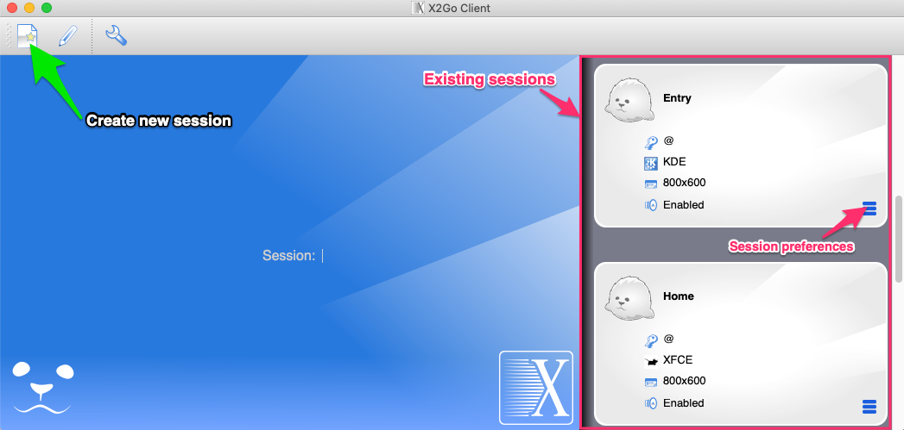
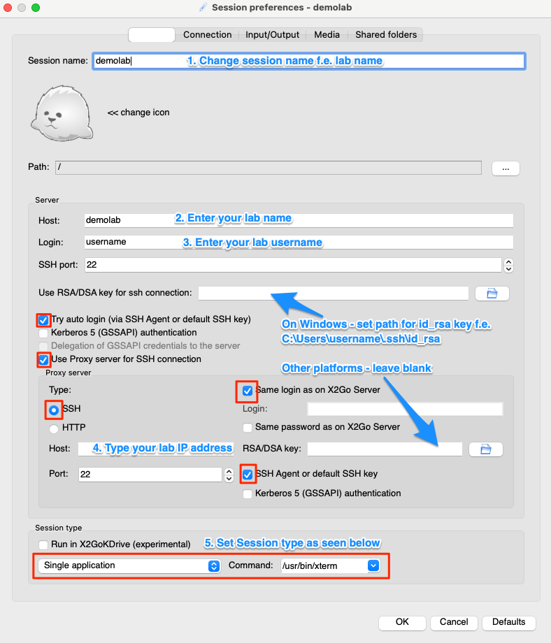
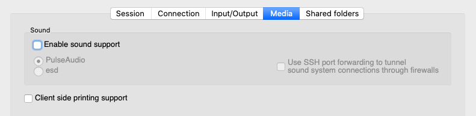
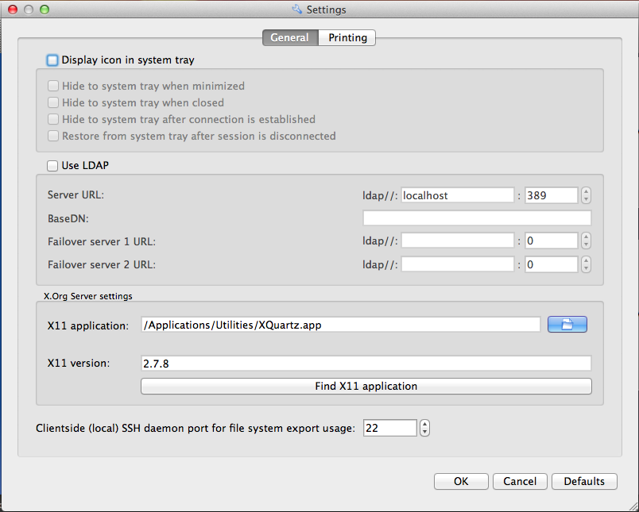

# X2Go

**This guide explain how you can install and configure the [X2Go](https://wiki.x2go.org/doku.php) software to get instant and 'passwordless' access to graphical tools in your lab, such as RStudio, Stata, SPSS and MatLab.**

[[toc]]

If you are connecting to the **`home`** machine in your lab, you are good to go after you have set up your local computer:

- [Set up your local computer](#set-up-your-local-machine)

If you want to connet to an unmanaged machine in your lab (On-demand or Spot machines) you will need to install the X2Go server before you set up your local computer:

- [Set up your unmanaged lab machine (On-demand and Spot)](#install-x2go-server-on-unmanaged-lab-machine-iaas)

## Set up your local computer

::: warning Requirements

- A working connection to your lab machine(s).
- A lab machine set up for X2Go connection (Home machines are by default set up with X2Go).

:::

### 1. Install the X2Go client

Install the [x2go client](https://wiki.x2go.org/doku.php/doc:installation:x2goclient) on your own local computer.

::: details Windows
Download and run the [X2Go client](https://wiki.x2go.org/doku.php/doc:installation:x2goclient#ms_windows) clicking **`Download X2Go for MS Windows™ and install.`** and then selecting the **`exe-file`**.
:::

::: details OS X/macOS

Use [brew](https://brew.sh/) to install both XQuartz (required for X2Go) and the X2Go client:

  ```bash
  brew install --cask xquartz
  brew install --cask x2goclient
  ```

  ::: warning XQuartz
  If this is your first time installing XQuartz, you **must** logout and log back in or restart your Mac for it to work.

Please read the official [X2Go installation docs](https://wiki.x2go.org/doku.php/doc:installation:x2goclient#os_x) for handy tweaks of the X2Go client.

  ::: warning OS X 10.15 Catalina
  In case of issues with x2goclient you can try [nightly build](https://code.x2go.org/releases/X2GoClient_nightly_macosx/x2goclient-4.1.2.2.git20191230.1893.heuler.OSX_10_13.dmg) version.

:::


::: details Linux (Ubuntu / Debian)

Install the X2Go client using apt:

```bash
sudo apt-get update -y && sudo apt install -y x2goclient
```

:::

### 2. Configure the X2Go client for your home machine

Once installed, open the X2Go client and click **`New session`** and enter a _Session name_ that you will use to identify this connection later, e.g. _demolab - rstudio_

::: warning NOTE
The configuration below will work on **`home`** machines. This configuration will -not- work on unmanaged On-demand and Spot machines.
:::

#### 2.1 Create session

Click **`Create new session`**.



#### 2.2 In the `Session` tab

2.1 Follow instructions below



#### 2.3 In the `Connection` tab

Play with the _Connection speed_ and _Compression_ methods. For office use **`LAN`** and **`16m-png`** should be fine.

#### 2.4 In the `Media` tab



- Uncheck **`Client side printing support`**
- Uncheck **`Enable sound support`**

Hit **`OK`** in the lower right corner.

#### 3. Connect to X2Go server

3.1. Ensure that your HUNT Cloud VPN is running and connected.

3.2. Click on your newly saved session in X2Go to connect to your lab machine. If this works you should see a terminal pop up on your screen.

3.3. Type **`xclock`** in the terminal to test the setup. With a little bit of luck, you should now see a new window popping up with a digital clock.

#### 4. Connect to other software

You may use X2Go to access software with graphical interfaces. Such software needs to be installed in your lab machine before you can connect.

For your home machine, [RStudio](/do-science/tools/analytical/r-studio#install-r-studio) should be installed by default. To access this program, go back to your configuration and update **`Session type`** at the bottom of the **`Session tab`** from **`/usr/bin/xterm/`** to the location of Rstudio (**`/usr/bin/rstudio`**) and reconnect. With a little bit of luck, you should now see Rstudio on the your screen. If so, time to celebrate with coffee! If not, time to visit the [troubleshooting section](/do-science/tools/technical/x2go#troubleshooting).


### 3. Configure the X2Go client for unmanaged machines

Once installed, open X2Go and click **`New session`** and enter a _Session name_ that you will use to identify this connection later, e.g. _demolab - rstudio_

The configuration below will only work on **`On-demand`** and **`Spot`** machines, and not on home machines.

::: warning NOTE

This setup requires that someone in your lab already have installed X2Go server and your software of choice on the particular machine you will be connecting to.
:::

::: warning NOTE

This setup requires working SSH Configuration as instructed in Lab access link.
:::


#### 3.1 Create session

Click **`Create new session`**.

  


#### 3.2 In the `Session` tab

::: details Server section

- _Host_: **`<iaas-machine>`**
  - You need to use hostname of the machine. You cannot type in the IP address for the machine because direct connections from entry are not allowed. You will find the hostname by logging into the iaas machine on ssh and type **`hostname`**
- _Login/username_: **`<iaas-machine-username>`**
  - The default user name of iaas and blue machines is **`ubuntu`**. It may be good to confer with your lab coordinator to learn their specific setup for the machine you plan to access.
- _SSH port_: **`22`**
- _Use RSA/DSA key for ssh connection_:

  - For Mac and Linux:

    Leave blank if your login is "passwordless" (key-based). If not, confer the '[establish a password less login](/do-science/lab/#_3-5-final-steps)' section in the installation guide.

  - For Windows:

    You will need to save the access keys to your local computer and point to this file: (1) log into your lab **`home`** machine, (2) print your key with **`cat ~/.ssh/id_rsa`**, (3) open _Notepad_ on your local computer and copy the text from **`-----BEGIN KEY-----`** to **`-----END KEY-----`** (including both headers and the key between) into a file that your save on your computer. (4) link to this file in the window _Use RSA/DSA key for ssh connection_.

  - On IAAS nodes:

    In addition to the steps above, ensure that you are able to log directly into the machine from your local computer following [this guide](#install-x2go-server-on-unmanaged-lab-machine).


- _Try auto login_: **`Check`**
- _Use Proxy server for SSH connection_: **`Check`**
  :::

::: details Proxy server section

- _Proxy server type:_ **`SSH`**
- _Host:_ **`<lab-ip>`**
  - This is your lab specific IP that starts with **`10.42.130.`**. You will find the full address in the software that you use to connect to your lab.
- _Port:_ **`22`**
- _Same login as on X2Go Sever:_ **`Leave blank`**
- _Login:_ **`<your-lab-username>`**
  - This is the user name that you use to connect to your lab.
- _Same password as on X2Go Server:_ **`Leave blank`**
- _RSA/DSA key:_
  - For Mac and Linux: **`Leave blank`**
  - For Windows: **`Link to the same file that you established above`**
- _ssh-agent or default ssh key:_ **`Check`**
  :::

::: details Session type section

- Choose **`Single application`** from the drop down menu
- Add **`/usr/bin/xterm`** in the command window
  :::

#### 3.3 Remaining configuration

Follow the setups outlines in the **`Configure the X2Go client for home machines`** for further setup, including **`In the connection tab`**, **`In the media tab`**, **`connecting to the X2Go server`** and **`Connect to other software`**: [Start here](#_2-configure-the-x2go-client-for-your-home-machine).

::: warning Check SSH config for IAAS machine

Make sure that your SSH config (`~/.ssh/config`) is not using `ProxyJump` options. X2go does not seem to support these yet.

```
    ProxyJump <hostname>
```

Instead `ProxyCommand` should be used, example:

```
    ProxyCommand ssh -W %h:%p <hostname>
```

This requirement applies to both IAAS machine and home machine.

:::

## Install a desktop environment

The default X2Go setup connects directly to individual applications. This section describe how you may install a lightweight [XFCE](https://www.xfce.org/) desktop environment using common settings.

::: details Minimal setup of XFCE desktop

```bash
sudo apt-get update -y && sudo apt-get autoremove -y
sudo apt-get install -y --no-install-recommends xubuntu-desktop
```
:::

In session preferences change Session type to `XFCE`.

## Tips for configuration

The default setup will need some care to run smoothly:

::: expander "TAB completion"

- Fixing TAB completion using shell: (1) Log into your lab machine and (2) run this code:

  ```bash
  sed -i 's|name="\&lt\;Super\&gt\;Tab" type="string" value="switch_window_key"|name="\&lt\;Super\&gt\;Tab" type="empty"|g' ~/.config/xfce4/xfconf/xfce-perchannel-xml/xfce4-keyboard-shortcuts.xml
  ```

- Fixing TAB completion using GUI approach over x2go client.

  ```md
  1. Open the Xfce **`Application Menu`** > **`Settings`** > **`Window Manager`**
  2. Click on the **`Keyboard Tab`**
  3. Clear the Switch window for same application setting
  ```

:::

::: expander "Copy-paste functionality"

Connect to your lab machine and run this code:

- Client is connecting **from MacOS**

  ```bash
  touch ~/.Xresources
  chmod u+x ~/.Xresources
  echo "*VT100.translations: #override Meta <KeyPress> V: insert-selection(PRIMARY, CUT_BUFFER0) \n" >> ~/.Xresources
  cp ~/.Xresources ~/.Xdefaults
  xrdb -merge ~/.Xresources
  ```

- Client is connecting from **Windows** or **Linux**

  ```bash
  touch ~/.Xresources
  chmod u+x ~/.Xresources
  echo "*VT100.Translations: #override Ctrl Shift <Key>V: insert-selection(CLIPBOARD) \n" >> ~/.Xresources
  echo "*VT100.Translations: #override Ctrl Shift <Key>C: copy-selection(CLIPBOARD) \n" >> ~/.Xresources
  cp ~/.Xresources ~/.Xdefaults
  xrdb -merge ~/.Xresources
  ```

  ::: warning MATLAB for X2Go users on MacOS

  MATLAB does not use system shotcuts and implements it's own configuration of shortcuts.
  You might be able to add META + C / META + V, but the behavior is not as expected.
  Since MATLAB is running on Linux server it enforces `CTRL + C` / `CTRL + V` and those should work as expected.

:::

## Install X2Go server on unmanaged lab machine

Connection to X2Go require the application **`x2goserver`** to run for connections to work.
You may install this on iaas and blue machines as follows:

::: tip NOTE
This section is those of you that want to set up an unmanaged On-demand or Spot machines for GUI access.
:::

::: warning REQUIREMENTS

Root access to your lab machine. The below configuration will not work on home machines.

:::

::: details Install x2goserver

Log into your unmanaged lab machine and install **`x2goserver`**:

```bash
sudo add-apt-repository ppa:x2go/stable
sudo apt update
sudo apt install x2goserver libnss3 libasound2 -y
```

:::

::: details Ensure smooth access

You need to make sure you and your lab colleagues can log in to the x2go machine passwordless using RSA certificates, e.g. by following these steps:

1. From your local computer, log into your lab's entry machine:

   ```bash
   ssh <labname>
   ```

2. Form your entry machine, copy your machine key to your iaas-machine with the running X2Go server:

   ```bash
   ssh-copy-id <name-of-iaas-node>
   ```

   ::: warning NOTE
   [Contact us](/contact) if you are unable to make the above step work since a security setting may prohibit this depending on your lab setup.

3. Confirm the passwordless route to your iaas machine:

   ```bash
   ssh <iaas-node>
   ```

<!-- DO NOT GUIDE TO IP ADDRESS - does not work for IAAS - there is no way to configure double proxy jump -->


:::

## Troubleshooting

#### Password prompts during login

::: details Read more

X2Go rely either password or certificate to authenticate your connection. If the certificate do not work (or not included), your may be asked to insert your password four times before your application start. If so, try to fetch and save your certificate as described in our [X2Go configuration](#_2-configure-the-x2go-client-for-your-home-machine) under **`Use RSA/DSA key for ssh connection`**.

:::

#### Keys do not release

::: details Read more

Key-buffer not receiving a key release action after a keypress is a known bug of X2GO. There does not seem to be any clear solution to this. It is possible to disable key repeating, which will cause intended key repeating to stop working (e.g. holding arrows). We recommend to check connection settings and to make sure that the best network connection available is used.
If this is causing too many problems, alternatives to X2GO like [MobaXterm](/do-science/tools/technical/mobaxterm) can be considered.

:::

#### Manually 'killing' a stuck X2Go session

::: details Read more

From time to time your X2Go sessions may get stuck, such as when your software inside X2Go consumes all available memory. In such circumstances you may need to manually terminate the stuck X2Go processes using the command line in your lab machine.

1. From your local computer, connect to your lab machine over SSH, either using command line (Mac/Linux) or MobaXterm (Windows).

2. Once onboard your lab machine, list X2Go processes running under your user name.

   ```bash
   ps aux | grep x2go | grep $(whoami)
   ```

   A single line of your output will similar to the output below. This is from a process running the RStudio software. Your output may look different depending on the software your run:

   ```
   demouser 22463 0.0 0.0 11300 1796 ? Ss Jul11 0:00 /bin/bash /usr/bin/x2goruncommand 50 22408 demouser-50-1563761927_stRrstudio_dp32 39401 /usr/bin/rstudio nosnd R
   ```

3. Identify the process ID number that you want to terminate. The unique process ID is listes in the second column in the output from Step 2. For example, the process ID for the X2Go session below is **`22463`** (your number will be different).

   ```
   demouser 22463 0.0 0.0 11300 1796 ? Ss Jul11 0:00 /bin/bash /usr/bin/x2goruncommand 50 22408 demouser-50-1563761927_stRrstudio_dp32 39401 /usr/bin/rstudio nosnd R
   ```

4. Terminate the session ID that is stuck.

   ```bash
   kill <process-id>
   # e.g.: kill 22463
   ```

5. Confirm that the process is killed by reapeating Step 2 to verify that the process ID is no longer listed. Repeat the procedure to kill additional processes if needed.

6. Restart X2Go.
   :::

#### XQuartz in Mac

::: details Read more

If XQuartz is used as X11 Server on OS X, X2Go Client has to be informed. Click on the screw-wrench in the upper left bar in order to open the settings window. If not indicated yet, select XQuartz for the X11 application and supply the right version. Make sure that you have restarted your mac after installing the XQuartz.



:::


#### Slow Firefox in x2go

::: details Read more

Since version 47 Firefox became slow when using x11 rendering. Current versions should still allow setting xrender. Open new tab and write `about:config` as a url in your firefox browser, then search for `gfx.xrender.enabled` and set it to `true`. Restart your Firefox browser.

:::

#### Shared folders

::: details Read more

X2Go requires sshfs to be installed in the lab in order to use Shared folders feature.

```bash
sudo apt update
sudo apt install -y sshfs
```

:::

#### MacOS Ventura - black screen in x2go

::: details Read more

Run below command in your Mac terminal for possible resolution of wrong colour display.
```
defaults write org.xquartz.X11 enable_render_extension 0
```

:::
