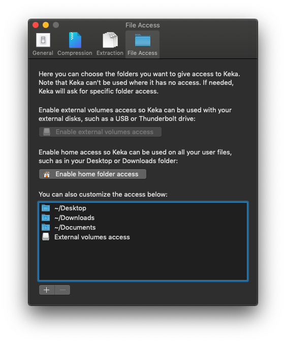

# 7z

**This guide explain how you can install, compress and decompress archives in your lab with the [7z](https://www.7-zip.org/7z.html) software, such as zip files.**

[[toc]]

## Installation

### Install 7z on your lab machine

Log into your lab machine and run the following code:

```bash
sudo apt update && sudo apt-get install p7zip-full
```

### Install 7z on your local computer

You can also install the 7z software on your own local computer:

::: expander "Windows" id="2-windows"

Download 7-Zip installer from official pages: [7-Zip website](https://www.7-zip.org/download.html)

Note: First option from download list on 7-zip website linked above should work in most cases.

  ::: tip NTNU users

  NTNU users can install 7-zip from the [Software Center](https://innsida.ntnu.no/wiki/-/wiki/English/Software+overview).<br /><br />

:::


::: expander "Mac OS" id="2-macos"

We recommend opening your zip files with [Keka](https://www.keka.io/en/download).  

After successfull installation, Keka requires permissions to your home folder.  
You can find this under `File Access` in Keka.


:::


::: expander "Ubuntu" id="2-ubuntu"

Install 7-zip command line tool using this command:

<CopyInput
    :value='`sudo apt update && sudo apt-get install p7zip-full`'
    label=""
    prefix=""
/>

:::


## Extract an archive

::: expander "Windows" id="3-windows"


:::

::: expander "Mac OS" id="3-macos"

Right click on your archive and select **Open With** --> [**Keka**](/do-science/tools/transfer/7z#detail-2-macos).

:::

::: expander "Ubuntu / Linux" id="3-ubuntu"

Use the following code to extract an archive on your lab machine:

```bash
# -- extract 7z
7za e <myfile>.7z

# -- extract zip
7za e <myfile>.zip
```
:::


## Compress small folders

This command allows you to compress and encrypt a folder in your lab:

```bash
# -- principal examples
7za a <filename-for-new-file.7z> <lab-folder> -p<key>
```

- Replace `<filename-for-new-file.7z>` with the name for your to-be compressed archive.
- Replace `<lab-folder>` with the path of the folder (or file) in your lab that you aim to compress, for example **`/mnt/scratch/export-folder/`**.
- Replace `<key>` with a key (passphrase) that you generate. This key is used to encrypt your archive. We recommend that your choose a [passphrase](/do-science/lab-access/configure-ssh#_3-2-design-a-passphrase) of at least 12 characters.

::: warning Secure key transfers

Transfer your key in a separate channel than your compressed file. For example, you may consider to transfer your compressed file over SSH or filesender.no, and to transfer your archive key over the encrypted mobile app Signal.

:::

## Compress large folders

For larger folders we recommend to split your compressed file into several parts for easier transfers. The code below split your folder into 100G chunks:

```bash
7za a -v100G <filename-for-new-file.7z> <lab-folder> -p<key>
```
