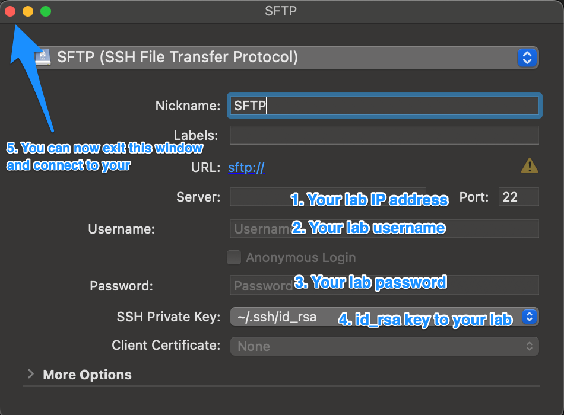

# Cyberduck
Is a free software for convenient file transfers between your macOS laptop and lab. 

[[toc]]
## Download

You can download free version of Cyberduck through their main [webpage](https://cyberduck.io/download/). Once you download the app, follow instructions on screen for quick install.

## Setup connection to your lab

1. After you open the app, you should see following window. Select + sign in bottom left corner in order to setup new connection

2. New window should pop-up. Fill in details as described in below image. 

3. Double-click on your new connection. You should successfully connect to your lab entry node.

## How to transfer your files

As of current state, you are unable to directly see all of your lab directories. For transfer of files, use your `cargo`directory for transfers. In cyberduck, you should see cargo folder under `/nfs/home/username`

## Immediate troubleshooting

### What is my lab IP address ?

You can find you lab IP address in config.txt file sent over to your email or via access link which you were provided during initial onboarding. If you cannot find either, ping us in your lab channel on slack and we will help you out.